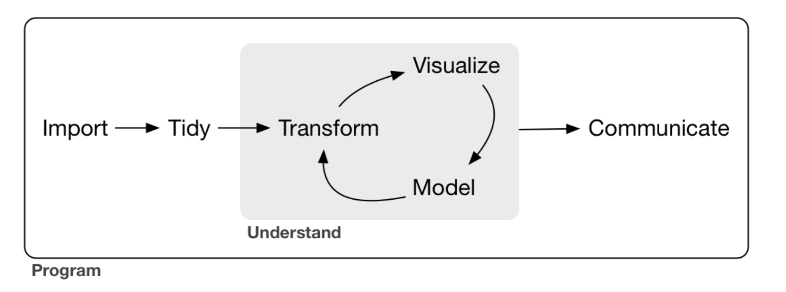

```{r  include=FALSE}
knitr::opts_chunk$set(echo = TRUE)
library(knitr)
```

## Ejemplos de cuestiones de análisis.

+ En la lista de proyectos que figura más abajo me refiero varias veces a un *análisis de datos*. Esa expresión hace referencia al diagrama que hemos visto:
    ```{r echo=FALSE, comment=NULL, fig.align='center', out.width = "70%",  purl=FALSE}
    
    ```
    Para que tengáis una idea más detallada del tipo de preguntas que pueden formar parte de un análisis como ese incluyo aquí [**un enlace**](https://musing-stonebraker-3eeaa5.netlify.app/datosExamenes.zip) al tipo de análisis que se ha usado en los exámenes de los últimos cursos

## Grupos de trabajo

+ El proyecto se realizará en grupos de tres personas. Excepcionalmente podemos considerar grupos de menor tamaño, pero ese es el tope superior. En clase comentaremos la forma de organizar los grupos.

## Formato y forma de entrega

El formato básico de entrega del trabajo es Rmarkdown y la forma de entrega del proyecto es a través del repositorio personal en GitHub de alguien del grupo. A partir de ahí podemos adaptarnos al tipo de proyecto (ver más abajo).

## Conjuntos de datos que puedes utilizar.

+ [**Conjuntos de datos abiertos en Kaggle**](https://www.kaggle.com/datasets). Contiene una colección de datos con temáticas muy diversas. Asegúrate de leer también [esta página](https://www.kaggle.com/docs/datasets) con información adicional y usa el filtro de la página para elegir tamaño y formato de los datos. No hay razón para limitarse a csv.

+ El portal [**UC Irvine Machine Learning Repository**](https://archive.ics.uci.edu/ml/index.php) es similar al anterior en variedad y buenas posibilidades de filtrado, aunque con una colección menor.

+ Portales de datos institucionales. Por ejemplo, la [**Unión Europea**](https://datos.madrid.es/portal/site/egob/) o el [*Gobierno de España*](https://datos.gob.es/) (que también da acceso a datos de Comunidades y Ayuntamientos), la [**Comunidad de Madrid**](https://www.comunidad.madrid/gobierno/datos-abiertos) o el [**Ayuntamiento de Madrid**](https://datos.madrid.es/portal/site/egob/). Cualquiera de estos portales tiene una cantidad enorme de conjuntos de datos interesantes. El principal problema es que a menudo no es tan fácil seleccionarlos como, por ejemplo, en Kaggle. Si tienes dudas sobre el conjunto que has seleccionado consúltame.

+ Hay cientos de blogs sobre R de todo tipo, algunos de ellos escritos por figuras muy destacadas de la comunidad de R y el análisis de datos. Si trabajas con R la página  [**R-bloggers**](https://www.r-bloggers.com/) puede ser una fuente de información e inspiración muy valiosa para conocer muchos de esos blogs. Y en este caso, para localizar algún conjunto de datos interesante.

+ Otros portales de datos como el [**Instituto Nacional de Estadística**](https://www.ine.es/inebmenu/queesinebase.htm), [**Our World in Data**](https://ourworldindata.org/), o [**Statista**](https://www.statista.com).   
+ Puedes elegir un conjunto de datos ajustado a tus intereses y a las técnicas que quieras practicar como parte de la propuesta de proyecto.

Recuerda en cualquier caso que debes identificar y citar claramente la fuente de la que provienen los datos originalmente. Si tenéis una idea para una fuente de datos pero también dudas sobre su utilidad, hablad con nosotros antes de dedicarle mucho tiempo. Y si después de un tiempo prudencial tenéis dificultades para localizar un conjunto de datos aprvechable e interesante, por favor avisadnos.

## Tipos de proyecto sugeridos. 

+ El más sencillo es un análisis de datos publicado en el repositorio personal en GitHub de uno de los miembros del grupo. Sería bueno que el formato de salida fuera, además de HTML, al menos `github_document` (ver la [**Sección 18.3 de Happy Git**](https://happygitwithr.com/rmd-test-drive.html#output-format)) 


+ Además de usar GitHub, como forma de mostrar los resultados puedes crear un blog usando [**blogdown**](https://bookdown.org/yihui/blogdown/) con un post que incluya el análisis de datos. Iniciarse en blogdown es muy sencillo, hay que usar de guía los tres primeros capítulos del libro de Yihui Xie, que son una lectura rápida. Para el alojamiento te sugiero usar [**netlify**](https://www.netlify.com/). 

+ Puedes usar [**Shiny**](https://shiny.rstudio.com/) para crear una aplicación web como parte de tu proyecto de análisis y publicarlo usando una cuenta gratuita de [**shinyapps.io**](https://www.shinyapps.io/). Esas cuentas tienen un límite de 25 horas mensuales de *ejecución* de la aplicación, pero eso debería ser más que suficiente para este proyecto. 

+ Hay dos tipos de proyectos interesantes que usan técnicas que no vamos a  poder cubrir en clase. 
    - En primer lugar se pueden usar técnicas de *Web Scrapping* para extraer información de alguna web, usando por ejemplo la librería [rvest](**https://rvest.tidyverse.org/index.html**) del tidyverse. El tipo de proyecto que os sugiero se ilustra por ejemplo en este [**tutorial de RStudio**](https://www.datacamp.com/community/tutorials/r-web-scraping-rvest). Si os interesa puedo sugeriros algunas webs que pueden servir para esto.
    - También podéis usar R para acceder a una API y usar esos datos como base del proyecto. Para haceros una idea podéis ver [**este vídeo**](https://www.coursera.org/lecture/data-cleaning/reading-from-apis-gIaQK) del curso *Getting and Cleaning Data* de la Univ. John Hopkins en Coursera. En el caso concreto de la API de Twitter la información del vídeo puede estar anticuada, pero se la idea general se mantiene. Como antes, puedo sugeriros algunas APIs con las que trabajar. 

+ Si tenéis una idea interesante para un proyecto que no encaja en las líneas anteriores, estoy deseando escuchar vuestra propuesta.

# Observaciones y plazos

+ Sugerimos que en las propuestas tratéis de combinar ambición con prudencia (nadie dice que sea fácil). En particular no os embarquéis en un proyecto que claramente supere los recursos de tiempo y esfuerzo que tenéis disponibles. Hacedme llegar vuestras propuestas de aquí al martes 2020-09-28. El plan es ser muy flexibles con las fechas de entrega, incluso se pueden extender más allá de la fecha de examen. porque tenemos margen. Pero en última instancia la fecha dependerá del tipo de propuestas que hagáis.  

