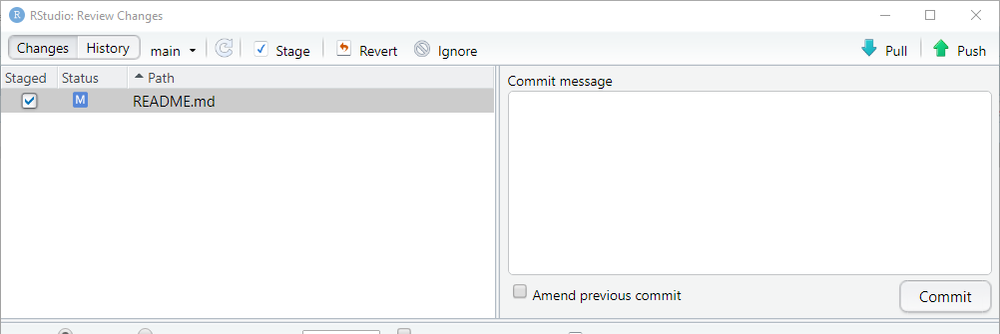

```{r set-options, echo=FALSE, purl=FALSE}
options(width = 60)
library(knitr)
knitr::opts_chunk$set(comment = '', fig.width = 6, fig.height = 6)
def.chunk.hook  <- knitr::knit_hooks$get("chunk")
knitr::knit_hooks$set(chunk = function(x, options) {
  x <- def.chunk.hook(x, options)
  ifelse(options$size != "normalsize", paste0("\\", options$size,"\n\n", x, "\n\n \\normalsize"), x)
})
if (grepl(pattern = "cloud", getwd())){
  homeDir  <-  "/cloud/project/"
  } else {
  homeDir <- "./"
  }
figpath <- function(figname){
  paste0(homeDir,"fig/", figname)
} 
```

```{r echo = FALSE}
## title: 'Master en Big Data. Fundamentos  matemáticos  del  análisis  de  datos.'
## author: "Fernando San Segundo"
## subtitle: "Práctica 0. Comprobación del software y proceso de entrega."
```


# Configurando tu repositorio personal en GitHub

1. Ve a la página de la organización del curso en GitHub:  
\link{https://github.com/mbdfmad}{https://github.com/mbdfmad}.  
Al enviar tu nombre de usuario en GitHub a los profesores habrás recibido una invitación para unirte a `mbdfmad`. Si aún no has aceptado esa invitación hazlo al acceder a la página por primera vez usando el enlace de la parte superior.


2. Localiza tu repositorio en esa página. Tendrá un nombre como `apellido_nombre` ¡Pero con tu propio nombre y apellido, claro! No lo confundas con el repositorio de pruebas que se llama *textualmente* `apellido_nombre`.

3. Al entrar en tu repositorio usa el botón verde 
$\includegraphics[width=0.7cm]{fig/01-fig21-boton_code_GitHub.png}$ y en la ventana que aparece copia la URL del repositorio haciendo clic en el símbolo del portapapeles. Asegúrate de usar la versión https, que debe ser algo como:
    ```
    https://github.com/mbdfmad/apellido_nombre.git
    ```

4. Ahora, como hicimos en la Sesión 1, en RStudio usa el menú $\text{\menu[,]{File, New Project}}$ y en la ventana que aparece selecciona *Version Control*. A continuación selecciona *Git* y en el primer campo copia la URL en GitHub del paso anterior. No modifiques el nombre del repositorio y, **muy importante**, con el botón *browse* selecciona la ubicación del clon local del repositorio. Deberías situarlo dentro de tu carpeta de la asignatura, *al mismo nivel* que tu copia del repositorio `fmad2122`, **¡pero no dentro de este!**

---

5. Cuando se abra la ventana de RStudio para el nuevo proyecto usa la pestaña *Terminal* (al lado de la consola) y ejecuta este comando:  
    ```{r eval=FALSE, comment=NULL}
    git config --local --list
    ```
    En la lista que aparece asegúrate de comprobar que la información de las líneas `user.name`, `user.email` y `remote.origin.url` es correcta. 


6. Ahora vuelve a la consola de RStudio (la pestaña de la izquierda si estás en *Terminal*). Vamos a llevar a cabo el proceso que se describe en el \link{Capítulo 19 de Happy Git}{https://happygitwithr.com/credential-caching.html\#credential-caching}, para que puedas sincronizar este repositorio con GitHub. Para hacerlo ejecuta este comando de R:
    ```{r eval=FALSE, comment=NULL}
    usethis::create_github_token()
    ```
    Al ejecutarlo se abrirá tu navegador en una página de GitHub, con el encabezamiento *New personal access token*. El cursor se sitúa en un campo en el que verás el nombre `R:GITHUB_PAT`. Te sugiero que uses un nombre más descriptivo como `R_PAT_FMAD2122`. Acepta las opciones que aparecen marcadas por defecto y en la parte inferior de la página usa el botón verde *Generate token*. Cuando la ventana se recargue verás el PAT (personal access token) que has creado. Es, a los efectos que nos interesan, como una contraseña. Trátala como tal, y guárdala como harías con una contraseña de correo, de una cuenta bancaria, etc. 

---

7. Nos queda un último paso de configuración. Ejecuta este comando en la consola de R:
    ```{r eval=FALSE, comment=NULL}
    gitcreds::gitcreds_set()
    ```
    Entonces R te pedirá que introduzcas el PAT que has creado en el paso anterior.
  
8. Comprobemos que todo funciona. Usa el panel `Files` de RStudio (abajo a la derecha) para abrir el fichero llamado  `README.MD`. Es un fichero (de tipo `markdown`) que GitHub usa como punto de entrada y descripción de tu repositorio. Deja el contenido del repositorio como está pero añade una línea en la parte inferior que diga:
    ```{r eval=FALSE, comment=NULL}
    Repositorio activado el [fecha_de_hoy].
    ```
    cambiando el texto entre corchetes por la fecha real. Graba el fichero y mira el panel `Git` de RStudio (arriba, derecha). Debería aparecer el nombre del fichero `README.MD`. **Si aparecen más ficheros avisa a tu profesor antes de seguir adelante**. Marca la casilla a la izquierda del nombre y haz clic en el botón `Commit` de la parte superior.  Aparecerá una ventana como esta:
    ```{r echo=FALSE, comment=NULL, fig.align='center', out.width = "30%",  purl=FALSE}
    
    ```
En el campo  *Commit Message* escribe `Primer commit del curso`, asegúrate de que `README.md` está seleccionado en el panel de la izquierda y usa el botón `Commit`.

---

9. Aparecerá una ventana confirmando que el `commit` se ha completado. Ciérrala y ahora haz clic en al flecha verde  `Push` para enviar ese cambio a GitHub. De nuevo aparecerá una ventana en la que apenas debería haber tres líneas de texto, indicando que el `push` se ha completado. Si aparecen mensajes de error o tienes dudas consulta a tus profesores. Si todo ha ido bien, cierra esa ventana y la ventana titulada `RStudio Review Changes`.

10. Finalmente, ve a la página de este repositorio en GitHub (recárgala si es necesario) y comprueba que el fichero `README.md` incluye la línea de texto que has añadido y que encima de ese fichero aparece el `commit` que acabas de hacer con su mensaje.

# Creando un fichero Rmarkdown para esta práctica. 

+ Antes de seguir adelante asegúrate de cerrar en RStudio el proyecto que acabamos de crear. Para ello puedes usar el menú $\text{\menu[,]{File,  Close Project}}$ Lo usaremos después pero ahora debe estar cerrado. 

+ Crea una carpeta llamada P0 dentro de tu  tu *carpeta de la asignatura* (a la que nos referiremos como carpeta FMAD, aunque la puedes haber llamado como quieras). En particular asegúrate de que la carpeta P0 **no está** dentro de ninguna de las dos carpetas de repositorios (la que se llama `fmad2122` y la que se llama `apellido_nombre`).

+ Descarga ahora a esa carpeta `P0` el fichero  Rmarkdown llamado  
\begin{center}
\link{https://raw.githubusercontent.com/mbdfmad/fmad2122/main/practicas/p0/P00_apellidos_nombre.Rmd}{P00\_apellidos\_nombre.Rmd}.  
\end{center}
**Recuerda:** usa el código con `download.file`, no hagas la descarga con el navegador. 

+ Abre ese fichero con RStudio. Puedes hacer doble clic con el ratón y *si todo va como se espera*, el fichero se abrirá normalmente. Pero siempre tienes la opción segura de usar el menú de RStudio. 

+ Examina el contenido del fichero y después busca el menú desplegable (el pequeño triángulo negro) junto al botón `Knit` de la parte superior del editor de RStudio. Usa la opción `Knit to HTML` para empezar. Al cabo de unos segundos debe abrirse una ventana con el resultado del procesamiento de ese fichero. Si tienes problemas avisa a tus profesores.

---

+ En particular observa que el código R de cada uno de los bloques (*chunks*) se ha ejecutado y que el resultado de la ejecución se ha incorporado al documento HTML de salida.

+ Prueba a usar ahora los botones `Knit to PDF` y `Knit to Word`. Estas dos opciones usan software adicional que debe estar instalado correctamente en tu ordenador, así que la probabilidad de fallo es más alta. Si ocurre eso avisa a tus profesores para que te aconsejen cómo proceder.

+ En la siguiente sección vamos a hacer el trabajo de la práctica de hoy relacionado con los contenidos teóricos de la asignatura. Usa ese documento Rmarkdown para hacer los ejercicios que se proponen. Te servirá de ensayo para la primera tarea que debes entregar.

# Ejercicios

1. Usando la función `sample` crea un vector `dado_honesto` con 100 números del 1 al 6. Haz una tabla de frecuencias absolutas (de dos maneras, con `table` y `dplyr`) y una tabla de frecuencias relativas. 

2. A continuación crea un nuevo vector `dado_cargado` de manera que la probabilidad de que el número elegido valga 6 sea el doble que la probabilidad de elegir cualquiera de los cinco números restantes. Lee la ayuda de `sample` si lo necesitas. De nuevo, haz tablas de frecuencias absolutas y relativas de este segundo vector.

3. Utiliza las funciones `rep` y `seq` para crear tres vectores `v1`, `v2` y `v3` con estos elementos respectivamente:

    ```{}
    4, 4, 4, 4, 3, 3, 3, 3, 2, 2, 2, 2, 1, 1, 1, 1 
    
    1, 2, 2, 3, 3, 3, 4, 4, 4, 4, 5, 5, 5, 5, 5
    
    1, 2, 3, 4, 1, 2, 3, 4, 1, 2, 3, 4, 1, 2, 3, 4
    
    ```

4. Utilizando la tabla `mpg` de la librería `tidyverse` crea una tabla `mpg2` que: 
    + contenga las filas en las que la variable `class` toma el valor `pickup`.
    + y las columnas de la tabla original cuyos nombres empiezan por `c`. No se trata de que las selecciones *a mano*, por sus nombres. Busca información sobre funciones auxiliares para `select` en la \link{https://r4ds.had.co.nz/transform.html\#select}{Sección 5.4 de R4DS}.


---

5. Descarga el fichero \link{http://www.stata-press.com/data/r8/census.dta}{census.dta}. Averigua de qué tipo de fichero se trata y usa la herramienta `Import DataSet` del panel `Environment` de RStudio para leer con R los datos de ese fichero. Asegúrate de copiar en esta práctica los dos primeros comandos que llevan a cabo la importación (excluye el comando `View`) y que descubrirás al usar esa herramienta. Después completa los siguientes apartados con esos datos y usando `dplyr` y `ggplot`:
    + ¿Cuáles son las poblaciones totales de las regiones censales?
    + Representa esas poblaciones totales en un diagrama de barras (una barra por región censal).
    + Ordena los estados por población, de mayor a menor.
    + Crea una nueva variable que contenga la tasa de divorcios /matrimonios para cada estado.
    + Si nos preguntamos cuáles son los estados más envejecidos podemos responder de dos maneras. Mirando la edad mediana o mirando en qué estados la franja de mayor edad representa una proporción más alta de la población total. Haz una tabla en la que aparezcan los valores de estos dos criterios, ordenada según la edad mediana decreciente y muestra los 10 primeros estados de esa tabla.
    + Haz un histograma (con 10 intervalos) de los valores de la variable `medage` (edad mediana) y con la curva de densidad de la variable superpuesta.
    
# Practicando la entrega de las Tareas.

+ Cada semana del curso tras la práctica tendrás que hacer un Quiz en Moodle y una tarea. La tarea consistirá en elaborar un documento Rmarkdown en el que realizarás análisis de datos más complejos a medida que avancemos en el curso. Para entregarla debes crear en tu repositorio personal una carpeta. La de la primera tarea se llamará A1, la segunda A2, etc. Esta semana vamos a practicar la entrega y para ello usaremos el fichero Rmarkdown que has creado en la práctica de hoy. Vamos a ver paso a paso cómo hacer la entrega. 
    
+ Empieza creando dentro de tu repositorio (apellidos_nombre) una carpeta llamada A0. Copia en esa carpeta el fichero Rmarkdown que hemos usado para hacer los ejercicios de la práctica de hoy. Para entregar tareas debes guardar en esa carpeta cualquier fichero de datos, figura, etc. que sea necesario en la tarea.
    
+ Asegúrate de ejecutar en ese fichero *Knit to ...* para cada formato de entrega requerido (HTML, PDF) y comprueba que el resultado es correcto.
    
+ El resto es muy parecido a la que hicimos al activar este repositorio. Usa el botón `Commit` situado sobre el panel `Git` de Rstudio. En la parte superior izquierda de la ventana que aparece debes ver los ficheros que vas a entregar. En particular, debes ver el fichero Rmarkdown y el HTML o PDF. Marca la casilla `staged` para todos los ficheros (selecciona uno de ellos, pulsa CTRL+A y la barra de espacio). *Nota:* si sólo ves la carpeta `A0` haz clic en ella para desvelar los ficheros que contiene.
    
---
      
+ **Escribe un mensaje en la ventana** `commit message`. El texto del mensaje debe ser algo como *Entrega de la tarea A0*. Después usa el botón `Commit`.
    
+ Aparecerá la ventana que ya conoces para confirmar que el `commit` se ha completado. Ciérrala y ahora haz clic en la flecha verde  `Push`. Si aparecen mensajes de error o el sistema te pide una contraseña o, en cualquier caso, si tienes dudas consulta a tus profesores. Al terminar correctamente cierra esa ventana y la ventana titulada `RStudio Review Changes`.
    
+ Ve a la web de GitHub y comprueba que esos cambios se han propagado hasta tu repositorio personal. Es decir, que existe una carpeta A0 que contiene los ficheros Rmarkdown y HTML o PDF y que el mensaje de commmit que has escrito aparece junto a ellos.


