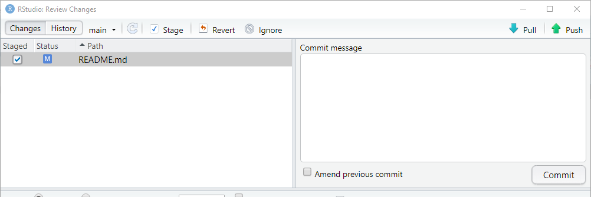

```{r set-options, echo=FALSE, purl=FALSE}
options(width = 60)
library(knitr)
knitr::opts_chunk$set(comment = '', fig.width = 6, fig.height = 6)
def.chunk.hook  <- knitr::knit_hooks$get("chunk")
knitr::knit_hooks$set(chunk = function(x, options) {
  x <- def.chunk.hook(x, options)
  ifelse(options$size != "normalsize", paste0("\\", options$size,"\n\n", x, "\n\n \\normalsize"), x)
})
if (grepl(pattern = "cloud", getwd())){
  homeDir  <-  "/cloud/project/"
  } else {
  homeDir <- "./"
  }
figpath <- function(figname){
  paste0(homeDir,"fig/", figname)
} 
```

```{r echo = FALSE}
## title: 'Master en Big Data. Fundamentos  matemáticos  del  análisis  de  datos.'
## author: "Fernando San Segundo"
## subtitle: "Sesión 1: Presentación. Instalación de Software y Primeros Pasos"
```


# Configurando tu repositorio personal en GitHub

1. Ve a la página de la organización del curso en GitHub:  
\link{https://github.com/mbdfmad}{https://github.com/mbdfmad}.  
Al enviar tu nombre de usuario en GitHub a los profesores habrás recibido una invitación para unirte a `mbdfmad`. Si aún no has aceptado esa invitación hazlo al acceder a la página por primera vez usando el enlace de la parte superior.


2. Localiza tu repositorio en esa página. Tendrá un nombre como `apellido_nombre` ¡Pero con tu propio nombre y apellido, claro! No lo confundas con el repositorio de pruebas que se llama *textualmente* `apellido_nombre`.

3. Al entrar en tu repositorio usa el botón verde 
$\includegraphics[width=0.7cm]{fig/01-fig21-boton_code_GitHub.png}$ y en la ventana que aparece copia la URL del repositorio haciendo clic en el símbolo del portapapeles. Asegúrate de usar la versión https, que debe ser algo como:
    ```
    https://github.com/mbdfmad/apellido_nombre.git
    ```

4. Ahora, como hicimos en la Sesión 1, en RStudio usa el menú $\text{\menu[,]{File, New Project}}$ y en la ventana que aparece selecciona *Version Control*. A continuación selecciona *Git* y en el primer campo copia la URL en GitHub del paso anterior. No modifiques el nombre del repositorio y, **muy importante**, con el botón *browse* selecciona la ubicación del clon local del repositorio. Deberías situarlo dentro de tu carpeta de la asignatura, *al mismo nivel* que tu copia del repositorio `fmad2122`, **¡pero no dentro de este!**

---

5. Cuando se abra la ventana de RStudio para el nuevo proyecto usa la pestaña *Terminal* (al lado de la consola) y ejecuta este comando:  
    ```{r eval=FALSE, comment=NULL}
    git config --local --list
    ```
    En la lista que aparece asegúrate de comprobar que la información de las líneas `user.name`, `user.email` y `remote.origin.url` es correcta. 


6. Ahora vuelve a la consola de RStudio (la pestaña de la izquierda si estás en *Terminal*). Vamos a llevar a cabo el proceso que se describe en el \link{Capítulo 19 de Happy Git}{https://happygitwithr.com/credential-caching.html\#credential-caching}, para que puedas sincronizar este repositorio con GitHub. Para hacerlo ejecuta este comando de R:
    ```{r eval=FALSE, comment=NULL}
    usethis::create_github_token()
    ```
    Al ejecutarlo se abrirá tu navegador en una página de GitHub, con el encabezamiento *New personal access token*. El cursor se sitúa en un campo en el que verás el nombre `R:GITHUB_PAT`. Te sugiero que uses un nombre más descriptivo como `R_PAT_FMAD2122`. Acepta las opciones que aparecen marcadas por defecto y en la parte inferior de la página usa el botón verde *Generate token*. Cuando la ventana se recargue verás el PAT (personal access token) que has creado. Es, a los efectos que nos interesan, como una contraseña. Trátala como tal, y guárdala como harías con una contraseña de correo, de una cuenta bancaria, etc. 

---

7. Nos queda un último paso de configuración. Ejecuta este comando en la consola de R:
    ```{r eval=FALSE, comment=NULL}
    gitcreds::gitcreds_set()
    ```
    Entonces R te pedirá que introduzcas el PAT que has creado en el paso anterior.
  
8. Comprobemos que todo funciona. Usa el panel `Files` de RStudio (abajo a la derecha) para abrir el fichero llamado  `README.MD`. Es un fichero (de tipo `markdown`) que GitHub usa como punto de entrada y descripción de tu repositorio. Deja el contenido del repositorio como está pero añade una línea en la parte inferior que diga:
    ```{r eval=FALSE, comment=NULL}
    Repositorio activado el [fecha_de_hoy].
    ```
    cambiando el texto entre corchetes por la fecha real. Graba el fichero y mira el panel `Git` de RStudio (arriba, derecha). Debería aparecer el nombre del fichero `README.MD`. **Si aparecen más ficheros avisa a tu profesor antes de seguir adelante**. Marca la casilla a la izquierda del nombre y haz clic en el botón `Commit` de la parte superior.  Aparecerá una ventana como esta:
    ```{r echo=FALSE, comment=NULL, fig.align='center', out.width = "30%",  purl=FALSE}
    
    ```
En el campo  *Commit Message* escribe `Primer commit del curso`, asegúrate de que `README.md` está seleccionado en el panel de la izquierda y usa el botón `Commit`.

---

9. Aparecerá una ventana confirmando que el `commit` se ha completado. Ciérrala y ahora haz clic en al flecha verde  `Push` para enviar ese cambio a GitHub. De nuevo aparecerá una ventana en la que apenas debería haber tres líneas de texto, indicando que el `push` se ha completado. Si aparecen mensajes de error o tienes dudas consulta a tus profesores. Si todo ha ido bien, cierra esa ventana y la ventana titulada `RStudio Review Changes`.

10. Finalmente, ve a la página de este repositorio en GitHub (recárgala si es necesario) y comprueba que el fichero `README.md` incluye la línea de texto que has añadido y que encima de ese fichero aparece el `commit` que acabas de hacer con su mensaje.

# Creando un fichero Rmarkdown para esta práctica. 

+ Antes de seguir adelante asegúrate de cerrar en RStudio el proyecto que acabamos de crear. Para ello puedes usar el menú $\text{\menu[,]{File,  Close Project}}$ Lo usaremos después pero ahora debe estar cerrado. 

+ Crea una carpeta llamada P1 dentro de tu  tu *carpeta de la asignatura* (a la que nos referiremos como carpeta FMAD, aunque la puedes haber llamado como quieras). En particular asegúrate de que la carpeta P1 **no está** dentro de ninguna de las dos carpetas de repositorios (la que se llama `fmad2122` y la que se llama `apellido_nombre`).

+ Descarga ahora a esa carpeta `P1` el fichero  Rmarkdown llamado  
\begin{center}
\link{Nope}{practica01\_apellidos\_nombre.Rmd}.  
\end{center}
**Recuerda:** usa el código con `download.file`, no hagas la descarga con el navegador. 

+ Abre ese fichero con RStudio. Puedes hacer doble clic con el ratón y *si todo va como se espera*, el fichero se abrirá normalmente. Pero siempre tienes la opción segura de usar el menú de RStudio. 

+ Examina el contenido del fichero y después busca el menú desplegable (el pequeño triángulo negro) junto al botón `Knit` de la parte superior del editor de RStudio. Usa la opción `Knit to HTML` para empezar. Al cabo de unos segundos debe abrirse una ventana con el resultado del procesamiento de ese fichero. 


