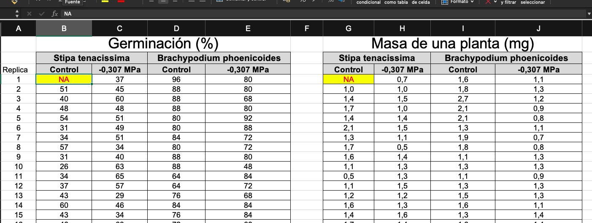
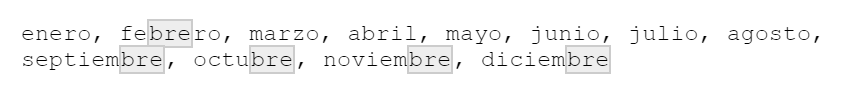
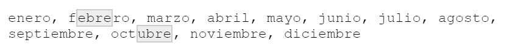

```{r set-options, echo=FALSE, purl=FALSE}
options(width = 60)
library(knitr)
knitr::opts_chunk$set(comment = '', fig.width = 6, fig.height = 6)
def.chunk.hook  <- knitr::knit_hooks$get("chunk")
knitr::knit_hooks$set(chunk = function(x, options) {
  x <- def.chunk.hook(x, options)
  ifelse(options$size != "normalsize", paste0("\\", options$size,"\n\n", x, "\n\n \\normalsize"), x)
})
if (grepl(pattern = "cloud", getwd())){
  homeDir  <-  "/cloud/project/"
  } else {
  homeDir <- "./"
  }
figpath <- function(figname){
  paste0(homeDir,"fig/", figname)
} 
```

## Preliminares

```{r echo = FALSE}
## title: 'Master en Big Data. Fundamentos  matemáticos  del  análisis  de  datos.'
## author: "Fernando San Segundo"
## subtitle: "Práctica 2"

```

Carga de librerías inicial:

```{r message=FALSE}
library(tidyverse)
```

## Cálculo de probabilidades en ficheros de datos.

+ Vamos a empezar volviendo a las preguntas sobre el Teorema de Bayes que dejamos pendientes en la sesión 3, usando los datos de `spam` de la librería `kernlab`.
    ```{r message = FALSE}
    library(kernlab)
    data(spam)
    spam[1:4, c(5:10, 58)]
    ```
    Recuerda las preguntas:
    - ¿Cuál es la probabilidad de que un mensaje elegido al azar sea spam?
    - ¿Cuál es la probabilidad de que un mensaje elegido al azar contenga la palabra *order*?
    - *Sabiendo* que un mensaje es spam, ¿cuál es la probabilidad de que contenga la palabra *order*?
    - Y ahora, usando la fórmula de Bayes, vamos a construir el programa antispam más simple del mundo: sabiendo que un mensaje contiene la palabra *order*, ¿cuál es la probabilidad de que sea spam?

---

### Probabilidad de spam

+ Vamos a usar `dplyr y a guardar el resultado en la variable `pSpam`. Casi todo el trabajo que hay que hacer se puede hacer con código sencillo como este:\small
    ```{r}
    spam %>% 
      count(type) %>% 
      mutate(probs = n / sum(n)) 
    ```
    \normalsize En clase discutiremos modificaciones y alternativas sobre este código base.
    Modifícalo después para obtener la probabilidad de `order` y guárdala en `pOrder`.
    ```{r echo = FALSE}
    pSpam = spam %>% 
      count(type) %>% 
      mutate(probs = n / sum(n), .keep='none') %>%
      select(probs) %>% 
      .[2, 1]
    
    pOrder = spam %>% 
      summarise(pOrder = mean(order > 0)) %>% 
      .[1, 1] # o con  as.numeric()
      
    ```
    
    
### Probabilidad de que contenga la palabra `order` *sabiendo* que es spam.

+ Estas probabilidades *sabiendo algo* son siempre probabilidades condicionadas. Y el suceso que sabemos que ha ocurrido es el que condiciona. Así que en este caso se trata de calcular $P(\,\text{ contiene order}\,|\,\text{spam})$.  

+ La definición dice que esto es:
$\dfrac{P(\,\text{spam}\,\cap\,\text{ contiene order})}{
P(\,\text{ spam })}$. Antes de mirar una posible solución en la siguiente página, piensa en como calcular el numerador con `dplyr`. Guarda el resultado en 
`P_spam_y_order`.

---

### 

+ Esta es una de las (muchas) soluciones posibles:
    ```{r }
    P_spam_y_order = spam %>% 
      summarise(prob = mean((order > 0) & (type == "spam"))) %>% 
          .[1, 1]
    ```

+ Y ahora la probabilidad condicionada $P(\,\text{spam}\,|\,\text{ contiene order})$ es:
    ```{r}
    (P_order_si_spam = P_spam_y_order / pSpam)
    ```

### 

+ Vamos a comprobar el T. de Bayes calculando la condicionada recíproca $P(\,\text{spam}\,|\,\text{ contiene order})$ de dos maneras. Una directa: 
    ```{r}
    (P_spam_si_order = P_spam_y_order / pOrder) 
    ```
    y otra que es la aplicación directa del teorema:
    \scriptsize
    ```{r eval = FALSE}
    P_spam_si_order = 
       (P_order_si_spam * pSpam) / (P_order_si_spam * pSpam +  P_order_si_noSpam * pNoSpam)  
    ```
    \normalsize Dejamos como ejercicio para clase el cálculo de las probabilidades que faltan en esta expresión. *Indicación:* una de ellas es trivial.
    ```{r echo=FALSE}
    pNoSpam = 1 - pSpam
    
    P_order_si_noSpam = spam %>% 
      filter(type == 'nonspam')%>% 
      summarise(mean(order > 0)) %>% 
      .[1, 1] # o con  as.numeric()
      
    P_spam_si_order =(P_order_si_spam * pSpam) / (P_order_si_spam * pSpam +  P_order_si_noSpam * pNoSpam)
    ```

## Tablas de contingencia

+ Vamos a usar el fichero de datos de \link{https://raw.githubusercontent.com/dijendersaini/Customer-Churn-Model/master/churn\_data.csv}{este enlace}  para practicar el lenguaje de las tablas de contingencia. El fichero  contiene datos de `churn` (clientes que se dan de baja) de una compañía de telecomunicación. 

+ Usa dplyr y además usa como referencia el script de tablas de contingencia asociado a la Sesión 3 del curso para completar estos ejercicios:
    - Construye un factor binario `Contrato` con dos niveles llamados `mensual`, y `largo` según que los valores de `PaymentMethod` sean respectivamente `Month-to-month` o algún valor diferente (anual, bianual).
    - Haz una tabla de contigencia 2x2 de ese factor contrato frente al factor `Churn`.
    - Calcula la probabilidad de que un cliente se de de baja (`Churn` es 'Yes') sabiendo que su contrato es mensual. 
    - Calcula la probabilidad de que un cliente tenga un contrato mensual  sabiendo que se da de baja.
    - Calcula la probabilidad de que un cliente se de baja **y** tenga un contrato mensual. 
    - Vamos a pensar en un modelo (extremadamente simplista) en el que usamos los valores de `Contrato` para predecir las bajas de los clientes. La *precision* (*accuracy*) del modelo es la tasa de aciertos (positivos verdaderos TP y negativos verdaderos TN). Calcula esa precisión para este modelo.     
    - La *sensibilidad* de una prueba diagnóstica es la tasa de positivos verdaderos sobre el total de casos reales (total de enfermos). Calcula la sensibilidad cuando consideramos un contrato anual como un test positivo para *diagnosticar* el churn.
    - De forma análoga, la *especificidad* es la tasa de negativos verdaderos sobre el total de *sanos*. Calcula la especificidad en este ejemplo.   
    - Mira los enlaces de la Wikipedia sobre \link{https://en.wikipedia.org/wiki/Confusion\_matrix}{Confusion matrix} y \link{https://en.wikipedia.org/wiki/Contingency\_table}{Contingency table}.
    
```{r eval=FALSE, echo=FALSE}
churn = read_csv("https://raw.githubusercontent.com/dijendersaini/Customer-Churn-Model/master/churn_data.csv") 
```

## La binomial con R.

+ Ver Sesión 3, página 15.

+ Usaremos el Cuestionario 2 de Moodle para practicar con algunos ejemplos.


## Datos limpios (tidy data).

    ```{r echo = -(1:2)}
    ##
    ## Datos limpios (tidy data).
    ```

+ El \link{https://r4ds.had.co.nz/tidy-data.html}{Capítulo 12} de *R for Data Science* es una lectura casi obligada, ya que H. Wickham es el creador del concepto de *datos limpios*.

+ Un conjunto de datos se considera *limpio* si cumple estas tres condiciones:  

  $1.$ Cada variable tiene su propia columna.  
  $2.$ Cada observación tiene su propia fila.  
  $3.$ Cada valor tiene su propia celda.  

## Ejemplos de datos no limpios.
  
+ Por ejemplo, consideremos este conjunto de datos que corresponde al importe (en miles de euros) de ciertas operaciones de venta en tres tiendas de una cadena de supermercados.
    ```{r echo = -(1:2)}
    # Ejemplo de datos no limpios 1
    
    (ventas <- tibble( tienda = c("A", "B", "C"),
                         enero = c(12, 23, 15),
                         febrero = c(16, 11, 19),
                         marzo = c(8, 12, 15)
                         ))
    ```
    Este conjunto de datos no es limpio, porque las filas no corresponden a observaciones y las columnas no corresponden a variables. Las variables de este conjunto de datos son `tienda`, `mes`, `ventas`. Una observación (fila) debería mostrar los valores conjuntos de las tres variables. Hay que convertir los valores de `mes` en una columna y eso hará la tabla más larga (y estrecha)

## Limpiando la tabla con `pivot_longer`

+ La función `pivot_longer` de *tidyR* hace precisamente eso:
    ```{r}
    (ventasTidy = ventas %>% 
    pivot_longer(enero:marzo, names_to = "mes"))
    ```
    Esta función se usa cuando los nombres de algunas columnas de la tabla no son realmente variables, sino valores de una variable (que no aparece por su nombre en la tabla). Por ejemplo, algunas columnas pueden ser nombres de países, años, etc.

  
## Otra situación distinta con datos `not tidy`
  
+ Este otro ejemplo usa un conjunto de datos `pacientes` que contiene información sobre los pacientes de una clínica: un código que identifica al paciente, los meses que hace que esa persona es paciente y el número de visitas que ha realizado a la clínica. Y tampoco es un conjunto de datos limpio porque hay variables distintas almacenadas en una misma columna. Para verlo mejor: ¿en qué unidades se miden los valores de la columna `valor`?
    ```{r echo = FALSE}
    # Ejemplo de datos no limpios 2
    
    (pacientes = tibble(
      codigo = rep(LETTERS[1:4], each = 2),
      tipo = gl(n = 2, k = 1, length = 8,   
                 labels = c("meses", "visitas")),
      valor = sample(1:10, 8, replace = TRUE)
      ))
    ```
    En este caso para representar las variables `visitas` y `meses` debemos colocar cada una en su propia columna, haciendo la tabla más ancha (y corta).

## Limpiando la tabla con `pivot_wider`

+ Y de nuevo *tidyR* viene al rescate con una función que hace precisamente eso:
    ```{r}
    pacientes %>% 
      pivot_wider(names_from = tipo,
                  values_from = valor)
    ```
    Usamos esta función cuando una observación está repartida en varias filas de la tabla o cuando una columna contiene nombres de variables.
   
    

## Más ejemplos...

+ En otro ejemplo, unos biólogos querían hacer unos análisis de unos datos de germinación de unas plantas obtenidos en un estudio de campo. Por comodidad a la hora de recoger los datos, estos estaban organizados en un *estadillo* que a su vez se reflejaba en una tabla Excel como la de la figura:
    ```{r echo=FALSE, message=FALSE, fig.align='center', out.width = "80%", purl=FALSE}
    
    ```
  en este conjunto de datos ni filas ni columnas corresponden a observaciones ni variables de una manera limpia. 
  
+ **Ejercicio:** Descarga el fichero \link{https://raw.githubusercontent.com/swirldev/swirl_courses/master/Getting_and_Cleaning_Data/Tidying_Data_with_tidyr/students3.csv}{students3.csv}, ábrelo con R y piensa qué problemas tiene esta tabla de datos.
  
## Comentarios adicionales sobre tidyR.

+ La librería *tidyR* se ha actualizado recientemente y cuando busques información en la red es inevitable que te cruces con los nombres de las funciones de la versión previa. En concreto `gather` era la predecesora de `pivot_longer` y `spread` hacía el trabajo que ahora hace `pivot_wider`.

+ Aunque las dos clases de `pivot` son la parte central de *tidyR*, existen otras funciones auxiliares. En concreto queremos destacar `separate` y `unite`. Son especialmente útiles para trabajar con columnas que contienen varias variables agrupadas con algún formato. Por ejemplo, puede ser conveniente separar una columna con fechas como 1988-02-15 en tres columnas año, mes, día. Volveremos sobre ellas después de aprender sobre fechas y expresiones regulares. 

+ Es muy recomendable ver los esquemas gráficos que aparecen en el \link{https://github.com/rstudio/cheatsheets/raw/master/tidyr.pdf}{resumen de tidyR} elaborado por RStudio para ver gráficamente el efecto de las operaciones `gather` y `spread`.

## Un ejemplo con `gather` (obsolescente).

+ La tabla de datos `USArrests` de la librería `datasets` comienza así:\small
    ```{r echo = FALSE}
    # Ejemplo de gather.
    
    library(datasets)
    head(USArrests)
    ```
  \normalsize Fijate en que hay tres columnas que en realidad contienen la variable *tipo de delito* (tasa por 100000 habitantes). Vamos a usar `gather` para crear una variable llamada `felony` a partir de esas tres columnas:\scriptsize 
    ```{r}
    USArrests %>% 
      gather("Murder", "Assault", "Rape", 
      key = "Felony", 
      value = "ratePer100K") %>% 
      sample_n(4)
    ```  
  \normalsize 

+ **Ejercicio:** comprueba el cambio de dimensiones de la tabla y reescribe este ejemplo con `pivot_longer`.

## Ejemplo de `spread` (obsolescente)

+ Vamos a usar los datos de `table2`, un ejemplo incluido con el `tidyverse` (se muestra el comienzo, la tabla tiene dimensiones `r dim(table2)`):\scriptsize
    ```{r echo = FALSE}
    # Ejemplo de spread.
    
    head(table2, 4)
    ```
\normalsize Aplicamos \small
    ```{r}
    table2 %>% 
      spread(key = "type", value = "count")
    ```
  \normalsize y ahora las variables de `cases` y `population` ya tienen columnas propias. 
  
+ **Ejercicio:** comprueba el cambio de dimensiones de la tabla y reescribe este ejemplo con `pivot_wider`  


## Fechas en R. Lubridate.

```{r echo=FALSE}
# Fechas en R. Lubridate.

```

+ Las fechas (y horas) son un tipo de dato muy frecuente pero a menudo difícil de gestionar, por los diferentes formatos que se usan. En el ecosistema del `tidyverse` disponemos de la librería `lubridate` para facilitar ese tipo de operaciones. Recomendamos la lectura del \link{https://r4ds.had.co.nz/dates-and-times.html}{Capítulo 16} de *R for Data Science* o el Capítulo 8 de [@Boehmke2016]. También la consulta del \link{https://github.com/rstudio/cheatsheets/raw/master/lubridate.pdf}{resumen de `lubridate` elaborado por RStudio}. 

+ Una de las operaciones básicas es la conversión de una fecha en formato texto al tipo de datos fecha que usa `lubridate`. Existen diversas funciones de conversión para los formatos más habituales. En este ejemplo, después de examinar el texto hemos optado por la función `dmy_hm` (de *day-month-year_hour_minute*):\small
    ```{r message = FALSE}
    library(lubridate)
    fechaTexto = "21-07-1969 02:56UTC"
    (fecha = dmy_hm(fechaTexto))
    ```
    \normalsize De la misma forma, existen funciones como `ydm`, `hms`, etc. para extraer la información necesaria de la mayoría de formatos de texto que encontrarás. 

## Acceso a las componentes de una fecha y operaciones con fechas. 

+ Una vez que disponemos de una fecha en el formato correcto, también podemos extraer de ella las partes que la componen:\scriptsize
    ```{r echo=-1}
    # Acceso a las componentes de una fecha y operaciones con fechas. 
    day(fecha)
    month(fecha)
    hour(fecha)
    ```
    \normalsize

+ También es muy fácil hacer operaciones con fechas. Por ejemplo, ¿qué fecha se obtiene si sumamos 100 días a la fecha de ejemplo que venimos usando?\small
    ```{r}
    fecha + days(100)
    ```
    \normalsize ¿Y si le sumamos 1000 horas y 42 minutos?\small
    ```{r}
    fecha + hours(1000)  + minutes(42)
    ```
    \normalsize El 29 de octubre de ese mismo año se envio el primer mensaje a través de Arpanet, el precursor de Internet. ¿Cuántos días separan ambas fechas?\small
    ```{r}
    fecha2 = dmy_hm("29-10-1969 00:00")
    fecha2 - fecha
    ```
  \normalsize 

```{r echo=FALSE}
#########################################################
## Complementos de R
## 
#########################################################

# Strings y regex con `stringr`

```

## Strings y regex con `stringr`

+ La librería `stringr` es un componente del tidyverse que pemite trabajar de forma eficiente con variables de tipo `character` y que ofrece una sintaxis más homogénea que R base, que además está orientada al uso de *expresiones regulares*. 

+ Ver el Capítulo 14 de [R for Data Science, @Wickham2016]. Y no dejes de descargarte la [referencia rápida de stringr](https://raw.githubusercontent.com/rstudio/cheatsheets/master/strings.pdf).

+ Las funciones de `stringr` tienen nombres que empiezan siempre por `str_`. Por ejemplo, para ver el número de caracteres que componen un string:\small
    ```{r echo=-1}
    # Número de caracteres de un string
    palabras = c("Wahrheit", "ist", "Feuer", "und", 
                 "Wahrheit", "reden", "heißt", "leuchten", "und",
                 "brennen")
    str_count(palabras)
    ```
    \normalsize
    
+ Hemos usado varias veces `paste` a lo largo del curso para combinar strings, pero con `stringr` se puede usar también `str_c`. Dos ejemplos: \small
    ```{r echo=-(1:2)}
    # str_c
    
    str_c(palabras, collapse = " ")
    str_c("20",1:9, sep = "0")
    ```
    \normalsize


## Expresiones regulares

    ```{r echo = FALSE, message = FALSE}
    # Expresiones regulares
    
    library(lubridate)
    fechaTexto = "01-01-2020"
    fecha = dmy(fechaTexto)
    meses = fecha + months(0:11)
    ```

+ Vamos a usar `str_view` para localizar todas la apariciones de un patrón en un string dado:\scriptsize
    ```{r eval=FALSE, comment=NULL, echo=-c(1:2,5)}
    # Localizando las aparciones de patrones con regex
    
    meses = "enero, febrero, marzo, abril, mayo, junio, julio,     agosto, septiembre, octubre, noviembre, diciembre"
    patron = "bre"
    require(htmlwidgets)
    str_view_all(meses, patron) # requiere instalar htmlwidgets
    ```
    \normalsize
    ```{r echo=FALSE, message=FALSE, fig.align='center', out.width = "75%", purl=FALSE}
        meses = "enero, febrero, marzo, abril, mayo, junio, julio, agosto,  septiembre, octubre, noviembre, diciembre"
    
    ```

+ Vamos ahora a pedir que el patrón aparezca precedido por una vocal, creando una clase de caracteres con corchetes:\scriptsize
    ```{r eval=FALSE, comment=NULL}
    patron2 = "[aeiou]bre"
    str_view_all(meses, patron2)
    ```
    ```{r echo=FALSE, message=FALSE, fig.align='center', out.width = "75%", purl=FALSE}
    
    ```
    \normalsize

+ Hay muchas más formas de definir patrones para seleccionar strings de tipos diversos. Por ejemplo para seleccionar exactamente dos consonantes (el guión selecciona caracteres consecutivos). Ejecuta este código y pregúntate qué ha pasado con `mbr`:\scriptsize
    ```{r eval=FALSE, comment=NULL}
    patron3 = "[b-df-hj-np-tv-z]{2}"
    str_view_all(meses, patron3)
    ```
    \normalsize 

## Usando las expresiones regulares con funciones de `stringr`

+ Una vez que definimos un patrón con una expresión regular podemos usarlo en las funciones de `stringr`. Por ejemplo, podemos remplazarlo:\scriptsize
    ```{r echo=-(1:2)}
    # Usando las expresiones regulares con funciones de stringr
    
    patron3 = "[b-df-hj-np-tv-z]{2}"
    str_replace_all(meses, patron3, "##")
    ```
    \normalsize Y opciones más sofisticadas. El siguiente patrón identifica dos caractéres que sean dígitos o letras seguidos (no espacios ni puntuación) e intercambia el orden de esos dos caracteres:\scriptsize
    ```{r}
    patron4 = "(\\w)(\\w)"
    # str_view_all(meses, patron4) # Ejecuta para ver como funciona
    str_replace_all(meses, patron4, "\\2\\1")
    ```
    \normalsize 
+ Las expresiones regulares (disponibles en muchos lenguajes de programación y en herramientas bash como grep) junto con las funciones de `stringr` forman una combinación muy potente para el trabajo con textos desde R. Por ejemplo, el vector `words` contiene una colección de 980 palabras comunes en inglés. ¿Cuáles contienen dos eses? Usando `stringr`, expresiones regulares y el operador `%>%` se tiene: \scriptsize
    ```{r}
    words %>%  str_detect(pattern = "(s){2}") %>%  words[.]
    ```
    \normalsize


```{r eval=FALSE, echo=FALSE, error=FALSE, message=FALSE, purl=FALSE}
sessionName = "practica02"
RmdName = paste0(sessionName,".Rmd")
ScriptName = paste0(sessionName, "-comandos.R")
lnkScriptGitHub = paste0("https://raw.githubusercontent.com/mbdfmad/fmad2122/main/scripts/", ScriptName)
knitr::purl(RmdName, output = paste0("./scripts/", ScriptName), documentation = 0)
```

## Referencias
