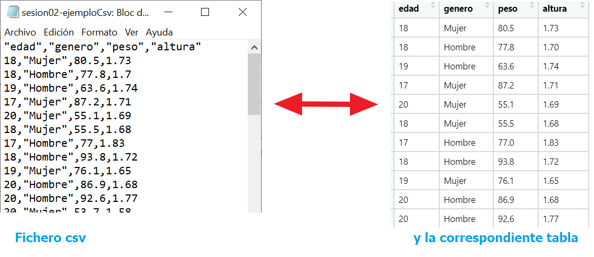
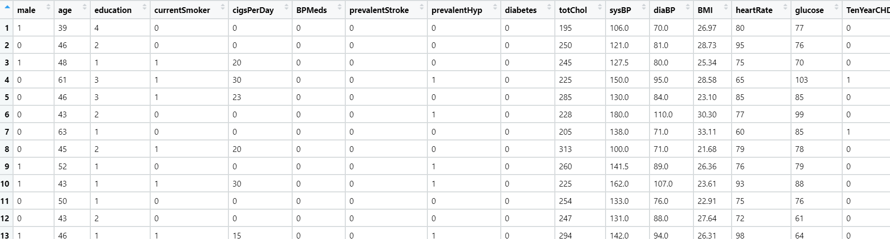
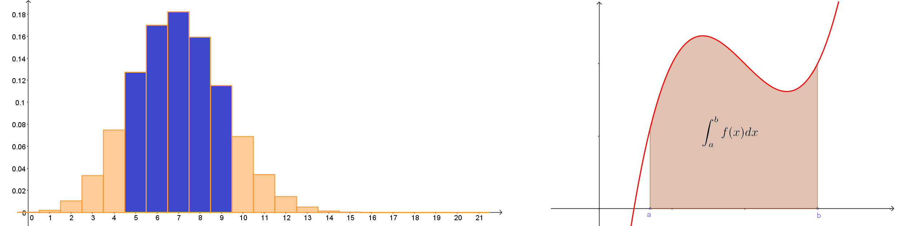
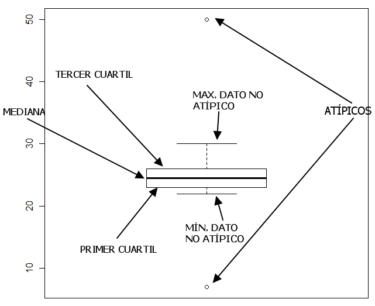

```{r set-options, echo = FALSE, purl=FALSE}
options(width = 60)
library(knitr)
knitr::opts_chunk$set(comment = '', fig.width = 6, fig.height = 6,
                      tidy = TRUE, tidy.opts=list(arrow=TRUE, indent=2))
def.chunk.hook  <- knitr::knit_hooks$get("chunk")
knitr::knit_hooks$set(chunk = function(x, options) {
  x <- def.chunk.hook(x, options)
  ifelse(options$size != "normalsize", paste0("\\", options$size,"\n\n", x, "\n\n \\normalsize"), x)
})

if (grepl(pattern = "cloud", getwd())){
  homeDir = "/cloud/project/"
  } else {
  homeDir = "../"
  }
# figpath = function(figname){
#   paste0(homeDir,"fig/", figname)
# } 
# purl("./Rmd/sesion02.Rmd", "./scripts/sesion02-comandos.R", documentation = 0)

``` 

```{r echo = FALSE}
## title: 'Master en Big Data. Fundamentos  matemáticos  del  análisis  de  datos.'
## author: "Fernando San Segundo"
## subtitle: "Sesión 2: Tipos de Variables y Análisis Exploratorio"
```

---

\begin{center}
\textcolor{red}{\Huge RECUERDA: ANTES DE SEGUIR\\[5mm] EJECUTA GIT PULL EN EL REPOSITORIO\\[5mm] FMAD2122} 
\end{center}

<!-- ---------------------------------------- -->
<!-- ---------------------------------------- -->
# Trabajando con ficheros de datos.
<!-- ---------------------------------------- -->
<!-- ---------------------------------------- -->

+ En la primera sesión hemos usado tablas de datos incorporadas en R (o en librerías). Pero para nuestro trabajo necesitaremos normalmente importar datos procedentes de fuentes externas. Hoy aprenderemos a usar datos almacenados en:
  - ficheros de texto (csv, txt).
  - ficheros Excel
Vamos a ver como leer estos ficheros para usar los datos en R y también veremos como guardar datos desde R en esos formatos. 

${ }$  
    
+ En otros recursos del curso trataremos formas alternativas de acceder a ficheros de otros programas estadísticos ( (SAS, SPSS, etc.) o a datos no almacenados en ficheros (URLs, APIs, bases de datos tipo SQL, Web Scrapping, etc.)  

## Ficheros de tipo csv o txt.

+ El nombre csv proviene de *comma separated values*, valores separados por comas (pero no hay que tomarse el nombre al pie de la letra).

+ Un fichero csv es un fichero de *texto plano* que contiene una tabla de datos. Cada *línea* del fichero contiene una *fila* de la tabla y, dentro de esa fila, los elementos de cada columna de la tabla se separan mediante comas, espacios,  tabuladores, etc. La siguiente figura muestra uno de esos ficheros abierto en el *Bloc de Notas* de Windows y la tabla correspondiente (se muestran las primeras filas).
    ```{r echo = FALSE, comment=NULL, fig.align='center', out.width = "80%", purl=FALSE}
    
    # clase = read.table("./data/sesion02-ejemploCsv.csv", header = TRUE, sep=",")
    ```
  También se usan ficheros txt para almacenar tablas de datos de esta manera.

---

## Ficheros csv con R.

+ Vamos a empezar descargando uno de estos ficheros, llamado `movies.csv` que contiene datos sobre las  [\textcolor{blue}{{películas más taquilleras  entre 2007 y 2011}}](https://gist.githubusercontent.com/tiangechen/b68782efa49a16edaf07dc2cdaa855ea/raw/0c794a9717f18b094eabab2cd6a6b9a226903577/movies.csv). 

+ **¡Recuerda las instrucciones de descarga de la primera sesión!**: 
  - Debes indicarle a RStudio el *Directorio de Trabajo*
  - \textcolor{red}{\textbf{\underline{El fichero descargado debe estar almacenado en la subcarpeta \texttt{data}}}}  del directorio de trabajo.

+ Empieza abriendo ese fichero en un editor de texto (tipo *Bloc de Notas*) para hacer una exploración preliminar. Fíjate en sí existe una *línea especial* en la  cabecera y en el *tipo de separador* (coma, punto y coma, espacio).

+ Para abrir ese fichero con R vamos a empezar usando una función del sistema básico de R:\small
  ```{r comment=NULL, echo=-1}
  # Ficheros csv con R, Lectura ficheros movies
  movies = read.csv(file = "./data/movies.csv", header = TRUE, sep=",")
  ```
  \normalsize Enseguida repetiremos esta operación usando el tidyverse.

+ El resultado del comando básico de R `read.table` es un data.frame. Las opciones de la función son:
    - *file*: el nombre y directorio del fichero relativo (a la carpeta de trabajo).
    - `header`: que puede ser TRUE o FALSE, para indicar si la primera fila del csv contiene los nombres de las variables.
    - `sep`: el carácter usado para separar las columnas de la tabla. 

---

### Repaso de operaciones con data.frames.

+ Recuerda que puedes seleccionar por filas con instrucciones como:
  ```{r echo = -1, eval = FALSE, comment=NULL}
  # Repaso de operaciones con data.frames.
  movies[7, ]
  ```  

+ Y por columnas de forma similar o también por nombre de variable usando `$`:
  ```{r eval = FALSE, comment=NULL}
  tail(movies$Year, 20) # se muestran las 20 últimas
  ```

+ Recuerda asimismo que puedes seleccionar por condiciones. Por ejemplo para ver el género de las películas de 2010 con:
  ```{r  eval = FALSE, comment = NULL}
  movies$Genre[movies$Year == 2010]
  ```
  <!-- También sabemos usar `dplyr` para seleccionar: -->
  <!-- ```{r echo=-1, message=FALSE, results='hide'} -->
  <!-- # Seleccionar usando el tidyverse (dplyr) -->
  <!-- library(tidyverse) -->
  <!-- movies %>%  -->
  <!--   filter(Year == 2010) %>%  -->
  <!--   select(Genre) %>%  -->
  <!--   .[1:20, ]     # ¿Qué hace esta última operación? -->
  <!-- ``` -->

+ **Ejercicio:**  Repite estas operaciones con `dplyr`. Además úsalo para localizar cuál es la película más taquillera. ¿Cuál es el género de esa película?  


## Usando readr para leer y escribir ficheros csv.

+ La librería `readr`, que forma parte del tidyverse, incluye la función `read_csv`, que es muy fácil de usar y más rápida que `read.table` para ficheros grandes. Explora esta tabla como hemos hecho con la primera versión.\small
  ```{r echo=-1, message=FALSE, warning=FALSE}
  # Usando readr para leer y escribir ficheros csv.
  library(tidyverse)
  movies2 <- read_csv("./data/movies.csv")
  ```  
  \normalsize

+ **Ejercicio:** Ejecuta `str(movies2)`. ¿Qué tipo de objeto usa el tidyverse para almacenar tablas en lugar del `data.frame` del R básico?

+ También puedes usar readr para crear ficheros csv a partir de una tabla (por ejemplo un data.frame) en R. El siguiente código genera primero una tabla con tres variables A, B y C y a continuación guarda esa tabla a un fichero csv. Asegúrate de abrir el fichero resultante en un editor de texto para ver el resultado.\small
  ```{r echo=-1, results='hide'}
  # crear ficheros csv a partir de una tabla
  set.seed(2019)
  datos <-  
    data.frame(A = sample(1:100, 10), B = sample(LETTERS, 10), C = rnorm(10))
  head(datos, 2)
  write_csv(datos, file = "./data/sesion02-guardarCsv.csv")
  ```
  \normalsize Las funciones `write.table` y `write.csv` de R básico funcionan de manera parecida. 

## Ficheros Excel

+ Es frecuente encontrarse con ficheros de datos que se han almacenado en alguno de los formatos propios de diferentes versiones de Excel. Descarga para usar como ejemplo \link{http://users.stat.ufl.edu/~winner/data/train_acc_2010.xls}{este fichero} en formato 
xls, que contiene datos sobre accidentes ferroviarios ocurridos en 2010 en los Estados Unidos. Puedes encontrar más detalles sobre el fichero en [\textcolor{blue}{{este documento auxiliar}}](http://users.stat.ufl.edu/~winner/data/train_acc_2010.txt).

+ Para leer esos datos vamos a usar la librería `readxl` (del tidyverse) de esta forma
  ```{r echo=-1}
  # Ficheros Excel
  library(readxl)
  accidentes <- read_excel("./data/train_acc_2010.xls")
  ```
  Puedes leer más sobre `readxl` \link{https://readxl.tidyverse.org}{aquí}. Por ejemplo, para aprender como leer una selección rectangular de filas y columnas concretas de una hoja en particular del fichero Excel.

+ **Ejercicio:** exporta esta tabla de R a un fichero en formato csv llamado `accidentes.csv`. 


---

#### Exportando nuestros datos a Excel

+ Veamos como guardar una tabla de datos de R (`data.frame` o similar) en formato Excel. Empezamos cargando la librería `wrtiexl`. Recuerda que debes instalarla primero si todavía no dispones de ella.
    ```{r}
    library(writexl)
    ```
    Ahora vamos a usarla para exportar a Excel la tabla de datos `iris` (que siempre está disponible como ejemplo en R). Asegúrate siempre de comprobar el directorio de trabajo antes de una operación de este tipo, para saber dónde estás poniendo los datos. 
    ```{r}
    getwd()
    write_xlsx(iris, path = "./data/iris.xlsx")
    ```
    Asegúrate de abrir el fichero con Excel (o Calc) para comprobar el resultado. Después puedes borrarlo de tu carpeta de trabajo con
    ```{r}
    file.remove("./data/iris.xlsx")
    ```
    
<!-- ---------------------------------------- -->
<!-- ---------------------------------------- -->
# Tipos de Variables. 
<!-- ---------------------------------------- -->
<!-- ---------------------------------------- -->

+ Las tablas de datos que hemos leído en los ficheros de la sección previa pueden contener variables de distintos tipos: números enteros, con decimales, fechas, variables binarias de tipo sí/no, hombre/mujer, ubicaciones, etc. Existen muchos tipos de datos distintos, que permiten distintas operaciones con ellos. 

+ En las próximas secciones vamos a conocer las categorías básicas de datos y las formas más adecuadas de describirlos. Como ejemplos iniciales vamos a usar la tabla `mpg` contenida en la librería `tidyverse` y también una tabla con datos relativos a un estudio sobre enfermedades coronarias llevado a cabo en Framingham (UK). Puedes descargar el fichero csv desde [\textcolor{blue}{{este enlace}}](https://raw.githubusercontent.com/fernandosansegundo/MBDFME/master/data/framingham.csv) y leer más detalles sobre el estudio [\textcolor{blue}{{aquí}}.](https://biolincc.nhlbi.nih.gov/media/teachingstudies/FHS_Teaching_Longitudinal_Data_Documentation.pdf?link_time=2019-08-26_14:42:24.487245).

---

+ **Ejercicio:** lee el fichero a una tabla de R llamada fhs (de Framingham Heart Study). Explora esa tabla con las funciones `str` y `glimpse`. Piensa en qué tipo de información contiene cada variable de la tabla. Lee también la documentación sobre `mpg` en [\textcolor{blue}{{este enlace}}](https://ggplot2.tidyverse.org/reference/mpg.html).
```{r echo = FALSE, message=FALSE, fig.align='center', out.width = "95%", purl=FALSE}

```
```{r echo = FALSE, message=FALSE}
# Datos de enfermedades coronarias en Framingham
fhs = read_csv("./data/framingham.csv")
```


## Clasificación inicial.

+ Los datos que han ido apareciendo en nuestros ejemplos se pueden clasificar en:

  - **Datos Cuantitativos (Numéricos):** que a su vez se dividen en **discretos** y **continuos**.  
  - **Datos Cualitativos (Factores)**: que pueden ser o no ordenados.

+ Esta es la clasificación tradicional en muchos cursos de introducción a la Estadística y enseguida vamos a ver ejemplos para entender la diferencia entre estos tipos de datos, Pero queremos subrayar que existen muchos tipos de datos estructurados de uso frecuente que superan esta clasificación tradicional (fechas, imágenes, ficheros de audio o vídeo). 
+ Primero vamos a aprender a analizar variables individuales, por separado, antes de preguntarnos por las relaciones entre ellas. 

## Variable cuantitativa

+ Una *variable cuantitativa* (discreta o continua) es una variable que toma valores numéricos que *además* se han medido en alguna escala que permite interpretarlos y hacer operaciones aritméticas (sumas, productos, etc) con ellos. 

+ Una variable cuantitativa es *discreta* si se mide en una escala de unidades enteras (paso a paso, los valores se miden *contando*). Y la variable *continua* si la escala de medida se puede dividir arbitrariamente (se usan valores decimales). Pero como veremos en ejemplos, la división discreto/continuo también es sutil y se refiere en realidad a la forma en la que *usamos* la variable.

+ Podría pensarse entonces que las variables cuantitativas son las variables numéricas y las cualitativas las no numéricas. La diferencia es, en realidad, un poco más sutil. Una variable es *cualitativa (nominal)* cuando *solo* se utiliza para establecer categorías, para *clasificar*. Podemos *representar* los valores de una de estas variables con números, pero el valor numérico concreto es arbitrario, es una *etiqueta*. Las variables cualitativas nominales también se denominan *factores*

+ **Ejercicio:** Examina las variables  `cty`, `disp`, `class` y `cyl` de la tabla `mpg`. ¿De qué tipo crees que es cada variable?


# Variables cuantitativas discretas.

---

## Tablas de frecuencia absolutas y relativas.

+ La variable `cty` de `mpg` el número de millas por galón que el coche recorre en ciclo urbano (atención: valores más altos indican menor consumo de combustible). Fíjate en que los valores son un número entero de millas. En principio no hay nada que impida dar esos valores con decimales. Pero no es eso lo que se *ha decidido* hacer aquí, sino que se trata como una variable discreta. 

+ El primer paso con una variable discreta como esta es obtener una tabla de frecuencias (absolutas), que nos dirá qué valores toma la variable y cuántas veces toma cada valor. Usando `table` 
  ```{r comment=NULL, echo=-(1:2)}
  # variable discreta, tabla de frecuencia absoluta
  options(width = 100)
  table(mpg$cty)
  ```
 
 + También se puede usar la función `count` de `dplyr` así (se omite el resultado):
    ```{r eval = FALSE, comment=NULL}
    mpg %>%
      count(cty)
    ```

## Tabla de frecuencias relativas.

+ A menudo, y especialmente cuando se usan para comparaciones, nos interesa más saber la fracción del total que corresponde a cada uno de los valores de una variable discreta. Cuando esas fracciones se expresan como *tanto por uno* obtenemos las frecuencias relativas, que es fácil convertir en porcentajes.

+ Vamos a obtener una tabla de frecuencias relativas con R básico (para mejorar la presentación elegimos el número de cifras significativas con `signif`):\small
  ```{r echo = -(1:2)}
  # y tabla de frecuencia relativa
  options(width = 70)
  signif(prop.table(table(mpg$cty)), 2)
  ```
  \normalsize

+ Se puede usar `dplyr` pero en este caso es más complicado que con el R básico.
  ```{r eval = FALSE, comment=NULL}
        mpg %>% 
          count(cty) %>%
            mutate(cty, relFreq = prop.table(n), n=NULL) 
  ```
  Ejecuta el código por fases para entenderlo y analizar el papel de cada función y argumento.

---

### Propiedades de las frecuencias relativas.

+ Las frecuencias relativas suman siempre 1. Compruébalo:\small
  ```{r echo=-1, results= 'hide'}
  # suma frecuencias relativas
  sum(prop.table(table(mpg$cty)))
  ```
  \normalsize  
  **Ejercicio:** Piensa cómo hacer esto en `dplyr`.

+ Además las frecuencias relativas están relacionadas con la idea de *probabilidad empírica*. Es decir, si elegimos aleatoriamente un valor de la variable `cty` y repetimos esa elección muchas veces, la probabilidad de cada uno de los distintos valores es la frecuencia relativa que hemos calculado. 


### Frecuencias acumuladas.

+ Las *frecuencias acumuladas* se usan con variables discretas para responder a la pregunta *"¿cuántos valores hay que sean menores o iguales que ...?"* En R se obtienen con:\small
  ```{r echo=-1, results = 'hide'}
  # Frecuencias acumuladas.
  cumsum(table(mpg$cty))
  ```
  \scriptsize
  ```{r echo=FALSE, purl = FALSE}
  options(width = 80)
  cumsum(table(mpg$cty))
  ```
  \normalsize Por ejemplo, en la tabla hay `r cumsum(table(mpg$cty))[7]` valores menores o iguales que `r (sort(unique(mpg$cty)))[7]`.  **Ejercicio:** (1) con `mutate` y una función adecuada haz esto en `dplyr`. (2) ¿para qué sirven las frecuencias *acumuladas relativas*? ¿son distintas de las *relativas acumuladas*?

# Variables cuantitativas continuas,

## Discreto vs continuo.

+ Las tablas de frecuencias por valores no son útiles cuando hay muchos valores distintos. La tabla de frecuencias de `cty` ya era un poco excesiva. Pero  si tratamos de calcular una tabla de frecuencia para la variable `age` de la tabla `fhs` 
  ```{r eval = FALSE, comment=NULL, echo = -1}
  # Error:  tabla de frecuencia de una v. continua 
  table(fhs$totChol)
  ```
  puedes comprobar que la tabla que se obtiene no es una representación útil de la información. 
  
+ En muchos ejemplos como este las diferencias entre valores consecutivos no son relevantes. Las preguntas relevantes pasan a ser las que se refieren a intervalos de valores. Para agrupar los valores en intervalos en R podemos usar la función `cut`. 
  ```{r size = "scriptsize", echo = -1}
  # Creando intervalos con cut
  cholLevels = cut(fhs$totChol, breaks = 10)
  head(cholLevels)
  ```

+ La respuesta de R nos indica que ha dividido el *recorrido* de la variable (de mínimo a máximo) en 10 intervalos semiabiertos de igual longitud. El primero incluye los valores entre 106 y 166, hasta el último que incluye los valores de 637 a 697. La variable `cholLevels` que hemos fabricado es un *factor ordenado*. Veremos más ejemplos cuando aprendamos más sobre factores.  

---

+ Con las variables puramente continuas no suele haber demasiado dudas a la hora de reconocerlas. Pero con las variables discretas el problema puede ser más complicado, porque depende esencialmente del número de valores distintos que tome la variable. Al final, en muchos casos, tratar a una variable como discreta o continua es decisión de quien realiza el análisis. 
```{r echo = FALSE, purl=FALSE}
options(width = 60)
```


+ Por ejemplo, la tabla de frecuencias de la variable agrupada `cholLevels` es mucho más informativa que la de la variable original `totChol`. Eso nos indica que seguramente es mejor tratar a `cholLevels` como una variable continua aunque sus valores sean enteros,\small
  ```{r}
  table(cholLevels)
  ```
  \normalsize
  
+ En cualquier caso si una variable cuantitativa discreta solo toma cinco o menos valores en general es beneficioso pensar en ella como un *factor ordenado*, que discutiremos más adelante. 


## Histogramas. 

+ Una forma común de representar gráficamente la tabla de frecuencias de una variable discreta que tome más de cinco valores distintos es mediante un *histograma*, que es un diagrama de barras. 

+ Lo dibujmos con ggplot, eligiendo primero los puntos de corte con `cut`:\small
  ```{r echo=TRUE, message=FALSE, fig.align='center', out.width = "30%"}
  # Histograma con ggplot2
  cortes = seq(min(mpg$cty), max(mpg$cty), length.out = 11)
  ggplot(data = mpg) + 
    geom_histogram(mapping = aes(cty), breaks = cortes, 
                   fill = "orange", color="black")
  ```
  \normalsize Fíjate en que el eje horizontal contiene los valores de la variable mientras que el eje vertical muestra las frecuencias.

---


+ **Ejercicios:** 
   - ¿Cómo se usa la función `seq` que hemos empleado para fabricar los `cortes` del histograma? Averigua lo que hace la opción `by` de esa función `seq`. 
   - Fíjate en las opciones de color de `geom_histogram` y busca información sobre nombres de colores en R.
   - Dibuja un histograma de `mpg$cyl`. ¿Por qué ocurre esto?
   - Consulta \link{http://www.sthda.com/english/wiki/histogram-and-density-plots-r-base-graphs}{este enlace} para ver cómo se dibujan histogramas en R básico.
  
${}$

${}$
  
### ¿Cuántos intervalos se deben usar en la construcción de un histograma?

+  No hay una regla fija. Aunque R y el resto de programas utilizan diversos algoritmos para determinar ese número, lo cierto es que la respuesta depende mucho de los datos concretos con los que trabajamos. Por eso normalmente es necesario experimentar un poco con diversos valores. En cualquier caso es *desaconsejable* utilizar menos de cinco intervalos (o más que $\sqrt{n}$, siendo $n$ el número de datos).
  

## Curvas de densidad. 

+ La *curva de densidad* es un tipo de diagrama alternativo al histograma. Por ejemplo, para los datos de `cty` que venimos usando se obtiene con:\small
  ```{r message=FALSE, fig.align='center', out.width = "35%", echo = -1}
  # Curvas de densidad con ggplot
  ggplot(mpg) + 
    geom_density(mapping = aes(cty), color="red", fill="lightblue", size=1.5)
  ```
  El eje horizontal contiene los valores de la variable. La altura de la curva indica la frecuencia de los valores. 
  
+ **Ejercicio:** Usando los datos de `auto2` dibuja la curva de densidad de cada una de las variables  `length`, `price`, `displacement` y `rep78`.   

+ **¿Curvas de densidad o histogramas?** ¡Ambos! En general, cuando analicemos un conjunto de datos es mejor empezar en la fase de exploración dibujando muchos gráficos. Al presentar nuestras conclusiones seleccionaremos aquellos que ilustren mejor la historia que queremos contar.
 

## Relación entre curvas de densidad e histogramas. 

+ En muestras de tamaño grande y usando una partición fina en subintervalos la curva de densidad se ajusta bastante a la forma o perfil del histograma como ilustra este ejemplo. Esa *forma* es lo que llamaremos **distribución** de la variable.\small
  ```{r echo=-1, message=FALSE, fig.align='center', out.width = "25%"}
  # Relación entre curvas de densidad e histogramas.
  ggplot(mpg, aes(x = cty)) + 
    geom_histogram(aes(y=stat(density)), 
                   breaks = cortes, fill = "orange", color="black")  + 
    geom_density(color="red", size=1.5)
  ```
  \normalsize Este fenómeno es una manifestación más de esa separación borrosa que existe entre las variables discretas con muchos valores (el histograma es una representación discreta) y las variables continuas (la curva de densidad es una representación continua).  

+ **Ejercicio:** Para entender `stat(density)` lee esta sección de \link{https://r4ds.had.co.nz/data-visualisation.html?\#statistical-transformations}{R4DS}
  
# Distribuciones.

---

+ En un ejercicio previo proponíamos dibujar las curvas de densidad de varias variables de la tabla `auto2`. Si lo haces obtendrás curvas como estas:
  ```{r echo = FALSE, message=FALSE, fig.align='center', out.width = "40%"}
  # Curvas de densidad de auto2, p. 4
  require(gridExtra)
  require(tidyverse)
  require(haven)
  auto2 = read_dta("./data/auto2.dta")
  p1 = ggplot(auto2) + 
    geom_density(mapping = aes(price), color="red", fill="lightblue", size=1.5)
  
  p2 = ggplot(auto2) + 
    geom_density(mapping = aes(trunk), color="red", fill="lightblue", size=1.5)
  
  p3 = ggplot(auto2) + 
    geom_density(mapping = aes(weight), color="red", fill="lightblue", size=1.5)
  
  p4 = ggplot(auto2) + 
    geom_density(mapping = aes(gear_ratio), color="red", fill="lightblue", size=1.5)
  
  grid.arrange(p1, p2, p3, p4, nrow = 2)
  ```
  **Mira el código de esta sesión** para ver como dibujar esta *"tabla de figuras"*.
  
+ Cada una de esas curvas muestra una *distribución de los valores*, que es una representación de la forma en la que se reparten los datos entre los valores posibles. Las distribuciones van a jugar un papel central en las próximas sesiones, así que vamos a desarrollar un poco de lenguaje para referirnos a ellas.

## Distribuciones unimodales y multimodales. 

+ Una distribución que presenta un único máximo se denomina *unimodal*
  ```{r echo = FALSE, message=FALSE, fig.align='center', out.width = "25%"}
  # Distribución unimodal p. 5
  curve(dchisq(x, df=6), from = 0, to = 16, ylab="density", col="red", lwd=4, main="")
  ```

+ Mientas que una distribución con dos máximos locales claramente definidos como la de la figura se denomina *bimodal* (o *multimodal* cuando son más de dos).
  ```{r echo = FALSE, message=FALSE, fig.align='center', out.width = "25%"}
  # Distribución bimodal p. 5
  set.seed(2014)
  N = 10000
  mu1 = 12
  sigma1 = 0.7
  mu2 = 14
  sigma2 = 0.5
  n1 = rnorm(N, mean=mu1, sd=sigma1)
  n2 = rnorm(N, mean=mu2, sd=sigma2)
  # mezcla de normales
  mezcla = c (n1,  n2)
  plot(density(mezcla), col="red", lwd=4, main="")
  ```
+ La mayoría de las distribuciones con las que vamos a trabajar serán unimodales. 


## Distribuciones asimétricas.

+ Otra característica de las distribuciones en la que nos vamos a fijar a menudo es su simetría. Fíjate en que es la *cola* más larga de la distribución la que da nombre a la asimetría. En inglés esta característica se denomina [\textcolor{blue}{{skewness}}](https://en.wikipedia.org/wiki/Skewness)
```{r echo = FALSE, message=FALSE, fig.align='center', out.width = "80%"}
# Ilustrando el concepto de skewness p.5
par(mfrow = c(3, 1))
curve(dchisq(x, df=6), from = 0, to = 16, 
      ylab="density", col="blue", lwd=4, main="Asimétrica a derecha", cex.main=2)  
curve(dnorm, from = -3, to = 3, 
      ylab="density", col="black", lwd=4, main="Simétrica", cex.main=2)  
curve(dchisq(15-x, df=6), from = 0, to = 16, 
      ylab="density", col="red", lwd=4, main="Asimétrica a izquierda", cex.main=2)  
par(mfrow = c(1, 1))
```

## Distribuciones y cálculo de probabilidad. Discusión informal. 

+ La distribución de una variable discreta con muchos valores distintos se representa adecuadamente mediante un histograma. Si las alturas de las barras del histograma representan frecuencias relativas entonces la probabilidad de que un valor elegido al azar caiga en el intervalo $[a, b]$ se obtiene sumando el área de todas las barras desde $a$ hasta $b$, como se ilustra en la parte izquierda de la figura.
  
+ Por su parte, La distribución de una variable continua se representa mediante una curva de densidad. Y entonces la probabilidad de que un valor elegido al azar caiga en el intervalo $[a, b]$ se obtiene calculando (con una integral) el área bajo la curva desde $a$ hasta $b$
  ```{r echo = FALSE, message=FALSE, fig.align='center', out.width = "90%", purl=FALSE}
  
  ```

+ Don't panic! No hace falta que sepas calcular integrales. Pero es importante entender que el cálculo de probabilidades está estrechamente relacionado con el cálculo de áreas.

# Valores centrales, de posición y dispersión.

## La media aritmética

+ Al trabajar con variables cuantitativas muchas veces trataremos de elegir un *valor central*. Es decir, un valor que sea *representativo* de los valores que toma la variable. Un buen valor central debería ser la respuesta a esta pregunta: *"si elijo un valor de la variable al azar ¿lo más probable es que se parezca a ...?"*  

+ El valor central más conocido es la *media aritmética*. Dados $n$ números $x_1, x_2, \ldots, x_n$ su media aritmética es:
$$
\bar x = \dfrac{x_1 + x_2 + \cdots + x_n}{n} = \dfrac{\displaystyle\sum_{i = 1}^n x_i}{n}
$$

+ En R se utiliza la función `mean` para calcular la media de los valores de un vector numérico. Con este código vamos a elegir 20 números al azar entre 0 y 100 (con remplazamiento). Recuerda que los paréntesis sirven para que R muestre el resultado.
  ```{r echo = -(1:2), size="scriptsize"}
  # Media aritmética, p. 9
  set.seed(2019) # no ejecutes esta línea si quieres ver otras muestras
  (muestra = sample(0:100, size = 20, replace = TRUE))
  (media = mean(muestra))
  ```

+ **Ejercicio:** Repítelo varias veces y mira las medias que obtienes. ¡Al pensar en esas medias estás empezando a hacer Estadística!

## La media y los valores atípicos. 

+ La media aritmética se usa mucho porque su definición matemática es muy sencilla. Pero tiene un problema: su valor se ve muy afectado por la presencia de valores anormalmente grandes o pequeños de la variable, los llamados *valores atípicos* (que muy pronto vamos a definir con más rigor).

+ Por ejemplo, si elegimos 99 números al azar de 0 a 100, su media es parecida a 50 como cabría esperar.
  ```{r echo = -1}
  # Valores atípicos, p. 10
  set.seed(2019)
  muestra = sample(0:100, size = 99, replace = TRUE) 
  (media = mean(muestra))
  ```
  Pero si ahora añadimos un único valor igual a 1000 y volvemos a calcular la media:
  ```{r}
  muestra2 = c(muestra, 1000)
  (media2 = mean(muestra2))
  ```
  Las dos muestras son esencialmente idénticas, así que al elegir un valor representativo (en el sentido probabilístico que hemos discutido) nos gustaría obtener respuestas mucho más parecidas. Pero como ilustra este ejemplo, la media se ve muy afectada por ese único valor atípico.
  
  
## La mediana.

+ Para paliar este problema podemos usar la *mediana* como sustituto o alternativa a la media. La mediana de un conjunto de valores se define con esta receta: se ordenan los números de menor a mayor y se toma el valor que queda en el centro (si hay una cantidad impar de valores; si son pares se promedian los dos valores centrales). 

+ Por ejemplo, para calcular la mediana de estos 17 valores:
  ```{r echo  =-1}
  # Mediana, p. 11
  set.seed(2019)
  (valores = sample(1:100, 17, replace = TRUE))
  ```
  los ordenamos y tomamos el valor central
  ```{r results='hold'}
  (ordenados = sort(valores))
  (mediana = ordenados[9])
  ```
  Aunque lo mejor, claro, es usar la función de R:
  ```{r}
  median(valores)
  ```

## Más detalles sobre la mediana.  

+ Por su propia construcción (en términos de posiciones/rangos y no de tamaños) debería estar claro que la mediana no se ve muy afectada por la presencia de valores atípicos. Si volvemos a la muestra de 99 valores que construimos antes y miramos su mediana antes y después de añadir el valor atípico 1000 se obtiene:
  ```{r}
  median(muestra)
  median(muestra2)
  ```
  En este ejemplo concreto la mediana no se ve afectada en absoluto por ese valor.
  
+ Y entonces, ¿por qué no se usa siempre la mediana en lugar de la media aritmética? Pues porque la definición de la mediana utiliza unas matemáticas bastante más complicadas que la media aritmética. Gracias al ordenador la importancia  de los métodos basados en la mediana ha ido aumentado. Pero los métodos clásicos que usan la media aritmética siguen siendo los más comunes.  

+ En cualquier caso, recomendamos explorar bien los datos, identificar posibles valores atípicos y comprobar si la media y la mediana son parecidas.
  
## Otros valores de posición. Recorrido. Función summary.

+ **Cuartiles y percentiles.** La mediana se puede pensar como el valor que es mayor o igual que el 50% de los valores de nuestro conjunto de datos. De la misma forma se definen el *primer y tercer cuartil* como los valores que son mayores o iguales respectivamente que el 25% y el 75% de los valores. Esto se generaliza a la noción de percentil. El percentil 43, por ejemplo, es un valor que deja por debajo al 43% de los valores. En R ese percentil se calcula para una variable como `cty` de `mpg` mediante:\small
    ```{r echo=-1}
    # Valores de posición, p. 13
    quantile(mpg$cty, probs = 0.43)
    ```
    \normalsize

+ El *recorrido* (del inglés *range*) de un conjunto de valores es el intervalo que va del valor mínimo al máximo. Cuidado: en español se usa a menudo erróneamente *rango*. Pero los rangos en Estadística son otra cosa (que corresponde a *rank* en inglés).

+ Una manera sencilla de obtener varias de estas medidas de posición es usando `summary`\small
  ```{r echo=-1}
  # Summary, p. 13
  summary(mpg$cty)
  ```
  \normalsize

+ **Ejercicio.** Prueba a aplicar la función a todo el `data.frame` con `summary(mpg)`. Ejecuta también `str(mpg)` y `glimpse(mpg)`.


## Dispersión

+ La siguiente figura muestra dos conjuntos de valores, ambas con media 0 y el mismo número de puntos. Las coordenadas verticales de los puntos se han modificado con un poco de *ruido* para hacer mejorar la visualización de ambos conjuntos. Puedes mirar el código de esta sesión para ver como se ha construido esta figura. 
  ```{r echo = FALSE, message=FALSE, warning=FALSE, fig.align='center', out.width = "50%"}
  # El gráfico para ilustrar la idea de dispersión
  library(tidyverse)
  set.seed(2019)
  n = 400
  library(MASS)
  muestra1 = mvrnorm(n, mu = 0, Sigma = 1, empirical = TRUE)
  min1 = min(muestra1)
  max1 = max(muestra1)
  muestra1 = c(muestra1[-(1:10)], runif(10, 2 * min1, 2 * max1))
  muestra2 = runif(n, 2 * min1, 2 * max1)
  muestras = 
    data.frame(x = c(muestra1, muestra2), tipo = gl(2, n))
  
  ggplot(data = muestras) +
    geom_point(mapping = aes(tipo, y = x, color = tipo), 
               position =  position_jitter(w = 0.05, h = 0)) + 
    coord_flip()
  ```

+ ¿Qué diferencia a estos dos conjuntos de datos?

---

### Dispersión en los diagramas de densidad.

+ En esta otra figura puedes ver juntas las curvas de densidad de esos dos conjuntos de datos. 
  ```{r echo = FALSE, message=FALSE, warning=FALSE, fig.align='center', out.width = "50%"}
  # y la versión en curvas de densidad de la siguiente página
  plot(density(muestra1, adjust = 2), col="blue", 
       xlim = c(-12, 12), lwd = 3, main = "", xlab= "")
  lines(density(muestra2, adjust = 2), col="red", lwd = 3, sub="")
  ```
  Este diagrama ilustra lo que la mostraban las nubes de puntos de la figura previa: los puntos de un conjunto están más agrupados en torno al centro que los del otro conjunto. La diferencia entre ambos conjuntos está en la **dispersión**.  

+ La idea intuitiva de la dispersión está clara: se trata de medir como de agrupados en torno al centro están los valores. ¿Como se define rigurosamente? Al igual que sucedía con los valores centrales (media vs mediana) hay varias posibilidades.


## Recorrido intercuartílico. Valores atípicos.

+ La primera forma de medir la dispersión que vamos a ver se basa en observar la diferencia entre los cuartiles tercero (75%) y primero (25%). Ese número es el *recorrido intercuartílico*; un intervalo de longitud IQR desde el primer hasta el tercer cuartil contiene siempre al 50% central de los valores. En R se calcula con:
  ```{r echo=-1}
  # Recorrido intercuartílico, p. 16
  IQR(mpg$cty)
  ```
  Fíjate en que es precisamente la diferencia entre esos dos cuartiles. 
  ```{r size="small"}
  summary(mpg$cty)
  ```

+ El IQR nos permite dar una definición formal de los **valores atípicos:**  son aquellos valores que superan (tercer cuartil) + 1.5 $\cdot$ IQR o quedan por debajo de (primer cuartil) - 1.5 $\cdot$ IQR. Por ejemplo, en `mpg$cty` será atípico cualquier valor fuera de este intervalo
  ```{r size="small"}
  unname(quantile(mpg$cty, probs = c(1/4, 3/4)) + c(-1, 1) * 1.5 * IQR(mpg$cty))
  ```

+ **Ejercicio:** Mira el código de esta sesión y calcula el IQR de los dos conjuntos de datos de las páginas previas.


## Boxplots 

+ El *boxplot* o diagrama de caja y bigotes (box and whiskers) es una forma de representar gráficamente estas medidas de posición. La estructura de un boxplot es la que se describe en esta figura:
```{r echo = FALSE, comment=NULL, fig.align='center', out.width = "60%", purl=FALSE}

```

## Boxplots con R básico.

+ Dibujar un boxplot con R básico es muy sencillo. Por ejemplo, para la variable `cty`:
  ```{r echo=-1, comment=NULL, fig.align='center', out.width = "30%"}
  # Boxplot con R básico p. 19
  bxp_cty = boxplot(mpg$cty, col="orange")
  ```
  
+ Además al darle un nombre al boxplot podemos usar ese nombre para acceder a varios componentes del boxplot. Por ejemplo los valores atípicos en el vector de datos:
  ```{r size="small"}
  bxp_cty$out
  ```

+ **Ejercicio:** ¿Cuáles son las *posiciones que ocupan* los valores atípicos de esta variable? Además haz un boxplot de `speed` en `accidentes` y busca en la ayuda del boxplot como dibujar el gráfico sin los valores atípicos.

---

## Boxplot con ggplot

+ En este caso usamos:
    ```{r echo=-1, comment=NULL, fig.align='center', out.width = "45%"}
    # Boxplot y violinplot con R básico p. 20
    ggplot(mpg) + 
      geom_boxplot(mapping = aes(y = cty), fill="orange")
    ```
    A diferencia de lo que sucede con el boxplot de R básico, ggplot no proporciona una forma directa de localizar los posibles valores atípicos. 

## Boxplot con datos y violinplots. 

+ Aunque los boxplots son muy útiles y se usan mucho, tienen sus limitaciones. La principal de ellas es que no muestran la distribución subyacente de valores (¡la *forma*!). Hay dos formas de combatir ese problema:
  - incorporando los valores al gráfico
  - usando un *violinplot* que es básicamente un boxplot con curvas de densidad añadidas.

+ Esos dos remedios se pueden aplicar por separado o combinados como hemos hecho en este gráfico de ggplot:
  ```{r echo=TRUE, comment=NULL, fig.align='center', out.width = "30%", size="tiny"}
  ggplot(mpg) + 
    geom_violin(mapping = aes(x=0, y = cty)) +
    scale_x_discrete(breaks = c()) +
    geom_boxplot(mapping = aes(y = cty), fill="green") +
    geom_jitter(aes(x=0, y = cty), 
                position = position_jitter(w=0.05, h= 0), col="blue")
  ```

## Desviación absoluta mediana

+ Además del rango intercuartílico se usan otras medidas de dispersión. Las más comunes están basadas en la idea de medir la *desviación absoluta* de cada dato individual con respecto a un valor central. Si los datos son $x_1, x_2, \cdots, x_n$ y el valor central (puede ser la media o la mediana) es $c$ entonces las desviaciones absolutas son:
$$
d_1 = |x_1 - c|,\quad d_2 = |x_2 - c|,\quad\cdots\quad d_n = |x_n - c|
$$
Usamos valores absolutos para evitar que las desviaciones por exceso compensen a las desviaciones por defecto. Aunque el valor absoluto es complicado...

+ Para obtener una medida de dispersión buscamos un valor representativo (valor central) de las desviaciones absolutas. Por ejemplo, la mediana de las desviaciones absolutas respecto de la mediana (usando $c$ igual a la mediana de los datos). Este valor es la **desviación absoluta mediana (MAD)**, que en R se calcula así:\small
    ```{r echo = -1}
    # Desviación absoluta mediana p. 21
    library(readxl)
    accidentes = read_excel("./data/train_acc_2010.xls")
    mad(accidentes$Speed, constant = 1)
    ```
    \normalsize

+ **Ejercicio:** calcula este valor a partir de los datos usando `median`. Mira lo que sucede si quitas la opción `constant = 1`. Lee la ayuda de `mad` y [\textcolor{blue}{{esta página}}](https://en.wikipedia.org/wiki/Median_absolute_deviation).

+ **Ejercicio:**  calcula `mean(accidentes$Speed - mean(accidentes$Speed))`. Cambia de variable y de tabla y repite el cálculo. ¿Por qué pasa esto?

## Varianza y desviación típica (definición poblacional).

+ Usar los valores IQR o MAD como medidas de dispersión tiene inconvenientes similares a los que planteamos al comparar media y mediana. Las matemáticas de medianas y valores absolutos son complicadas y los resultados teóricos asociadas son más difíciles. Por esa razón tradicionalmente la Estadística ha usado una medida de dispersión basada en la media y con matemáticas más simples.

+ Dados los valores numéricos $x_1, x_2, \cdots, x_n$ su **varianza (en sentido poblacional)** es la *media de las desviaciones cuadráticas respecto de la media aritmética* $\bar x$:
$$
\sigma^2_x =
\dfrac{\displaystyle\sum_{i=1}^n (x_i-\bar x)^2}{n}
$$
y la **desviación típica (también poblacional)** es la raíz cuadrada de la varianza:
$$
\sigma_x = \sqrt{\sigma^2_x} = 
\sqrt{\dfrac{\sum_{i=1}^n (x_i-\bar x)^2}{n}}
$$
Elevamos al cuadrado para conseguir un efecto similar al valor absoluto, pero usando una función derivable. Pero al hacerlo cambiamos las unidades y tenemos que tomar raíz cuadrada para obtener la dispersión en las unidades originales del problema. 
 
## Varianza y desviación típica muestrales.

+ Al introducir la varianza y desviación típica les hemos puesto el apellido de *poblacionales*. Y tal vez te hayas dado cuenta de que no hemos dicho como calcular esos valores en R. 

+ La razón para hacer esto empezará a quedar más clara en las próximas sesiones y tiene que ver con la esencia misma de la Estadística. La misión fundamental de la Estadística se puede resumir en **obtener información fiable sobre una población a partir de muestras.** En particular, para obtener información sobre la media y la dispersión en la población usaremos la media y la dispersión en la muestra. Y ese es el problema: usar en la muestra la misma fórmula de la varianza que en la población *no funciona bien para averiguar la varianza de la población*. 

+ El remedio es sencillo, afortunadamente. Hay que usar en la muestra las fórmulas *muestrales* para la varianza y desviación típica:
$$
S^2_x =
\dfrac{\displaystyle\sum_{i=1}^n (x_i-\bar x)^2}{\textcolor{red}{n - 1}}
\qquad\qquad
s_x = \sqrt{s^2_x} = 
\sqrt{\dfrac{\sum_{i=1}^n (x_i-\bar x)^2}{\textcolor{red}{n - 1}}}
$$
como ves, la diferencia estriba en que dividimos por $n-1$ en lugar de $n$, siendo $n$ el **tamaño de la muestra** (no el de la población).

## Las funciones var y sd.

+ Para calcular la varianza muestral en R usamos `var`:
  ```{r echo = -1}
  # Varianza y desviación típica p. 24
  var(mpg$displ)
  ```
puedes comprobar que esto es lo mismo que:
  ```{r}
  n = length(mpg$displ)
  media = mean(mpg$displ)
  sum((mpg$displ - media)^2) / (n - 1 )
  ```

+ Y para calcular la desviación típica muestral usamos `sd` (de *standard deviation*):
  ```{r}
  sd(mpg$displ)
  ```
  puedes comprobar que esto es lo mismo que:
  ```{r}
  sqrt(var(mpg$displ))
  ```

# Factores.

## Tablas de frecuencia y terminología para factores. 

+ Hasta ahora hemos centrado la discusión en variables cuantitativas, con valores numéricos. Vamos a tratar aquí muy brevemente las variables cualitativas o factores. Habrá muchas ocasiones en las próximas sesiones de practicar su uso. 

+ Al trabajar con factores sigue teniendo sentido usar tablas de frecuencias absolutas y relativas (pero no acumuladas, en general):
  ```{r echo=-1}
  # Factores p. 26
  table(accidentes$TrkType)
  prop.table(table(accidentes$TrkType))
  ```

+ **¡Con factores genéricos los valores centrales o la dispersión no tienen sentido!**
  
+ Los distintos valores de un factor se suelen llamar *niveles (levels)* del factor. Un factor *dicotómico* (o binario) tiene dos niveles; es decir, solo toma dos valores distintos. Si toma más de dos valores el factor es *politómico*. El nivel más frecuente es la *moda* del factor.

## Operaciones básicas con factores.

+ Podemos crear un factor a partir de un vector de strings con la función `factor`:
  \small
    ```{r echo=-1}
    options(width = 70)
    (ardeida = factor(c("martinete", "garzaReal", "avetorillo", "garzaReal",
                        "cangrejera", "martinete", "martinete"), ))
    ```
 \normalsize Dos detalles sobre la salida: fíjate en la ausencia de comillas y en que el orden de los niveles es alfabético. Si quieres otro orden (por ejemplo para las tablas de frecuencia) puedes hacerlo explícito:
  \small
    ```{r echo=-1}
    options(width = 70)
    (ardeida = factor(c("martinete", "garzaReal", "avetorillo", "garzaReal",
                      "cangrejera", "martinete", "martinete"), 
    levels = c("garzaReal", "martinete",  "cangrejera", "avetorillo")))  
    ```
\normalsize

+ El factor puede ser *ordenado* si además incorporamos la opción `ordered = TRUE`. *No se debe confundir con el uso de levels* para fijar un orden "estético"  de los niveles. En un factor ordenado el orden aporta información *relevante* sobre los niveles.


## Más funciones que generan factores

+ Ya hemos visto que el resultado de `cut` es un factor ordenado cuyos niveles son los intervalos en que se divide el recorrido de la variable.

+ La función `gl` sirve para generar factores a medida y es un complemento para otras funciones como `rep`. Un ejemplo en el que fabricamos un factor con tres niveles y 4 repeticiones: 
\small
    ```{r echo=-(1:2)}
    ## Más funciones que generan factores
    options(width = 70)
    gl(n = 3, k = 4, labels = c("piedra", "papel", "tijera"))
    ```
\normalsize  

+ A veces, por cuestiones de diseño del experimento o del conjunto de datos, querremos que los niveles del factor aparezcan intercalados.
\small
    ```{r}
    gl(n = 3, k=1, length = 30, labels = c("piedra", "papel", "tijera"))
    ```
\normalsize

+ Puedes consultar el Capítulo 7 de [@Boehmke2016], el \link{https://r4ds.had.co.nz/factors.html}{Capítulo 12 (15 en la versión online)} de [@Wickham2016], o el Capítulo 6 de [@Matloff2011].
  

## Gráficos para factores: diagramas de barras.

+ El diagrama más simple y a menudo el más efectivo para representar la tabla de frecuencias de los niveles de un factor es el diagrama de barras: 
    ```{r echo=-1, message=FALSE, fig.align='center', out.width = "45%", size="scriptsize"}
    # Gráficos para factores
    library(viridisLite)
    ggplot(accidentes) + 
      geom_bar(mapping = aes(x = TrkType), fill= viridis(5))
    ```
  
+ **Se desaconseja** el uso de diagramas de tarta (*piecharts* en inglés).

## Factores dicotómicos: variables binarias (de Bernouilli). 

+ Un factor dicotómico solo tiene dos niveles (valores). Esos valores se pueden representar como sí/no, cierto/falso, éxito/fallo, etc. Los factores dicotómicos también se llaman a menudo variables binarias o de Bernouilli. Los factores con más de dos niveles se llaman *politómicos*.

+ *Media como proporción.* Si pensamos en los niveles de un factor binario como cierto/falso, entonces al igual que hace R podemos identificar cierto/falso con 1/0. Esta representación numérica  tiene una ventaja importante. Aunque hemos dicho que los valores centrales no tienen sentido en factores genéricos, en este caso concreto la media aritmética de un vector de unos y ceros *mide la proporción* de valores iguales a 1. 

+ Veamos un ejemplo. La variable `male` de la tabla `fhs` es un factor binario que vale 1 si el paciente es un hombre y 0 si es una mujer. Para averiguar la proporción de hombres en ese estudio basta con hacer:
  ```{r echo=-1, message=FALSE}
  # Factores dicotómicos
  fhs = read_csv("./data/framingham.csv")
  mean(fhs$male)
  ```
  Aproximadamente el `r signif(100 * mean(fhs$male), 2)`% de los pacientes son hombres.   
  
  
  
## Referencias para la sesión

**Enlaces**

```{r echo = FALSE, purl=FALSE, message=FALSE, error=FALSE}
sessionName = "sesion02"
RmdName = paste0(sessionName,".Rmd")
ScriptName = paste0(sessionName, "-comandos.R")
lnkScriptGitHub = paste0("https://raw.githubusercontent.com/fernandosansegundo/MBDFME/master/scripts/", ScriptName)
```
```{r eval=FALSE, echo=FALSE, error=FALSE, message=FALSE, purl=FALSE}
sessionName = "sesion02"
RmdName = paste0(sessionName,".Rmd")
ScriptName = paste0(sessionName, "-comandos.R")
lnkScriptGitHub = paste0("https://raw.githubusercontent.com/mbdfmad/fmad2122/master/scripts/", ScriptName)
knitr::purl(RmdName, output = paste0("./scripts/", ScriptName), documentation = 0)
```


```{r echo=FALSE, eval=FALSE, comment=NULL, purl=FALSE}
download.file(lnkScriptGitHub, destfile = paste0(getwd(),"/", ScriptName))
```


- \link{`r lnkScriptGitHub`}{Código de esta sesión}

+ [\textcolor{blue}{{Cookbook for R}}](http://www.cookbook-r.com/)

+ [\textcolor{blue}{{Página web de ggplot2}}](https://ggplot2.tidyverse.org/index.html), que contiene el 
[\textcolor{blue}{{resumen (chuleta)}}](https://github.com/rstudio/cheatsheets/raw/master/data-visualization-2.1.pdf)  elaborado por RStudio.

+ [\textcolor{blue}{{Resumen sobre importación de datos a R (chuleta)}}](https://github.com/rstudio/cheatsheets/raw/master/data-import.pdf)  elaborado por RStudio.

+ Web del libro [\textcolor{blue}{{PostData}}](http://www.postdata-statistics.com) y los tutoriales asociados. Para esta sesión se recomienda el Capítulo 2. 


**Bibliografía**
