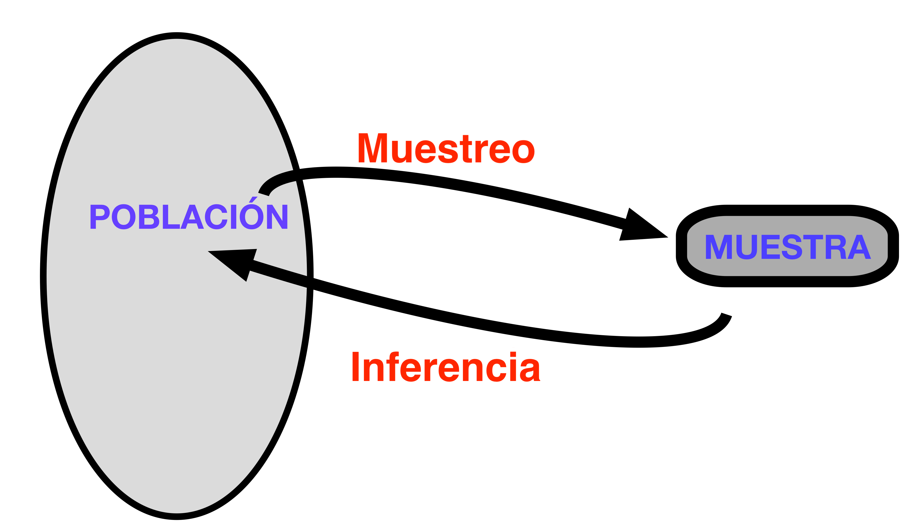
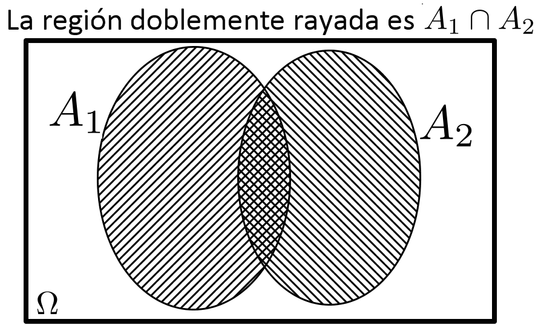

```{r set-options, echo = FALSE, purl=FALSE}
options(width = 60)
library(knitr)
knitr::opts_chunk$set(comment = '', fig.width = 6, fig.height = 6,
                      tidy = TRUE, tidy.opts=list(arrow=TRUE, indent=2))
def.chunk.hook  <- knitr::knit_hooks$get("chunk")
knitr::knit_hooks$set(chunk = function(x, options) {
  x <- def.chunk.hook(x, options)
  ifelse(options$size != "normalsize", paste0("\\", options$size,"\n\n", x, "\n\n \\normalsize"), x)
})

if (grepl(pattern = "cloud", getwd())){
  homeDir = "/cloud/project/"
  } else {
  homeDir = "../"
  }
# figpath = function(figname){
#   paste0(homeDir,"fig/", figname)
# } 
# purl("./Rmd/sesion03.Rmd", "./scripts/sesion03-comandos.R", documentation = 0)

``` 

```{r echo = FALSE}
## title: 'Master en Big Data. Fundamentos  matemáticos  del  análisis  de  datos.'
## author: "Fernando San Segundo"
## subtitle: "Sesión 3: Probabilidad"
```

---

\begin{center}
\textcolor{red}{\Huge RECUERDA: ANTES DE SEGUIR\\[5mm] EJECUTA GIT PULL EN EL REPOSITORIO\\[5mm] FMAD2122} 
\end{center}

<!-------------------------------------------->
<!-------------------------------------------->
# Población y muestra.

## Inferencia Estadística.

```{r echo=FALSE}
######################################################################
# Población y muestra. 
######################################################################

```

+ El objetivo central de la Estadística es obtener información fiable sobre las características de una **población** a partir de **muestras**. Ese término significa aquí un conjunto de entidades individuales (individuos), no necesariamente seres vivos. La población pueden ser los vehículos matriculados en 2015 o las órdenes de compra recibidas por una empresa cierto mes o  las especies de colibrí que visitan un comedero en Costa Rica en los últimos 10 años, etc.

+ Muchas veces estudiar toda la población es demasiado difícil, indeseable o imposible. Entonces surge la pregunta de si podemos usar las muestras para *inferir*, o *predecir* las características de la población. ¿Hasta qué punto los datos de la muestra son *representativos*de la población? 

+ La *Inferencia Estadística* es el núcleo de la Estadística porque da sentido a estas preguntas, las formaliza y responde.
```{r echo=FALSE, comment=NULL, fig.align='center', out.width = "40%", purl=FALSE}

```


## Poblaciones y muestras aleatorias simples con vectores usando R.

\small
+ Al estudiar una población nos interesan determinadas características individuales, que pueden cambiar de un individuo a otro y que constituyen las *variables de interés*. Cuando tomamos una muestra obtenemos los valores de esas variables en algunos individuos de la población. 

+ Para que la muestra sea representativa lo mejor es que sea una **muestra aleatoria simple**: elegimos a los individuos al azar y con remplazamiento (podemos incluir al mismo individuo más de una vez en la muestra). Tomemos esta población.
    
    ```{r echo=-1}
    ## Poblaciones y muestras aleatorias simples con vectores usando R.
    set.seed(2019)
    N = 158000
    poblacion = as.integer(2 * rchisq(N, df = 13), 0)
    ```
    

+ Para entenderlo mejor  haremos un experimento con R. En este caso vamos a suponer una población de $N = `r N`$ individuos. Por ejemplo, los viajeros que pasan por un aeropuerto en un día y sea la variable de interés su edad. El código de esta sesión construye un vector `poblacion` con las edades de los viajeros. Vamos a hacer una pequeña trampa y mostraremos el histograma de las edades de la población, que en un caso real desconoceríamos. La línea de puntos indica *la media poblacional de la edad.* ¿Cuál crees que es? 
    ```{r echo=FALSE, fig.align='center', out.width = "20%", message=FALSE, warning=FALSE}
    require(tidyverse)
    poblacion %>% 
      as_tibble %>% 
    ggplot() + 
      geom_histogram(aes(x = value), bins = 15, fill="orange", color="black") + 
      geom_vline(xintercept = mean(poblacion), 
                 col="blue", linetype="dashed", size=2)
    # hist(poblacion, main="", col="orange")
    # abline(v = mean(poblacion), lty=2, lwd=5, col="blue")
    ```

\normalsize    

---

## Medias muestrales

- Ese es justo el tipo de preguntas que esperamos que responda la Estadística. Aunque en este caso disponemos del vector completo de edades debes tener claro que en los problemas reales no será así. Así que recurrimos a las muestras aleatorias (con remplazamiento), en inglés *random sample (with replacement)*. Por ejemplo, de tamaño 20. En R construimos una de esas muestras así:
\small
    ```{r echo=-c(1, 2, 5)}
    ## Medias muestrales
    options(width= 90)
    n = 20
    (muestra = sample(poblacion, n, replace = TRUE))
    options(width= 70)
    ```
  \normalsize Esas son las 20 edades $x_1, \ldots, x_{20}$ de los viajeros de la muestra. Para *estimar* la edad media de *todos los viajeros* a partir de estos valores calcularíamos la **media muestral**.
$$
\bar x = \dfrac{x_1 + \cdots + x_{20}}{n} = 
\dfrac{`r  muestra[1]` + `r  muestra[2]` + \cdots + `r  muestra[20]`}{`r  n`} \approx
`r  signif(mean(muestra), 5)` = \text{mean(muestra) en R}
$$

+ Naturalmente, si tomas otra muestra, su media muestral puede ser otra: 
  \small
    ```{r echo = -1}
    options(width= 90)
    (muestra2 = sample(poblacion, n, replace = TRUE))
    mean(muestra2)
    ```
\normalsize 

## Muestras buenas y malas.

+ Hemos visto que cada muestra produce una media muestral y que esas medias muestrales pueden ser distintas. ¿Cuántas muestras distintas hay? Hay una cantidad inimaginablemente grande:\small
$$
158000^{20} = `r 158000^20`
$$
\normalsize Para ponerlo en perspectiva, se estima que en el universo hay menos de $10^{40}$ estrellas. Esta cantidad enorme de muestras, de las que solo hemos visto 2, forman lo que se llama el **espacio muestral** (de tamaño $n = 20$) de este problema. 

+ Entre esas muestras hay muestras *buenas* y muestras *malas*. ¿Qué queremos decir con esto? Para seguir con nuestro experimento vamos a ordenar *la población completa* por edad y tomemos los 20 primeros valores:
  \small
    ```{r echo = -(1:2)}
    ## Muestras buenas y malas.
    options(width= 90)
    (muestra3 = sort(poblacion)[1:20])
    ```
  \normalsize Hemos llamado `muestra3` a ese vector porque es una más de las muchísimas muestras posibles que podríamos haber obtenido al elegir al azar 20 viajeros. Y si usáramos esta muestra para estimar la media de la población obtendríamos
  \small
    ```{r echo = -1}
    options(width= 90)
    mean(muestra3)
    ```
  \normalsize Eso es lo que llamamos una *muestra mala*, poco representativa.

## La distribución de las medias muestrales.

+ La última muestra que hemos examinado era muy poco representativa. Pero la pregunta esencial para la estadística es ¿cuál es la relación entre muestras buenas y malas? Al elegir una muestra al azar, ¿cómo de probable es que nos toque una muestra tan mala en lugar de una buena?

+ Podemos hacer otro pequeño experimento para explorar el espacio muestral. No podemos repasar todas las muestras una por una para clasificarlas en buenas o malas (eso sería demasiado incluso para R) pero podemos tomar *muchas* muestras aleatorias (pongamos $k = 10000$) y ver como de buenas o malas son (hacemos una *muestra de muestras*). En R es muy fácil hacer esto usando la función `replicate`: \small
    ```{r echo = -1}
    ## La distribución de las medias muestrales.
    k = 10000
    # replicate repite k veces los comandos entre llaves y guarda el resultado
    # del último comando en el vector mediasMuestrales
    mediasMuestrales = replicate(k, { 
      muestra = sample(poblacion, n, replace = TRUE)
      mean(muestra)
    })
    head(mediasMuestrales, 10)
    ```
  \normalsize Se muestran las primeras 10 de las 10000 medias muestrales que hemos obtenido. 

---

+ En lugar de examinar una a una esas 10000 medias muestrales vamos a representarlas en un histograma y una curva de densidad. Además, aprovechándonos de que en este caso tenemos acceso a la población completa hemos añadido su curva de densidad:
```{r echo=FALSE, comment=NULL, fig.align='center', out.width = "45%", size="small", purl=TRUE}
# Representación gráfica de la distribución de las medias muestrales
hist(mediasMuestrales, breaks = 40, main="", 
     col="peachpuff", probability = TRUE, xlim=range(poblacion))
lines(density(mediasMuestrales), lwd=4, col="red")
lines(density(poblacion), lwd=4, col="blue")
abline(v = mean(poblacion), lty=2, lwd=5, col="blue")
```

+ Este es posiblemente \textbf{el gráfico más importante del curso}. Fíjate en tres cosas:  
  - La *media de las medias muestrales* coincide con  la media de la población.
  - Prácticamente no hay *muestras malas*. Es *extremadamente improbable* que una muestra elegida al azar sea muy mala.
  - La distribución de las medias muestrales tiene forma de campana (y es muy estrecha).
  
  Para entender bien estas ideas *necesitaremos aprender más sobre Probabilidad*.

## Otra población, mismos resultados.

+ Pero antes de lanzarnos a la probabilidad vamos a asegurarnos de algo. Puede que te preguntes si la población con la que hemos empezado tenía algo especial.  Probemos con otra muy distinta. La población la forman 20000 números elegidos al azar del 0 al 20, siendo todos los valores igual de probables (su curva de densidad es horizontal).\small
    ```{r}
    poblacion = sample(0:20, 20000, replace = TRUE)
    ```
  \normalsize Y ahora repetimos el proceso de construcción de medias muestrales usando replicate
  \scriptsize
    ```{r echo=-1}
    ## Otra población, mismos resultados.
    k = 10000
    mediasMuestrales = replicate(k, { 
      muestra = sample(poblacion, n, replace = TRUE)
      mean(muestra)
    })
    ```
  \normalsize El  gráfico del resultado muestra el mismo comportamiento de las medias  muestrales, lo que se conoce como **Teorema Central del Límite**:
```{r echo=FALSE, comment=NULL, fig.align='center', out.width = "30%", size="small", purl=FALSE}
hist(mediasMuestrales, breaks = 40, main="", 
     col="peachpuff", probability = TRUE, xlim=range(poblacion))
lines(density(mediasMuestrales, adjust = 1.5), lwd=4, col="red")
lines(x = c(0, 0, 20, 20), c(0, 1/20, 1/20, 0), lwd=4, col="blue")
abline(v = mean(poblacion), lty=2, lwd=5, col="blue")
```
  
```{r eval=FALSE, echo=FALSE, comment=NULL}
#####################################################################
# Otras poblaciones por si quieres experimentar
#####################################################################  
# Uniforme continua


tamPoblacion = 100000
poblacion = runif(tamPoblacion, min = 0, max = 10)
head(poblacion, 100)


hist(poblacion)
plot(density(poblacion))

mean(poblacion)

Tmuestra = 20

# ¿Cuántas muestras distintas hay?
choose(tamPoblacion, Tmuestra)

# La población es moderadamente grande, pero el espacio de muestras es enorme.

# Vamos a tomar muchas muestras y en cada una calculamos una media muestral.
numMuestras = 100000

# Repetiremos esto varias veces para hacernos una idea.
(muestra = sample(poblacion, size = Tmuestra, replace = TRUE))
mean(muestra)

mediasMuestrales = replicate(numMuestras, {
  muestra = sample(poblacion, size = Tmuestra, replace = TRUE)
  mean(muestra)
})

# ¿Cómo se distibuyen esas medias muestrales?
head(mediasMuestrales)
hist(mediasMuestrales)
hist(mediasMuestrales, breaks = 40, main="")
plot(density(mediasMuestrales, adjust = 1.5), main="")

# ¿Cuál es la media de las me?
(mu = mean(poblacion))
mean(mediasMuestrales)

# ¿Cuál es su desviación típica?
(desvTipPob = sqrt(sum((poblacion - mu)^2) / tamPoblacion))

sd(mediasMuestrales)
desvTipPob / sqrt(Tmuestra)
```
  
# Probabilidad básica.


```{r echo=FALSE}
######################################################################
# Probabilidad básica.
######################################################################


```

---

+ Para entender resultados como el Teorema Central del Límite tenemos que aprender el mínimo vocabulario necesario para poder hablar con precisión sobre la Probabilidad. 

+ Lo primero de lo que hay que ser conscientes es de que nuestra intuición en materia de probabilidad suele ser muy pobre. Vamos a empezar usando ejemplos de juegos de azar (dados, naipes, etc.) para poder desarrollar el lenguaje, igual que sucedió históricamente. 

## Experimentos del Caballero de Méré. 

+ ¿Qué es más probable?  
  
  $(a)$ obtener al menos un seis en cuatro tiradas de un dado, o  
  $(b)$ obtener al menos un seis doble en 24 tiradas de dos dados?
  
+ Los jugadores que en el siglo XVIII se planteaban esta pregunta pensaban así:  
  $(a)$ La probabilidad de obtener un seis en cada tirada es $\dfrac{1}{6}$. Por lo tanto, en cuatro tiradas es $\dfrac{1}{6}+\dfrac{1}{6}+\dfrac{1}{6}+\dfrac{1}{6} = \dfrac{2}{3}.$  
  $(b)$ La probabilidad de un doble seis en cada tirada de dos dados es $\dfrac{1}{36}$, (hay 36 resultados distintos) y todos aparecen con la misma frecuencia. Por lo tanto, en veinticuatro tiradas será $\dfrac{24}{36}=\dfrac{2}{3}.$  
    
  Así que en principio ambas apuestas parecen iguales,

+ Vamos a usar R para jugar a estos dos juegos sin tener que jugarnos el dinero. Descarga este \link{https://raw.githubusercontent.com/fernandosansegundo/fmad2122/main/scripts/sesion03-01-JuegosDeMere.R}{fichero de código} y ejecútalo. 


## La paradoja del cumpleaños.

+ Otro experimento que puede servir para afianzar la idea de que la probabilidad es poco intuitiva. Si en una sala hay 1000 personas entonces es seguro que hay dos que cumplen años el mismo día. De hecho basta con que haya 367 personas. Si hay menos de ese número, la probabilidad de que dos cumpleaños coincidan disminuye. ¿Cuál es el *menor número de personas* que nos garantiza una probabilidad mayor del 50% de coincidencia?

+ Usemos R para averiguar ese número. Repite el experimento varias veces para convencerte..\small
    ```{r}
    ## La paradoja del cumpleaños.
    n = 366 # Número de personas en la sala
    
    # Vamos a repetir el experimento N veces (N salas de n personas)
    N = 10000
    pruebas = replicate(N, {
    fechas = sort(sample(1:366, n, replace=TRUE)) 
    max(table(fechas)) # si el máximo es mayor que 1 es que 2 fechas coinciden
    })
    mean(pruebas > 1) # ¿qué proporción de salas tienen coincidencias?
    ```

## Regla de Laplace.

+ Fue históricamente el primer resultado que hizo posible calcular probabilidades de una manera sistemática, aunque como veremos no está libre de problemas.  

+ Vamos a fijar el lenguaje necesario para entender esa regla.  
  $(a)$  Estudiamos un experimento aleatorio con $n$ *resultados elementales* posibles (no simultáneos) que además son *equiprobables*; es decir, sus frecuencias relativas son iguales cuando el experimento se repite muchas veces.:
  $$\{a_1,a_2,\ldots,a_n,\}$$
  
  $(b)$  El *suceso aleatorio* $A$ es un {\sf subconjunto del conjunto de resultados elementales}. Por ejemplo, si lanzamos un dado, $A$ puede ser: obtener un número par. 
  
  $(c)$ Los resultados elementales que forman $A$ son los {\sf resultados favorables} a $A$. Por ejemplo, si lanzamos un dado, los resultados favorables al suceso 
  $$A= \text{obtener un número par}$$ 
  son $\{2,4,6\}$. 
  
+ **Regla de Laplace:** En esas condiciones la probabilidad de $A$ es
$$
P(A)=\dfrac{\text{número de sucesos elementales favorables a }A}{\text{n (número de sucesos elementales posibles)}}
$$

## Aplicaciones y limitaciones de la Regla de Laplace.

+ Con la Regla de Laplace y un poco de Combinatoria (don`t panic!) es posible responder a preguntas como estas:  
  
  - ¿Cual es la probabilidad de que la suma de los resultados al lanzar dos dados sea igual a siete?  
  - ¿Cuál es la probabilidad de que al tirar tres dados aparezca el seis en uno de los dados (no importa cual), pero sólo en uno de ellos?
  - En un paquete hay 20 tarjetas numeradas del 1 al 20. Se escogen al azar dos tarjetas. ¿Cuál es la probabilidad de que las dos que se han elegido sean la número 1 y la número 20? ¿Hay alguna diferencia entre sacar las dos tarjetas a la vez, o sacarlas consecutivamente sin remplazamiento? ¿Y si es con remplazamiento?   
  
+ Pero es necesario entender que la Regla de Laplace *no es una definición de Probabilidad*. En primer lugar porque sería una definición circular. Y en segundo lugar porque no sirve para responder a preguntas sencillas que tienen respuestas intuitivamente obvias como esta:  
  
  - Si elegimos al azar un número real $x$ en el intervalo $[0,1]$, ¿cuál es la probabilidad de que sea $1/3\leq x\leq 2/3$? ¿Qué dice (a gritos) la intuición? Y ahora trata de pensar en este problema usando la regla de Laplace. ¿Cuántos casos posibles (valores de $x$) hay? ¿Cuántos son los casos favorables? Experimenta con este \link{https://raw.githubusercontent.com/fernandosansegundo/fmad2122/main/scripts/sesion03-02-ProbabilidadGeometrica.R}{fichero de código R}.
  
  La Regla de Laplace no se diseñó para tratar con valores continuos, como el $x$ de este ejemplo. Necesitamos una noción de Probabilidad más general.

## Teoría Axiomática de la Probabilidad. 

+ Los detalles técnicos son complicados pero, simplificando mucho hay tres ingredientes:$\quad\vspace{1mm}$

    (a) Tenemos un *espacio muestral* $\Omega$ que  es el conjunto de todos los posibles resultados de un experimento.  
    
    (b) Un *suceso aleatorio* es (casi) cualquier subconjunto de $\Omega$ (no *demasiado raro*).   
    
    (c) Una *función probabilidad* que representaremos con la letra $P$ que  asigna un  número $P(A)$ a cada suceso aleatorio $A$ del espacio muestral $\Omega$. La función probabilidad debe cumplir  tres propiedades: $\quad\vspace{0.5mm}$
    
        1. $P(\Omega) = 1$.
        2. Sea cual sea el suceso aleatorio $A$, se tiene $0\leq P(A)\leq 1$.
        3. Si $A_1$ y $A_2$ son  dos sucesos aleatorios entonces 
        $$P(A_1\cup A_2) = P(A_1) + P(A_2) - P(A_1 \cap A_2)$$

+ Aquí $A_1\cup A_2$ es la *unión* de sucesos y $A_1 \cap A_2$ la *intersección*, como ilustra el diagrama de Venn (cambia probabilidades por áreas e imagina que el área del rectángulo es 1).
```{r echo=FALSE, comment=NULL, fig.align='center', out.width = "30%", purl=FALSE}

```
## Propiedades adicionales.

+ En la próxima sesión veremos ejemplos concretos y útiles de como construir esas funciones de probabilidad tanto en casos discretos como continuos. 

+ La probabilidad del *suceso vacío* $\emptyset$ es $0$; es decir $P(\emptyset)=0.$  
+ Dos sucesos $A_1$ y $A_2$ se llaman *incompatibles* o *disjuntos* si su intersección es vacía; es decir, no pueden ocurrir a la vez. En tal caso:
$$P(A_1\cup A_2) = P(A_1) + P(A_2)$$
+  Dado un suceso aleatorio $A$, el *suceso complementario* $A^c$ se define como ``no ocurre $A$''. Y siempre se cumple que
$$P(A^c)=1-P(A).$$

+ Si $A\subset B$ (se lee: si $A$ es un subconjunto de $B$) entonces
$$P(A)\leq P(B)$$ 

+ **Ejercicio:** Calcular la probabilidad de que un número de cuatro cifras tenga alguna repetida. Extra: diseña una simulación con R para comprobar tu resultado.

## Probabilidad condicionada.

+ El concepto de probabilidad condicionada trata de reflejar los cambios que se producen en el valor de probabilidad $P(A)$ de un suceso cuando tenemos alguna *información adicional (pero parcial)* sobre el resultado de un experimento aleatorio. 

+ *Ejemplo.* ¿Cuál es la probabilidad de que al lanzar un dado obtengamos un número par? Está claro que es 0.5. Pero y si te dijera, sin revelarte el resultado, que al lanzar el dado hemos obtenido un número estrictamente mayor que 3. ¿Seguirías pensando que esa probabilidad es 0.5?

+ Lo que ocurre en situaciones como esa es que queremos calcular la probabilidad de un suceso $A$ *sabiendo con certeza que* ha ocurrido otro suceso $B$, lo que se denomina probabilidad de $A$ condicionada por $B$ y se representa mediante $P(A\,|\,B)$. La definición, que se puede justificar con la Regla de Laplace, es:
$$P(A\,|\,B) = \dfrac{P(A \cap B)}{P(B)}$$

+ *Ejemplo (continuación):* \small
$$P(\text{dado par}|\text{sabiendo que dado > 3}) = 
\dfrac{P(\text{dado par y a la vez dado > 3})}{P(\text{dado > 3})} = 
\dfrac{2/6}{3/6} =\dfrac{2}{3} 
$$
\normalsize

+ El denominado \link{http://docentes.educacion.navarra.es/msadaall/geogebra/figuras/azar_monty.htm}{Problema de Monty Hall} es un ejemplo famoso de como la información adicional altera nuestra estimación de probabilidades (\link{https://www.geogebra.org/m/wa5qtjpp}{ver también}).

## Sucesos independientes.

+ El suceso $A$ es independiente del suceso $B$ si el hecho de saber que el suceso $B$ ha ocurrido no afecta a nuestra cálculo de la probabilidad de que ocurra $A$. Es decir, la independencia significa que $P(A\,|\,B) = P(A)$. Hay una manera equivalente de escribir esto que deja claro que la independencia es simétrica:
$$
A\text{ y }B\text{ son independientes significa que }P(A\cap B) = P(A)\,P(B)
$$

+ **Nunca confundas sucesos independientes e incompatibles** Los sucesos incompatibles no pueden ser independientes.

+ Esta noción de independencia es una abstracción matemática, que raras veces coincidirá en la práctica con nuestra noción intuitiva de que dos fenómenos son independientes.  Más adelante tendremos ocasión de profundizar en esta discusión y hablaremos de como medir en casos reales la independencia. 

# Probabilidad total y Regla de Bayes.

## Teorema de la probabilidad total. 

+ Este resultado sirve para calcular la probabilidad de un suceso $A$ que puede ocurrir a través de uno de entre $k$ mecanismos excluyentes. 

+ *Ejemplo:* una fábrica produce un tipo de piezas usando tres máquinas. (a) Cada pieza proviene de una y una sola de esas máquinas. (b) Cada una de las máquinas produce una fracción conocida de las piezas y (c) tiene una tasa de piezas defectuosas también conocida. Con esa información queremos calcular la tasa total de piezas defectuosas.   

\begin{columns}
\begin{column}{0.48\textwidth}
\qquad\begin{minipage}{0.80\textwidth}
$\bullet$ Sea $A$ el suceso {\em la pieza es defectuosa}; lo que queremos calcular es $P(A)$. Sean
$M_1, M_2, M_3$ los sucesos \em{la pieza se fabrica en la máquina 1} o en la 2 o 3 respectivamente.
\end{minipage}
\end{column}
\begin{column}{0.48\textwidth}
\includegraphics[width=4cm]{./fig/03-fig03-ProbabilidadTotal}
\end{column}
\end{columns}

+ T conocemos las tres probabilidades condicionadas $P(A\,|\,M_1)$, $P(A\,|\,M_2)$ y $P(A\,|\,M_3)$.

+ En problemas como este el Teorema de la Probabilidad Total afirma que:
$$
P(A) = \underbrace{P(A\,|\,M_1) P(M_1) + P(A\,|\,M_2) P(M_2) + P(A\,|\,M_3) P(M_3) }_{\text{un término para cada máquina / camino}}
$$

## Teorema de Bayes

+ El Teorema de Bayes se usa en situaciones idénticas a la que acabamos de ver, pero sirve para hacer una *pregunta inversa*. *Sabiendo que la pieza es defectuosa*, ¿cuál es la probabilidad de que provenga de la máquina M1 (por ejemplo)? Se trata por tanto de calcular $P(M_1\,|\, A)$. Y el resultado es:
$$P(M_1\,|\, A) = 
\dfrac{P(A\,|\, M_1) P(M_1)}{P(A\,|\, M_1) P(M_1) + P(A\,|\, M_2) P(M_2)+ P(A\,|\, M_3) P(M_3)}
$$
  Fíjate en que el denominador es $P(A)$.
  
+ *Ejemplos:* 
    - responde a la pregunta con la que se abre esta página.   
    - Lo más difícil al usar el Teorema de Bayes suele ser identificar los datos de forma correcta, Un ejemplo típico se ilustra en este problema: *Un hospital tiene dos quirófanos en funcionamiento. En el primero se han producido incidentes en el 20\% de sus operaciones y el segundo sólo en el 4\%. El número de operaciones es el mismo en ambos quirófanos. La inspección hospitalaria analiza el expediente de una operación, elegido  al azar y observa que en esa operación se produjo un incidente. ¿Cuál es la probabilidad de que la operación se realizara en el primer quirófano?*

## Jugando con el Teorema de Bayes y R

+ Vamos a usar una tabla de datos sobre spam en mensajes de correo electrónico. La tabla se llama `spam` y pertenece a la librería `kernlab`. Instala la librería y carga la tabla con `data(spam)`, La tabla contiene datos sobre varios miles de mensajes de correo. La última columna contiene la clasificación como spam o no spam. Las primeras 48 columnas indican el porcentaje de palabras del mensaje que coinciden con el título de la columna. Aquí se muestra una parte de la tabla:
  \scriptsize
    ```{r message=FALSE, warning=FALSE, echo = -1}
    # Librería spam de Kernlab y Teorema de Bayes
    library(kernlab)
    data(spam)
    spam[1:4, c(1:10, 58)]
    ```
  \normalsize

+ Con estos datos y usando funciones de R responde a estas preguntas:
  - ¿Cuál es la probabilidad de que un mensaje elegido al azar sea spam?
  - ¿Cuál es la probabilidad de que un mensaje elegido al azar contenga la palabra *order*?
  - *Sabiendo* que un mensaje es spam, ¿cuál es la probabilidad de que contenga la palabra *order*?
  - Y ahora, usando la fórmula de Bayes, vamos a construir el programa antispam más simple del mundo: sabiendo que un mensaje contiene la palabra *order*, ¿cuál es la probabilidad de que sea spam?
  
+ Este método es muy rudimentario, pero cuando aprendas algoritmos de clasificación estudiarás el método Naive Bayes (Bayes ingenuo) que se basa en ideas similares.

# Tablas de Contingencia.

---

## Tablas de contingencia 2x2

+ En el problema anterior nos hemos encontrado con una situación típica en la que hay dos factores binarios. Un factor S con valores  *spam / no spam* y un factor O, con valores "contiene order/ no contiene order". Al combinarlos hay cuatro casos posibles que podemos representar en una tabla dos por dos. 

+ Primero usaremos `dplyr` para obtener una tabla en la que solo aparezcan esos dos factores, aprendiendo de paso alguna manipulación adicional:\small
    ```{r message=FALSE, echo= -1}
    ## Tablas de contingencia 2x2
    library(tidyverse)
    spam = spam %>%
      select(order, type) %>% 
      mutate(hasOrder = factor(order > 0, # Creamos el factor hasOrder
                                levels = c(TRUE, FALSE), 
                                labels = c("order", "no order")),
             type = relevel(type, ref = "spam"), # Reordenamos los niveles
             -order) # y elminamos el factor order original
    ```
  \normalsize Ahora podemos obtener la tabla con \small
    ```{r comment = NULL}
    table(spam$hasOrder, spam$type)
    ```
  <!-- spam %>% group_by(type, hasOrder) %>% summarise(n = n()) %>% spread() -->
  \normalsize

## Vocabulario adicional para tablas de contingencia 2x2

+ El lenguaje de las tablas de contingencia proviene en buena medida del contexto de las pruebas diagnósticas para enfermedades. Esas pruebas no son infalibles: a veces  dan como resultado que una persona padece la enfermedad, cuando en realidad no es así. Es lo que se llama un *falso positivo* (FP). En otras ocasiones será al contrario. La prueba dirá que la persona está sana, aunque de hecho está enfermo. Eso es un *falso negativo* (FN). Los resultados correctos, que están en la diagonal principal de la tabla, son los TP (true positives) y los TN (true negatives).

+ Por ejemplo, podemos tener una tabla como esta:
\begin{tabular}{llccc}
&&\multicolumn{3}{c}{\underline{\bf Padecen la enfermedad}}\\

                          &          & Enfermo &  Sano & Total\\
\hline
\underline{\bf Resultado de la Prueba} & Positivo & TP = 192&  FP = 158&   350\\
                          & Negativo &  FN = 4 & TN = 9646&  9650\\
\hline
                          & Total    & 196& 9804& 10000\\
\hline
\end{tabular}

+ Vamos a usar este \link{https://raw.githubusercontent.com/fernandosansegundo/fmad2122/main/scripts/sesion03-03-TablasContingencia.R}{script de R} para aprender algo más de lenguaje sobre tablas de contingencia y de como manejarlas con R.

+ Una prueba diagnóstica es un *clasificador* de pacientes. Más adelante vamos a encontrar muchos algoritmos clasificadores, porque \link{https://en.wikipedia.org/wiki/Statistical_classification}{clasificar} es una de las tareas básicas en *Machine Learning*. Veremos entonces que en ese contexto se usa mucho el vocabulario de pruebas diagnósticas.


## Referencias para la sesión

**Enlaces**

```{r echo = FALSE, purl=FALSE, message=FALSE, error=FALSE}
sessionName = "sesion02"
RmdName = paste0(sessionName,".Rmd")
ScriptName = paste0(sessionName, "-comandos.R")
lnkScriptGitHub = paste0("https://raw.githubusercontent.com/fernandosansegundo/MBDFME/master/scripts/", ScriptName)
```
```{r eval=FALSE, echo=FALSE, error=FALSE, message=FALSE, purl=FALSE}
sessionName = "sesion02"
RmdName = paste0(sessionName,".Rmd")
ScriptName = paste0(sessionName, "-comandos.R")
lnkScriptGitHub = paste0("https://raw.githubusercontent.com/fernandosansegundo/MBDFME/master/scripts/", ScriptName)
knitr::purl(RmdName, output = paste0("../scripts/", ScriptName), documentation = 0)
```


```{r echo=FALSE, eval=FALSE, comment=NULL}
download.file(lnkScriptGitHub, destfile = paste0(getwd(),"/", ScriptName))
```


- \link{`r lnkScriptGitHub`}{Código de esta sesión}

+ [\textcolor{blue}{{Cookbook for R}}](http://www.cookbook-r.com/)

+ [\textcolor{blue}{{Página web de ggplot2}}](https://ggplot2.tidyverse.org/index.html), que contiene el 
[\textcolor{blue}{{resumen (chuleta)}}](https://github.com/rstudio/cheatsheets/raw/master/data-visualization-2.1.pdf)  elaborado por RStudio.

+ [\textcolor{blue}{{Resumen sobre importación de datos a R (chuleta)}}](https://github.com/rstudio/cheatsheets/raw/master/data-import.pdf)  elaborado por RStudio.

+ Web del libro [\textcolor{blue}{{PostData}}](http://www.postdata-statistics.com) y los tutoriales asociados. Para esta sesión se recomienda el Capítulo 2. 


**Bibliografía**
