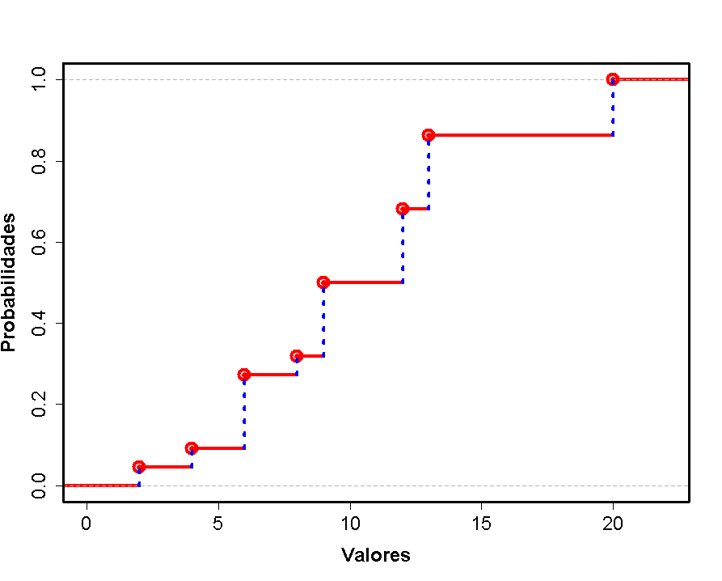
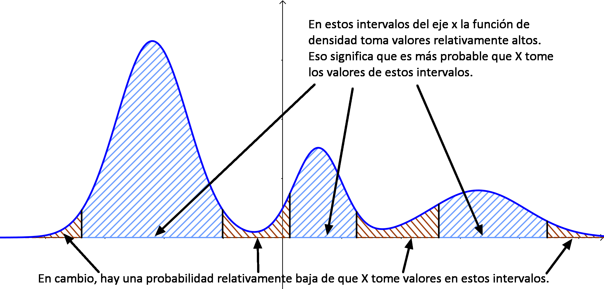
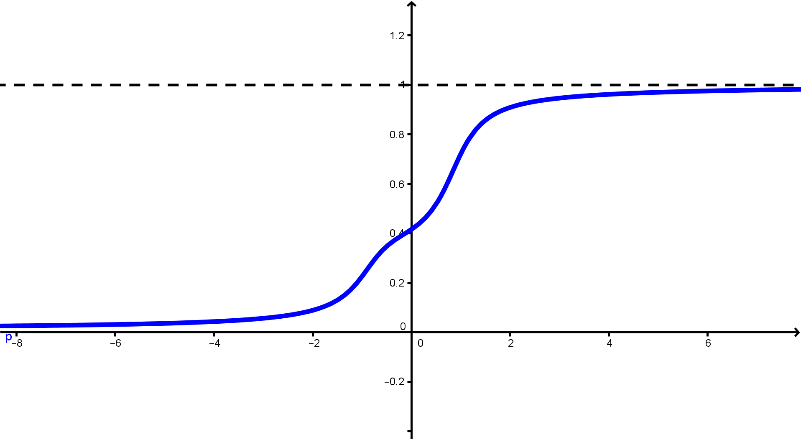
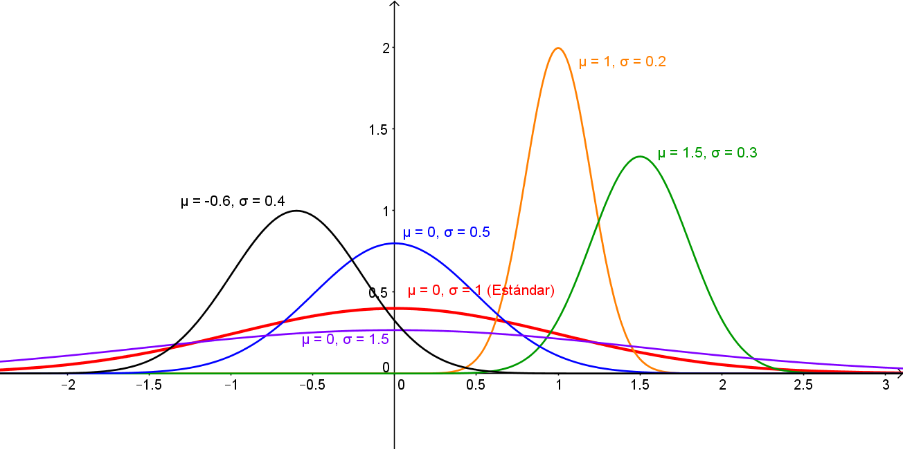
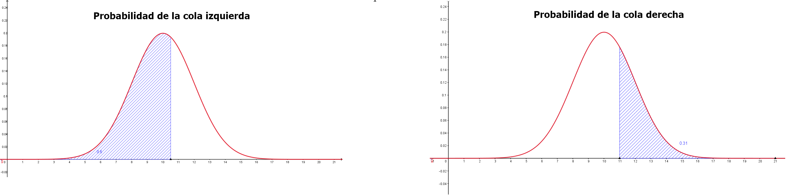
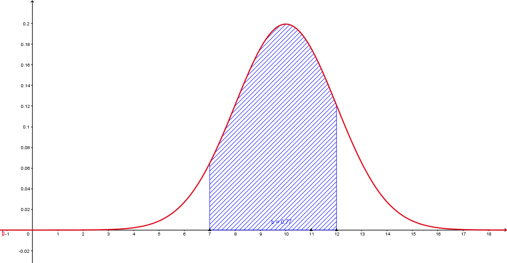
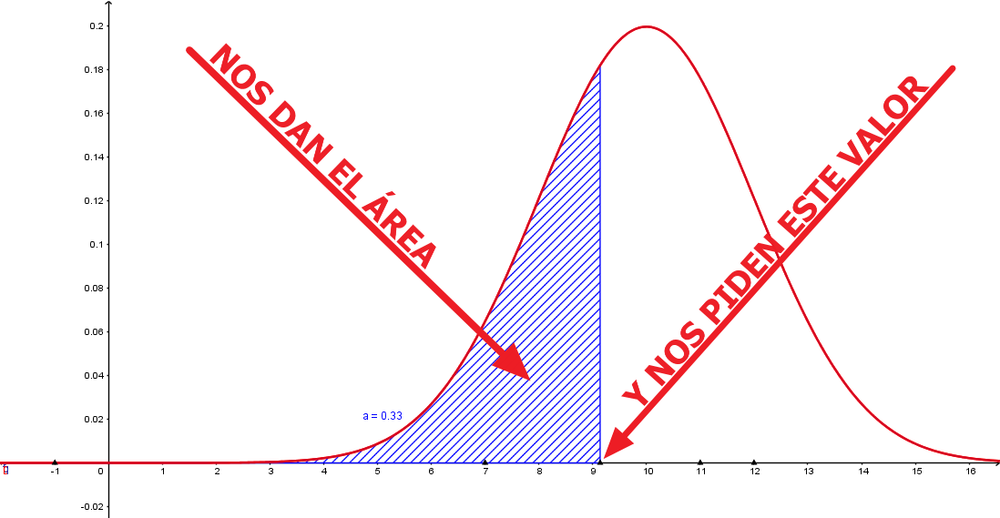
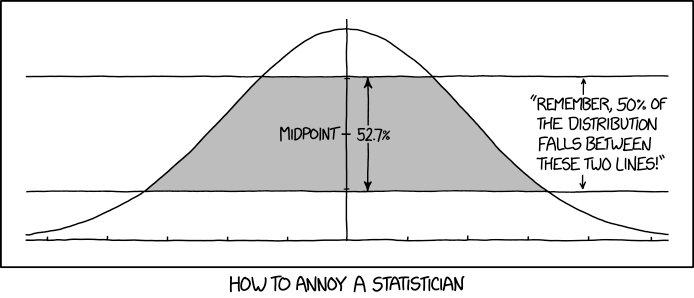

```{r set-options, echo = FALSE, purl=FALSE}
options(width = 60)
library(knitr)
knitr::opts_chunk$set(comment = '', fig.width = 6, fig.height = 6,
                      tidy = TRUE, tidy.opts=list(arrow=TRUE, indent=2))
def.chunk.hook  <- knitr::knit_hooks$get("chunk")
knitr::knit_hooks$set(chunk = function(x, options) {
  x <- def.chunk.hook(x, options)
  ifelse(options$size != "normalsize", paste0("\\", options$size,"\n\n", x, "\n\n \\normalsize"), x)
})

if (grepl(pattern = "cloud", getwd())){
  homeDir = "/cloud/project/"
  } else {
  homeDir = "../"
  }
# figpath = function(figname){
#   paste0(homeDir,"fig/", figname)
# } 
# purl("./Rmd/sesion04.Rmd", "./scripts/sesion04-comandos.R", documentation = 0)

``` 

```{r echo = FALSE}
## title: 'Master en Big Data. Fundamentos  matemáticos  del  análisis  de  datos.'
## author: "Fernando San Segundo"
## subtitle: "Sesión 4: Variables Aleatorias"
```

---

\begin{center}
\textcolor{red}{\Huge RECUERDA: ANTES DE SEGUIR\\[5mm] EJECUTA GIT PULL EN EL REPOSITORIO\\[5mm] FMAD2122} 
\end{center}

<!-------------------------------------------->
<!-------------------------------------------->

# Variables aleatorias discretas.

```{r echo=FALSE}
######################################################################
# Variables aleatorias discretas.
######################################################################

```

---

## Modelos teóricos frente a datos empíricos.

+ Vamos a proponerte un pequeño experimento mental. Imagínate que lanzamos un dado (honesto, no cargado) un millón de veces y que calculamos las *frecuencias relativas* de cada uno de los valores. ¿Qué números crees que habrá en la segunda fila de esta tabla?
$$
\begin{array}{|c|c|c|c|c|c|c|}
\hline
\text{valor del dado} & 1 & 2 & 3 & 4 & 5 & 6 \\
\hline
\text{frecuencia relativa} & ? & ? & ? & ? & ? & ? \\
\hline
\end{array}
$$
  Esos valores que ves con claridad en tu cabeza son un *modelo* teórico del experimento aleatorio que consiste en lanzar un dado. Y esa es precisamente la idea que trata de captar una variable aleatoria discreta: *un modelo teórico de un experimento aleatorio cuyos resultados son un conjunto discreto de valores.*

+ Para describir una variable aleatoria discreta $X$ tenemos por tanto que dar su **tabla (o función) de densidad de probabilidad**: una tabla de valores posibles de $X$ y sus correspondientes probabilidades:
$$
\begin{array}{|c|c|c|c|c|c|c|}
\hline
\text{valor de }X & x_1 & x_2 & \cdots & x_k \\
\hline
\text{Probabilidad de ese valor }P(X = x_i) & p_1 & p_2 & \cdots & p_k \\
\hline
\end{array}
$$
con $p_1 + p_2 + \cdots + p_k = 1$. A veces usaremos *notación funcional* $f(x_i) = P(X = x_i)$.

**Ejercicio:** usa R para hacer ese experimento y compara los datos empíricos con el modelo. 

## Media y varianza de distribuciones discretas.

+ Una variable aleatoria discreta es un modelo teórico de la distribución de valores en la población. La **media poblacional** o **esperanza** es la media aritmética de dichos valores y se representa con la letra griega $\mu$ o con el símbolo $E(X)$. De forma análoga se define la **varianza poblacional** que denotaremos $\sigma^2$.

+ Nuestro objetivo es utilizar datos muestrales para estimar o inferir los parámetros de una población. Si tenemos una muestra de una variable discreta que toma $k$ valores distintos $x_1, \ldots, x_k$ con frecuencias absolutas $f_1, \ldots, f_k$ respectivamente podemos calcular la *media muestral* haciendo:
$$
\bar x = 
\dfrac{x_1 f_1 + \cdots + x_k f_k}{n} = 
x_1 fr_1 + \cdots + x_k fr_k
$$
  donde $fr_1,.\ldots, fr_k$ son las *frecuencias relativas* de los valores. Recuerda que
las frecuencias relativas son las versiones *empíricas* de las probabilidades *teóricas*. Por eso la media poblacional $\mu$ (teórica) se calcula así a partir de la tabla de probabilidades:
\begin{center}
  \fcolorbox{black}{Gris025}{\begin{minipage}{4cm}
      \centering$\mu = x_1 p_1 + \cdots + x_k p_k$
\end{minipage}}
\end{center}
Una razonamiento similar conduce a esta expresión para la *varianza poblacional*
\begin{center}
  \fcolorbox{black}{Gris025}{\begin{minipage}{5cm}
      \centering$\sigma^2 = (x_1 - \mu)^2 p_1 + \cdots + (x_k - \mu)^2 p_k$
\end{minipage}}
\end{center}

+ **Ejercicio:** usa R para calcular $\mu$ y $\sigma^2$ para un dado.

---

## Usando `sample` con variables aleatorias discretas.

+ **Ejercicio:** Dada esta tabla de densidad de probabilidad de una variable aleatoria $X$:
$$
\begin{array}{|c|c|c|c|c|c|c|}
\hline
\text{valor de }X & 0 & 1 & 2 & 3 \\
\hline
\text{Probabilidad de ese valor }P(X = x_i) & \dfrac{64}{125} &
\dfrac{48}{125}& \dfrac{12}{125} & \dfrac{1}{125}\rule{0mm}{6mm} \\[3mm]
\hline
\end{array}
$$
  usa R para calcular $\mu$,  $\sigma^2$  y también $\sigma$, la desviación típica poblacional.

+ Hasta ahora hemos usado `sample` para fabricar muestras en las que todos los elementos del vector eran equiprobables. Pero también podemos simular muestras de una población como la que describe el modelo teórico $X$ usando la opción `prob` así (fíjate en que no hace falta *normalizar las probabilidades*):\small
    ```{r}
    muestra = sample(0:3, size = 10, replace = TRUE, prob = c(64, 48, 12, 1))
    ```
  \normalsize

+ **Ejercicio:**  
  $(1)$ Simula una muestra de tamaño 1000 de esta variable. ¿Cuál crees que es la mejor manera de representar gráficamente esa muestra?  
    ```{r echo=FALSE, eval=FALSE, comment=NULL}
    library(viridisLite)
    muestra = sample(0:3, size = 1000, replace = TRUE, prob = c(64, 48, 12, 1))
    barplot(table(muestra), col=viridis(4))
    ```
  $(2)$ Combina `sample` con `replicate` para simular cien mil muestras de tamaño 10. Estudia la distribución de las medias muestrales como hemos hecho en ejemplos previos. 

## Operaciones con variables aleatorias.

+ Imagina que la variable aleatoria $X$ representa el gasto en seguro del hogar y la variable $Y$ el gasto en seguro del automóvil. Si queremos calcular el gasto total en ambos seguros tenemos que pensar en la *variable suma* $X + Y$. De la misma forma, a veces queremos multiplicar una variable por un número y, en general, vamos a pensar en combinaciones de la forma $a\,X + b\, Y$ donde $a$ y $b$ son coeficientes numéricos. 

+ La media $E(X + Y)$ de la variable $a\,X + b\, Y$ se calcula a partir de las medias de $X$ e $Y$ usando la misma combinación 
$$a\,\mu_X + b\,\mu_Y$$

+ Para la varianza las cosas son más complicadas, porque involucran la noción de *independencia*, que discutiremos después. Informalmente, $X$ e $Y$ son independientes si la información sobre el valor de $X$ no afecta a la tabla de probabilidades de los valores de $Y$. La **covarianza** de $X$ e $Y$ es:
$$
\operatorname{cov}(X, Y) = E((X - \mu_X)(Y - \mu_Y))
$$
y en general $\sigma^2(a\,X + b\, Y) = a^2\,\sigma^2_X + b^2\,\sigma^2_Y + 2\,a\,b\, \operatorname{cov}(X, Y)$

+ **Cuando $X$ e $Y$ son independientes** se tiene $\operatorname{cov}(X, Y) = 0$ y por tanto:
$$\sigma^2(a\,X + b\, Y) = a^2\,\sigma^2_X + b^2\,\sigma^2_Y$$


## Función de distribución de una variable aleatoria discreta.

+ La función de distribución $F_X$ de una variable aleatoria $X$ (discreta o continua) se define así para cualquier número $k$:
$$
F_X(k) = P(X\leq k)
$$
Para una variable aleatoria la función de distribución juega un papel similar al de una *frecuencia relativa acumulada*, respondiendo a la pregunta ¿qué probabilidad hay de obtener un valor menor o igual que $k$?

+ La gráfica de la función de distribución de una variable aleatoria discreta típica tiene este aspecto:
```{r echo = FALSE, comment=NULL, fig.align='center', out.width = "50%", purl=FALSE}

```

# La distribución binomial.

## Variables aleatorias de Bernouilli.

+ Son probablemente las variables aleatorias discretas más sencillas de todas. Una variable aleatoria $X$ es de tipo Bernouilli con parámetro $p$ si su tabla de valores y probabilidades es:
\begin{center}{
\begin{tabular}[t]{|c|c|c|}
    \hline
    \rule{0cm}{0.5cm}{\em Valor de $X$:}&1&0\\
    \hline
    \rule{0cm}{0.7cm}{\em Probabilidad de ese valor:}&{\em p}&{\em q = 1 - p}\\
    \hline
\end{tabular}}
\end{center}
+ Por ejemplo, la variable $X =$"número de seises al lanzar un dado una vez" es una variable de tipo Bernouilli, con $p = \frac{1}{6}$, $p = \frac{5}{6}$. Para representar esto decimos que $X\sim Bernouilli(p)$ (el símbolo $\sim$ se lee *"es de tipo..."*).

+ Los valores 1 y 0 se denominan, arbitrariamente, **éxito y fracaso** respectivamente. 

+ La media de una variable $X\sim Bernouilli(p)$ es $\mu = p$  
(porque $1\cdot p + 0\cdot q = p$)

+ Su varianza es $\sigma^2 = p\cdot q$  
(porque $(1 - p)^2\cdot p + (0 - p)^2\cdot q = q^2p + p^2q = pq(p + q) = pq$).

+ Las variables aleatorias de Bernouilli son útiles porque las usaremos como piezas para construir variables más complicadas, como la binomial que vamos a ver a continuación.

---

## Variable aleatoria binomial.

+ **Ejemplo:** Lanzamos un dado 11 veces. Es importante entender que *el experimento no es una tirada sino 11 tiradas* del dado.  Definimos la variable $X$ así:
$$
X = \text{\emph{número de veces que obtenemos un 6 en esas 11 tiradas}}
$$
+ Esta situación tiene las siguientes características:

  $(1)$ Un **experimento básico**, lanzar un dado se **repite $n$ veces** (en el ejemplo $n = 11$).  
  
  $(2)$  Las repeticiones del experimento básico son **independientes** entre sí.  
  
  $(3)$  Cada repetición del experimento sólo puede terminar de una de estas dos maneras:  en **éxito (success)** (en el ejemplo, sacar un 6) que se representa con el valor $1$; o un **fracaso (failure)** (no sacar un 6) que se representa con el valor 0.  
  
  $(4)$  La **probabilidad de éxito** en cada repetición se denomina $p$ y la de fracaso es $q = 1- p$.  En el ejemplo $p = 1/6, q= 5/6$.  
  
  $(5)$ La variable $X$ es la **suma del número de éxitos en las $n$ repeticiones independientes**.

+ **Definición de la variable aleatoria binomial.**  
  Una variable aleatoria discreta $X$ que reúne esas características es una variable aleatoria binomial de parámetros $n$ y $p$, y escribiremos $X \sim B(n, p)$. 

## Ejemplo:

+ Vamos a ver un ejemplo de variable binomial. Para ello usaremos la variable `prevalentHyp` de la tabla `fhs`  (fichero `framingham.csv`) que hemos usado en sesiones previas. Esa variable vale 1 si el paciente hipertenso y 0 en caso contrario. Para insistir en la arbitrariedad de la elección mantenemos esos valores y definimos como *éxito* el hecho de que el paciente sea hipertenso. 

    ```{r message=FALSE, echo=FALSE}
    ## Variable aleatoria binomial.
    library(tidyverse)
    fhs = read_csv("./data/framingham.csv")
    tablaHyp = prop.table(table(fhs$prevalentHyp))
    p = unname(tablaHyp[2])
    ```
+ **Ejercicio:** carga esa tabla de valores y comprueba que si elegimos un paciente al azar, la probabilidad de éxito (de que sea hipertenso) es $p \approx$ `r signif(p, 4)`. 

+ Para definir una variable binomial vamos a elegir al azar $n = 7$ pacientes y nos preguntamos por el número $X$ de hipertensos que hay entre esos siete. 

+ **Ejercicio:**   

  $(a)$ ¿Qué valores puede tomar $X$?

  $(b)$ Escribe código en R para extraer una muestra de 7 pacientes (con remplazamiento) y contar cuántos de ellos son hipertensos (es decir, para calcular $X$ en esa muestra). 

  $(c)$  Usa replicate para fabricar 50000 de esas 7-muestras. Llama `X` al vector de 50000 valores de la variable que se obtiene y haz una tabla de frecuencias relativas de valores de `X`. 
    ```{r echo=FALSE, results='hide'}
    set.seed(2019)
    n = 7
    N = 50000
    X = replicate(N, {
      pacientes = sample(fhs$prevalentHyp, n, replace = TRUE)
      (exitos = (pacientes == 1))
      sum(exitos)
    })
    prop.table(table(X))
    dbinom(x = 0:n, size = n, prob = p)
    ```

## Densidad de probabilidad en la binomial.

+ Las frecuencias relativas de la última tabla son aproximaciones empíricas a las probabilidades teóricas de la binomial que vamos a calcular a continuación.

+ Dada una variable $X = B(n, p)$ la probabilidad de obtener $k$ éxitos es:
\begin{center}
  \fcolorbox{black}{Gris025}{\begin{minipage}{4cm}
      \centering$P(X = k) =\displaystyle\binom{n}{k}\,p^k\,q^{(n -k)}$
\end{minipage}}
\end{center}
<!-- $$ -->
<!-- P(X = k) = \binom{n}{k}\,p^k\,q^{(n -k)} -->
<!-- $$ -->
donde el *número combinatorio* es:
$$
\dbinom{n}{k}=\frac{\overbrace{n\left( n-1\right) \left( n-2\right) \cdots \left( n-k+1\right) }^{k\mbox{ factores}}}{k!}
$$
y $k! = k\cdot(k - 1)\cdot(k - 2)\cdot\,\cdots\,\cdot 2\cdot 1$ es el factorial de $k$.

+ **Media y varianza de una variable binomial.** Una variable $X \sim B(n, p)$ es la suma de $n$ variables de Bernouilli independientes (recuerda, que toman valores 0 o 1). Usando los resultados generales sobre variables aleatorias se obtiene:
$\quad$  

\begin{center}
  \fcolorbox{black}{Gris025}{\begin{minipage}{7cm}
      \centering Si $X \sim B(n, p)$ entonces $\mu = n\, p$, \quad $\sigma^2 = n\, p\, q$.
\end{minipage}}
\end{center}  
$\quad$  

## La binomial con R.

+ Para calcular probabilidades concretas como $P(X = 3)$  en R usamos la función `dbinom` (suponiendo que ya has definido $p$):\small
    ```{r echo=-1}
    ## La binomial con R.
    dbinom(x = 3, size = 7, prob = p)
    ```
    Con `dbinom` podemos calcular a la vez  *todas* las probabilidades de la variable binomial (mostramos tres cifras significativas):\small
    ```{r}
    signif(dbinom(x = 0:7, size = 7, prob = p), digits = 3)
    ```
  \normalsize Compara estos valores, que son predicciones teóricas, con las frecuencias relativas empíricas que hemos obtenido tomando muestras.

+ La función de distribución $F(k) = P(X\leq k)$ de una binomial se calcula en R con: \small
    ```{r}
    signif(pbinom(q = 0:7, size = 7, prob = p), digits = 3)
    ```

+ Además R permite simular valores aleatorios de la variable binomial mediante:\small
    ```{r}
    rbinom(n = 25, size = 7, prob = p)
    ```
  \normalsize 

## Representación gráfica de la variable binomial.

+ Para visualizar la tabla de densidad de probabilidad de una variable binomial con $n$ moderado lo mejor es utilizar un diagrama de barras como este que muestra como se *distribuye* la probabilidad sobre los valores de $0$ a $n$ (hemos reducido a 0 es espacio entre barras por razones que pronto quedarán claras).\scriptsize
    ```{r message=FALSE, fig.align='center', out.width = "30%", echo = -1}
    ## Representación gráfica de la variable binomial.
    probabilidades = dbinom(x = 0:7, size = 7, prob = p)
    bp = barplot(probabilidades, space = 0, col="tan", names.arg = 0:7)
    arrows(seq(0.5, 7.5, by = 1), 0, seq(0.5, 7.5, by = 1), prop.table(table(X)), col="red", lwd = 2)
    ```
  \normalsize Las flechas rojas representan las frecuencias relativas (¡empíricas!) de la muestra de miles de valores de $X$ que hemos construido antes. Como puedes ver el acuerdo entre las predicciones de la teoría que representa el modelo de la variable binomial y los valores empíricos de la muestra es muy alto.

<!-- --- -->

<!-- + **Ejercicio:** Calcula la media teórica de la binomial $B(7, `r signif(p, 4)`)$ que venimos usando como ejemplo. A continuación calcula la media de la muestra `X` de 50000 valores y compara la teoría con la muestra. -->
<!-- ```{r echo=FALSE, eval=FALSE} -->
<!-- n * p -->
<!-- mean(X) -->
<!-- ``` -->

<!-- ### Números combinatorios con R. -->

<!-- + Para calcular el número combinatorio $\binom{n}{k}$ en R disponemos de la función `choose`. Por ejemplo, para calcular $\binom{100}{17}$: -->
<!--   ```{r} -->
<!--   choose(50, 17) -->
<!--   ``` -->
<!--   ¡Fíjate en el tamaño del número! Trabajar con probabilidades binomiales usando directamente estos coeficientes binomiales es muy complicado desde el punto de vista computacional.  -->

## El zoo de las binomiales.

+ Vamos a fijarnos en la forma de las distribuciones binomiales para distintos valores de $n$ y $p$. Empezaremos por pensar en valores moderados de $n$ (como 10) y de $p$ (ni cerca de 0, ni cerca de 1). La siguiente figura muestra, a modo de ejemplo la distribución binomial $B(12, \frac{2}{3})$.
    ```{r message=FALSE, fig.align='center', out.width = "35%", echo = FALSE}
    ## El zoo de las binomiales.
    probabilidades = dbinom(x = 0:12, size = 10, prob = 2/3)
    bp = barplot(probabilidades, space = 0, col="tan", names.arg = 0:12)
    ```
  En general nos vamos a encontrar con **tres tipos de distribuciones binomiales**:   
  
  $(1)$ Binomiales con **$n$ pequeño**, como la de la anterior figura. En esos casos usamos la binomial directamente para calcular probabilidades. 
  
  $(2)$ Binomiales con **$n$ grande y $p$ moderado (ni cerca de 0, ni cerca de 1)**.  De estas hablaremos en el resto de este tema.  
  
  $(3)$ Binomiales con **$n$ grande y $p$ no moderado (cerca de 0 o cerca de 1)**.  De ellas se ocupa la *Distribución de Poisson*.  

## Binomiales con $n$ grande y $p$ moderado.

+ Vamos a ver ahora lo que sucede cuando $n$ es grande y mantenemos $p$ moderado (sin acercarlo al $0$ o al $1$). La siguiente figura muestra un diagrama de barras para la binomial $B(100, 1/3)$:
    ```{r message=FALSE, fig.align='center', out.width = "40%", echo = FALSE}
    ## Binomiales con $n$ grande y $p$ moderado.
    probabilidades = dbinom(x = 0:100, size = 100, prob = 1/3)
    bp = barplot(probabilidades, space = 0, col="tan", names.arg = 0:100)
    ```
  Es un diagrama de barras. Pero es evidente que empieza a adivinarse una curva. 

+ Y no es una curva cualquiera. Abraham de Moivre descubrió que se trata de la misma curva normal que nos hemos encontrado ya al hablar de la distribución de las medias muestrales. ¿Por qué es útil esa curva?


## Cálculos de probabilidad en binomiales con $n$ muy grande.

+ La binomial que aparece en la anterior figura es $X \sim B(n = 100, p =1/3)$. Vamos a suponer que queremos calcular esta probabilidad:\small
$$
P(25 \leq X \leq 35) = 
P(X = 25) + P(X = 26) + \cdots + P(X = 34) + P(X= 35)
$$
  \normalsize Calcular la probabilidad de ese intervalo equivale a calcular el área sombreada.
    ```{r probBinomial, message=FALSE, fig.align='center', out.width = "25%", echo = FALSE}
    ## Cálculos de probabilidad en binomiales con $n$ muy grande.
    probabilidades = dbinom(x = 0:100, size = 100, prob = 1/3)
    barplot(probabilidades, space = 0, col="tan", names.arg = 0:100)
    par(new = T)
    probabilidades[0:25] = 0
    probabilidades[36:100] = 0
    barplot(probabilidades/4, space = 0, col="blue", names.arg = 0:100)
    ```
  Para calcular esa suma de términos hay que calcular, por ejemplo, el término:\small
$$P(X = 29) = \dbinom{100}{29}\left(\dfrac{1}{3}\right)^{29}\left(\dfrac{2}{3}\right)^{71}$$
  \normalsize Pero \small
$$
\binom{100}{29} = \dfrac{100!}{29!\,\, 71!} = 
\dfrac{100\cdot 99 \cdot 98\cdots 73 \cdot 72}{29\cdot 28 \cdot 27\cdots  2\cdot 1} = 1917353200780443050763600
$$
\normalsize ¡Y esto es solo uno de los términos! La curva normal ofrece una alternativa.

---

## Otra vez la discusión "*discreto frente a continuo*".

+ Si volvemos a pensar en la anterior figura del cálculo $P(25\leq X\leq 35)$ en una $X\sim B(n = 100, p=1/3)$)
    ```{r message=FALSE, fig.align='center', out.width = "40%", echo = FALSE}
    ## Otra vez la discusión "*discreto frente a continuo*".
    probabilidades = dbinom(x = 0:100, size = 100, prob = 1/3)
    barplot(probabilidades, space = 0, col="tan", names.arg = 0:100)
    par(new = T)
    probabilidades[0:25] = 0
    probabilidades[36:100] = 0
    barplot(probabilidades/4, space = 0, col="blue", names.arg = 0:100)
    ```
  veremos que cada uno de los valores, cada una de las barras que forman ese gráfico, tiene un *peso individual* muy pequeño. Lo que importa es el *área conjunta*. Porque si la variable $X$ puede tomar valores desde 0 hasta 100 entonces en la mayoría de las aplicaciones la diferencia entre $X = 65$ y $X = 66$ será *muy poco relevante*.

+ Esta discusión recuerda a la que ya tuvimos al distinguir entre variables discretas y continuas. Cuando una variable toma muchos valores distintos y la diferencia entre valores individuales no es relevante, muchas veces es mejor considerarla continua. **No nos interesa la probabilidad de un valor concreto, sino la de un intervalo**.

---

## Una solución alternativa.

+ La curva normal describe muy aproximadamente el perfil de la distribución binomial. Así que para calcular la probabilidad de un intervalo, que es la suma de las áreas de los rectángulos sobre ese intervalo, podemos **aproximarla por el área bajo la curva normal en ese mismo intervalo**.   $\quad\vspace{2mm}$   
\begin{center}
\includegraphics[height=3cm]{./fig/04-04-BinomialVsNormal02.png} 
\includegraphics[height=3cm]{./fig/04-04-BinomialVsNormal01.png}
\end{center}
  $\quad$  
  Las dos figuras muestran las dos formas de trabajar para calcular $P(a \leq X \leq b)$:
    + a la izquierda calculamos (de forma exacta) $\sum_{k = a}^b P(X = k) = \sum_{k = a}^b \binom{n}{k}\,p^k\,q^{(n - k)}$.
    + a la derecha, si la curva normal es $y = f(x)$,  *aproximamos* esa probabilidad mediante 
$$P(a \leq X \leq b) \approx \text{área bajo la gráfica de }f = \int_a^bf(x)\,dx.$$

+ Si crees que integrar es *complicado*, ¡recuerda cómo son los números combinatorios!

# Variables aleatorias continuas.

```{r echo=FALSE}
######################################################################
# Variables aleatorias continuas.
######################################################################
```


## Función de densidad de probabilidad continua.

+ Vamos a profundizar en esa idea de usar la integral de una función para calcular la probabilidad de un intervalo. No nos sirve cualquier función, pero basta con que se cumplan dos condiciones.

+ Una función $f(x)$ es una **función de densidad continua** si posee estas características:  

  - Es no negativa: $f(x)\geq 0$ para todo $x$; es decir, $f$ no toma valores negativos.  
  - El área total bajo la gráfica de $f$ es 1:
  $$\int_{-\infty}^{\infty}f(x)\,dx=1$$

+ Si tenemos una función $f(x)$ con las propiedades que acabamos de ver, entonces diremos que $f$ define una **variable aleatoria continua** $X$ con función de densidad $f$. 

+ En tal caso la probabilidad de que el valor de $X$ pertenezca a cualquier intervalo $(a, b)$ se **define así**
\begin{center}
  \fcolorbox{black}{Gris025}{\begin{minipage}{8cm}
      \centering $$P(a \leq X \leq b) = \text{área bajo la gráfica de }f = \int_a^bf(x)\,dx.$$
\end{minipage}}
\end{center}

## Interpretación de la función de densidad.

+ La siguiente figura muestra una función de densidad y la forma de interpretar sus valores. Recuerda que los valores de la función no son probabilidades. Las probabilidades son *áreas*.
    ```{r echo = FALSE, comment=NULL, fig.align='center', out.width = "65%", purl=FALSE}
    
    ```
  Por eso decimos que una de estas funciones define una *distribución* (una forma de repartir) la probabilidad. Las variables discretas tienen una tabla de valores y probabilidades. Ahora tenemos la función $f$ para hacer el mismo trabajo. Es la versión teórica de las curvas de densidad que aprendimos a dibujar para describir los datos de una muestra.

+ Otra observación importante y que al principio resulta paradójica es que sea cual sea $x_0$ se cumple $P(X = x_0) = 0$.

---

## Media y varianza de una variable aleatoria continua.

+ Recuerda que para un variable aleatoria discreta con valores $x_1,\ldots, x_k$ y probabilidades $p_1, \ldots, p_k$ era:
$$
\begin{array}{l}
\mu = E(X) = \displaystyle\sum_{i = 1}^k x_i\cdot p_i\\[3mm]
\sigma^2 = Var(X) = \displaystyle\sum_{i = 1}^k (x_i - \mu)^2\cdot p_i
\end{array}
$$

+ Para una variable aleatoria continua con densidad $f(x)$ se tiene:
\begin{center}
  \fcolorbox{black}{Gris025}{\begin{minipage}{7cm}
    $$
    \begin{array}{l}
    \mu = E(X) = \displaystyle\int_{-\infty}^{\infty} x\cdot f(x)\, dx\\[5mm]
    \sigma^2 = Var(X) = \displaystyle\int_{-\infty}^{\infty} (x - \mu)^2\cdot f(x)\, dx
    \end{array}
    $$
\end{minipage}}
\end{center}

+ El paso de discreto a continuo se consigue cambiando el sumatorio por una integral y la probabilidad $p_i$ por el *diferencial de probabilidad* $dp = f(x)\, dx$ (ver la Sección 5.4.2 de [@SanSegundo2016]).

---

## La distribución uniforme.

+ La *distribución uniforme* en el intervalo $[a, b]$ es un ejemplo sencillo pero muy importante de variable aleatoria continua. Se usa cuando ninguna parte del intervalo es más probable que otra del mismo tamaño. 

+ Su función de densidad es constante en el intervalo $[a, b]$ y vale 0 fuera:
$$
f(x) = 
\begin{cases}
\dfrac{1}{b - a} & \text{ si } a\leq x\leq b\\[3mm]
0 & \text{ en otro caso }\\
\end{cases}
$$
A veces se dice que en esta distribución *todos los puntos de $[a, b]$ son igual de probables*. Pero en cualquier distribución continua, uniforme o no, la probabilidad de un punto es 0 

+ La media de la variable uniforme es como cabía esperar $\mu = \dfrac{a + b}{2}$  
y su desviación típica es $\sigma^2 = \dfrac{(b - a)^2}{12}$

+ En R usaremos la función `runif` para generar puntos aleatorios con distribución uniforme.

+ **Ejercicio:** ejecuta varias veces `runif(10, min = 5, max = 15)` para ver como funciona.

## Función de distribución.

+ La función de distribución de una variable aleatoria $X$ (¡discreta o continua!) es:
$$
F(k) = P(X \leq k)
$$
Para una variable continua esto se traduce en $\displaystyle F(k) = \int_{-\infty}^{k}f(x)\,dx$  

+ Vimos que la gráfica típica de la función de distribución de una variable discreta tiene forma de escalera. Para una variable continua la gráfica típica de la función de distribución es una rampa como esta:
```{r echo = FALSE, comment=NULL, fig.align='center', out.width = "50%", purl=FALSE}

```

+ Lo que hace que $F$ sea a menudo más útil que $f$ es esta **propiedad** :
$$P(a < X < b) = F(b) - F(a)$$

# Variables aleatorias normales.

## La curva normal.

+ Hemos hablado ya varias veces de la curva normal. En realidad hay toda una \link{https://www.geogebra.org/m/BE4aF2Yb}{familia de curvas normales}, cuya ecuación es
$$
f_{\mu,\sigma}(x)=\displaystyle\dfrac{1}{\sigma\sqrt{2\pi}}e^{-\frac{1}{2}\left(\frac{x-\mu}{\sigma}\right)^2}
$$
  Aunque todas tienen forma acampanada, cada elección de valores de $\mu$ y $\sigma$ produce una curva normal distinta: $\mu$ determina el centro de la distribución (que es simétrica) y $\sigma$ controla cómo de estrecha y alta o ancha y baja es la campana. La figura muestra varias curvas normales para varios valores de $\mu$ y $\sigma$. 
```{r echo = FALSE, comment=NULL, fig.align='center', out.width = "50%", purl=FALSE}

```

+ Una variable aleatoria continua $X$ con función de densidad $f_{\mu,\sigma}(x)$ es una **variable normal** y escribiremos $X \sim N(\mu, \sigma)$.  La media de la normal $N(\mu, \sigma)$ es $\mu$ y su varianza es $\sigma^2$ (algunos libros usan $N(\mu, \sigma^2)$, cuidado).

## Distribuciones normales en R. La función `pnorm`.

+ La función `pnorm` permite calcular en R la función de distribución de una variable normal $X\sim N(\mu, \sigma)$.
$$P(X < b) = \text{\tt pnorm(b, mean = mu, sd = sigma)}$$ 
+ Si $X$ es de tipo $N(10,2)$ y queremos calcular la probabilidad de una **cola izquierda** $P(X<10.5)$ usaríamos \small
    ```{r echo=-1}
    ## Distribuciones normales en R.
    pnorm(10.5, mean=10, sd=2)
    ```
  \normalsize
  
+ Si lo que queremos calcular es una **cola derecha** $P(X>11)$ usaríamos una de estas dos opciones equivalentes:\small
    ```{r echo = TRUE, results='hide', purl=TRUE}
      1 - pnorm(11, mean=10, sd=2)
      pnorm(11, mean = 10, sd = 2, lower.tail = FALSE)
    ```  
    ```{r echo = FALSE, purl=FALSE}
      pnorm(11, mean = 10, sd = 2, lower.tail = FALSE)
    ```  
    ```{r echo = FALSE, fig.align='center', out.width = "90%", purl=FALSE}
      
    ```
  \normalsize

## Probabilidad de un intervalo con `pnorm`.

  + Si queremos calcular la probabilidad de un **intervalo**, como $P(7<X<12)$ lo expresamos como una diferencia: \small
    ```{r echo = -1}
    ## Probabilidad de un intervalo con `pnorm`.
    pnorm(12, mean=10, sd=2) - pnorm(7, mean=10, sd=2)
    ```
    ```{r echo = FALSE, fig.align='center', out.width = "80%", purl=FALSE}
    
    ```
    \normalsize

## Problema inverso de probabilidad. La función `qnorm`.

+ El *problema inverso* de probabilidad es este: dada una probabilidad $p$  ¿cuál es el valor $b$ tal que $P(X < b) = p$? Es un problema *muy importante para  la Inferencia Estadística*. 

+ **Ejemplo** (problema inverso de cola izquierda) dada una distribución normal de tipo $N(10,2)$ ¿cuál es el valor k para el que se cumple $P(X\leq k) = \dfrac{1}{3}$? En R lo obtenemos así:\small
    ```{r echo = -1}
    ## Problema inverso de probabilidad. La función `qnorm`.
    qnorm(p = 1/3, mean = 10, sd=2)
    ```
```{r echo = FALSE, fig.align='center', out.width = "45%", purl=FALSE}

```
  \normalsize

+ **Ejercicio importante:** dada una normal $N(0, 1)$, ¿cuál es el valor $k$ para el que se cumple $P(X\geq k) = 0.025$? Volveremos a encontrar esta pregunta cuando hablemos de intervalos de confianza.

## Otras funciones para trabajar con normales: `rnorm` y `dnorm`. 

+ La función `rnorm` es *muy útil para simulaciones*. Sirve para fabricar una muestra con $n$ valores de una variable $X\sim N(\mu, \sigma)$ mediante:
    ```{r eval=FALSE, comment=NULL, purl=FALSE}
    muestra = rnorm(n, mean = mu, sd = sigma)
    ```
  **¡Atención!** `mean(muestra)` no es `mu` y `sd(muestra)` no es `sigma`. ¿Ves por qué? Cuando necesitemos garantizar eso en una simulación usaremos la función `mvrnorm` de la librería `MASS`.

+ **Ejercicio:** genera vectores `x1` e `y1` cada uno con 1000 valores de una normal $N(0, 1)$. Luego ejecuta este código. \small
    ```{r echo=-(1:4), eval=FALSE, comment=NULL}
    # La función rnorm
    set.seed(2019)
    x1 = rnorm(1000)
    y1 = rnorm(1000)
    ggplot(data.frame(x1, y1)) +
      geom_point(mapping = aes(x1, y1), col="red")
    ```
    ```{r echo=FALSE, eval=FALSE, comment=NULL}
    
    x2 = runif(1000, min = -1, max = 1)
    y2 = runif(1000, min = -1, max = 1)
    ggplot(data.frame(x2, y2)) +
      geom_point(mapping = aes(x2, y2), col="blue")
    ```
  \normalsize Ahora genera `x2` e `y2` cada uno con 1000 valores de una distribución uniforme en $N(0, 1)$ y ejecuta ese código cambiando `x1` e `y1` por `x2` e `y2`. ¿Ves la diferencia?

+ La función `dnorm` es la función de densidad de la variable normal. Es decir, su valor es la altura de la curva normal y *no se debe interpretar directamente en términos de probabilidad*. Sirve casi exclusivamente para dibujar esa curva. 


+ Cuando conozcamos otras distribuciones verás que para todas ellas existen funciones similares a estas. Por ejemplo, para la distribución exponencial existen `pexp`, `qexp`, `rexp`, `dexp`. El sufijo `exp` identifica la distribución y el prefijo `p`, `q`, etc. identifica la función.

## Tipificación y normal estándar $Z$. 

+ **Tipificación:** Si $X$ es una variable aleatoria normal de tipo $N(\mu,\sigma)$, entonces la variable que se obtiene mediante la transformación de tipificación:
$$
Z=\dfrac{X-\mu}{\sigma}
$$
es una variable normal de tipo $N(0,1)$, la **normal estándar** a la que siempre llamaremos $Z$. La tipificación permite reducir cualquier observación de una normal $N(\mu, \sigma)$ a una *escala universal* que nos proporciona la distribución $Z$.

+ **Regla 68 - 95 - 99.** Una consecuencia de lo anterior es que si $X$ es una variable normal de tipo $N(\mu,\sigma)$ entonces **siempre** se cumplen estas aproximaciones:\small
$$
\begin{cases}
P(\mu-\sigma<X<\mu+\sigma)\approx 0.683,\\[3mm]
P(\mu-2\sigma<X<\mu+2\sigma)\approx 0.955\\[3mm]
P(\mu-3\sigma<X<\mu+3\sigma)\approx 0.997
\end{cases}
$$ 
\normalsize

+ **Ejercicio:**  
$(a)$ comprueba estos resultados para, por ejemplo, la normal $N(0, 1)$ y la normal $N(40, 3.6)$.  
$(b)$ Tenemos una variable $X \sim N(123, 17)$ y observamos el valor $168$. ¿Como de *raro* es este valor? Tipifícalo para responder.  
$(c)$ Ejecuta `scale(168, center = 123, scale = 17)`

---

En \link{https://xkcd.com/2118/}{XKCD} apareció esta viñeta sobre cálculo de probabilidades en la normal:

$\quad$  
```{r echo = FALSE, comment=NULL, fig.align='center', out.width = "90%", purl=FALSE}

```


## Suma (y mezcla) de normales independientes.

+ Si $X_1\sim N(\mu_1,\sigma_1)$ y $X_2\sim N(\mu_2,\sigma_2)$ son variables **normales independientes**, su suma es **de nuevo una variable normal** de tipo\small
$$
N\left(\mu_1+\mu_2,\sqrt{\sigma_1^2+\sigma_2^2}\right).
$$
\normalsize Insistimos, la novedad es que *la suma de dos normales independientes sigue siendo normal*.  Ejecuta este código para ver un ejemplo\scriptsize
    ```{r echo = -1, fig.align='center', out.width = "25%"}
    ## Suma (y mezcla) de normales independientes.
    set.seed(2019)
    pob1 = rnorm(30000, mean = -3, sd = 1)
    pob2 = rnorm(30000, mean = 2, sd = 0.5)
    pobSuma = 3 * pob1 + 4 * pob2
    plot(density(pobSuma, adjust = 1.6), main="", lwd=5, col="red", xlab="")
    ```
  \normalsize Este resultado se generaliza a la suma de $k$ variables normales independientes, que dan como resultado una normal de tipo
$N\left(\mu_1+\cdots+\mu_k,\sqrt{\sigma_1^2+\cdots+\sigma_k^2}\right).$  
La **mezcla** de variables normales es un proceso completamente distinto. A menudo da como resultado distribuciones bimodales o multimodales. 


## Referencias para la sesión

**Enlaces**

```{r echo = FALSE, purl=FALSE, message=FALSE, error=FALSE}
sessionName = "sesion04"
RmdName = paste0(sessionName,".Rmd")
ScriptName = paste0(sessionName, "-comandos.R")
lnkScriptGitHub = paste0("https://raw.githubusercontent.com/mbdfmad/fmad2122/main/scripts/", ScriptName)
```
```{r eval=FALSE, echo=FALSE, error=FALSE, message=FALSE, purl=FALSE}
sessionName = "sesion04"
RmdName = paste0(sessionName,".Rmd")
ScriptName = paste0(sessionName, "-comandos.R")
lnkScriptGitHub = paste0("https://raw.githubusercontent.com/mbdfmad/fmad2122/main/scripts/", ScriptName)
knitr::purl(RmdName, output = paste0("./scripts/", ScriptName), documentation = 0)
```


```{r echo=FALSE, eval=FALSE, comment=NULL, purl=FALSE}
download.file(lnkScriptGitHub, destfile = paste0(getwd(),"/", ScriptName))
```


- \link{`r lnkScriptGitHub`}{Código de esta sesión}

+ Web del libro [\textcolor{blue}{{PostData}}](http://www.postdata-statistics.com) y los tutoriales asociados. Para esta sesión se recomienda el Capítulo 3. 


**Bibliografía**
