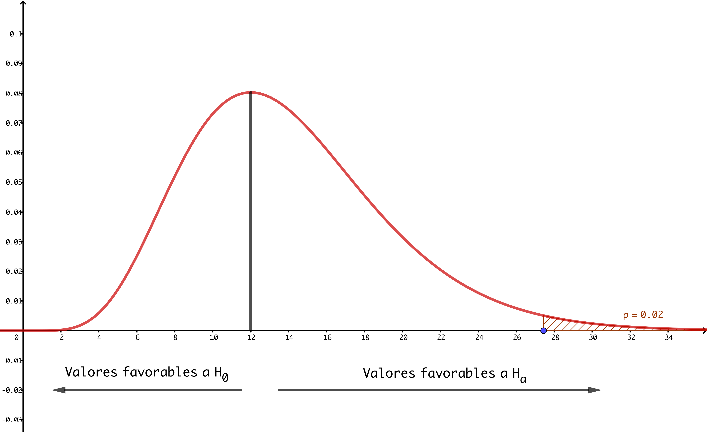

```{r set-options, echo = FALSE, purl=FALSE}
options(width = 60)
library(knitr)
def.chunk.hook  <- knitr::knit_hooks$get("chunk")
knitr::knit_hooks$set(chunk = function(x, options) {
  x <- def.chunk.hook(x, options)
  ifelse(options$size != "normalsize", paste0("\\", options$size,"\n\n", x, "\n\n \\normalsize"), x)
})


if (grepl(pattern = "cloud", getwd())){
  homeDir = "/cloud/project/"
  } else {
  homeDir = "../"
  }
figpath = function(figname){
  paste0(homeDir,"fig/", figname)
}

```

```{r echo = FALSE}
## title: 'Master en Big Data. Fundamentos  matemáticos  del  análisis  de  datos.'
## author: "Fernando San Segundo"
## subtitle: "Sesión 6. Contraste de hipótesis.

```

```{r echo=FALSE}
########################################################################
########################################################################
########################################################################
########################################################################
```

# Contrastes de Hipótesis.

    ```{r echo=FALSE, eval=FALSE, comment = NULL}
    #####################################################################
    # Contraste de Hipótesis
    #####################################################################
    ```
    

## Ejemplo inicial: una discusión científica. 

+ Hemos desarrollado un nuevo método de fabricación de las baterías que se usan en ciertos equipos. Pensamos que es tan bueno que, con este método, los equipos podrán funcionar más tiempo con cada carga completa de la batería. De hecho, afirmamos que  *"la duración (media) de la batería será mayor de lo que era antes de usar el método".* Esta es nuestra **hipótesis (alternativa)**.

+ Para obtener datos relacionados con nuestra afirmación, hemos tomado una muestra de $n = 100$ baterías, fabricadas con nuestro nuevo método. Y nos ponemos muy contentos, porque la duración media es mayor que antes de usar el método. 

+ Concretamente, las *mediciones previas de referencia* nos dice que la duración (en horas) de las baterías fabricadas por el anterior método **se distribuye como una normal**, con media $$\mu_0 = 2.5$$ (en horas). Pero en la muestra de 100 baterías fabricadas con nuestro método hemos observado una duración media (muestral) $$\bar X =  2.65$$
horas, con desviación típica muestral $s = 0.5$. Pues ya está, nuestro método es mejor que el anterior.

+ Pero ese no es el final de la historia, claro...

\vspace{2mm}

---

## Hipótesis nula y alternativa.

\vspace{4mm}

+ La empresa de la competencia, que lleva años vendiendo sus baterías, dirá que nuestro método tiene **efecto nulo** y que las duraciones que hemos observado en nuestras baterías son, simplemente, la variabilidad natural, que las baterias a veces duran más y a veces menos, y que nuestras medidas son simplemente **fruto del azar**. Tenemos así dos afirmaciones o hipótesis enfrentadas.

\vspace{2mm}

+ La hipótesis de la competencia, que llamaremos **hipótesis nula** $H_0$ (porque dice que el efecto es nulo), sostiene que la media no ha aumentado con el nuevo método\vspace{2mm}  
+ Nuestra hipótesis, que dice que la media sí ha aumentado. A esta la llamaremos **hipótesis alternativa** $H_a$.

\vspace{2mm}

+ Un **contraste de hipótesis** puede entenderse como la forma científica de resolver esta discusión, usando los datos y la teoría sobre Probabilidad que hemos aprendido.

\vspace{6mm}

\quad

--- 

## Notación. 

\vspace{2mm}

+ Vamos a usar la siguiente notación, y es **muy importante** entenderla bien desde el principio:  

\vspace{1mm}

+ Llamaremos siempre $\mu$ a la **media real** de la población de la que hemos tomado la muestra (en el ejemplo, las baterías fabricadas por el nuevo método). Ni los defensores de $H_0$ ni los de $H_a$ conocen (ni es posible que conozcan) este valor.  

\vspace{1mm}

+ Además en la discusión ha aparecido un **valor de referencia** $\mu_0 = 2.5$, que compararemos con $\mu$ mediante muestras. Este valor se utiliza para formular claramente las dos hipótesis contrapuestas. 

\vspace{1mm}

+ Los dos valores $\mu$ y $\mu_0$ son *valores teóricos*, no observados. Por último, tenemos el valor de la media muestral, $\bar X$, que es un *valor empírico* y procede de las observaciones. Pero es el valor fundamental para decidir a cuál de las dos hipótesis damos más credibilidad. 

\vspace{1mm}

+ Además es importante entender que ambas partes aceptan el valor de $\bar X$; ese valor no se discute (sería otra discusión). Recuerda que usamos $\bar X$ para **estimar** $\mu$. Así que si $\bar X$ es muy grande, ¿a quién parecen darle la razón los datos?

## Formalizando el contraste.

+ La utilidad de la notación es que podemos usarla para escribir las dos hipótesis con más precisión:

  $(a)$ La **hipótesis alternativa** $H_a$ sostiene que la media de la población (recuerda, la población es *tratada*) es mayor que el valor de referencia.
$$H_a = \{\mu > \mu_0\}$$

  $(b)$ La **hipótesis nula** $H_0$ dice justo lo contrario: que la media de la población (recuerda, la población es *tratada*) es menor o igual que el valor de referencia. 
$$H_0 = \{\mu \leq \mu_0\}$$
  Fíjate en que ponemos el igual en $H_0$ porque si la media es igual, seguirá teniendo razón en que no ha habido **efecto** del tratamiento.  Hay autores que siempre usan $=$  en la hipótesis nula y ponen $H_0 = \{\mu = \mu_0\}$.

+ **En el ejemplo:**  Recuerda que era $\mu_0 = 2.5$. Por lo tanto la hipótesis alternativa es
  $$H_a = \{\mu > 2.5\}$$
  mientras que la nula es:
  $$H_0 = \{\mu > 2.5\}\qquad (\text{ o bien } H_0 = \{\mu = 2.5\})$$
  **¡Atención!** es un error común incluir la media muestral $\bar X= 2.65$ en las hipótesis. 

---

## La idea clave.

+ El punto de partida es este: dado que la muestra procede de la población a examen,  debe ser $\bar X\approx \mu$ y, por lo tanto, si $\bar X$ es mayor que $\mu_0$, eso parece darle la razón a $H_a$. 

+ Pero recuerda que hay *"muestras malas"*. Así que el partidario de $H_0$ dirá ese valor de $\bar X$ se debe a que **por azar** nos ha tocado una muestra mala. Naturalmente, cuanto más grande sea el valor de $\bar X$, **menos probable** es que nos haya tocado por azar **una muestra así de mala**.

+ **En el ejemplo:** el partidario de $H_0 = \{\mu \leq 2.5\}$ puede entonces decir que el valor $\bar X = 2.65$ se debe al azar y a una muestra desafortunada. Pero si el valor muestral hubiera sido $\bar X = 5$, ese argumento de que la muestra es mala pierde mucho peso porque **es muy poco probable que nos toque una muestra tan mala**. 

+ Para hacer de esto una discusión precisa: ¿podemos calcular esa probabilidad? Es decir, ¿podemos calcular la probabilidad de muestras tan malas como esa?  


## Teorema Central del Límite y p-valor.

+ Lo que vamos a hacer es esto: supondremos, provisionalmente, que $H_0$ es cierta. De hecho, admitiremos como correcto el valor de $\mu$ que más le conviene al partidario de $H_0$ (luego volvemos sobre esto). Ese valor es: 
$$\mu = \mu_0$$
+ Y ahora usaremos esa suposición provisional para calcular la probabilidad de una muestra *tan mala o peor para $H_0$* como la nuestra. La probabilidad que vamos a calcular es el **p-valor** del contraste de hipótesis. 

+ Al suponer (provisionalmente) que $\mu = \mu_0$, podemos usar el TCL para decir que la distribución de la media muestral es:
$$
\bar X \sim N\left(\dfrac{\mu_0}{\frac{s}{\sqrt{n}}}\right)
$$
O, lo que es lo mismo, que
$$
\dfrac{\bar X - \mu_0}{\frac{s}{\sqrt{n}}}\sim Z
$$
Y esto nos permite calcular la probabilidad que buscamos, el p-valor, usando la normal estándar.

---

## Cálculo del p-valor en el ejemplo.

+ Recuerda que teníamos:
  $$
  \mu_0 = 2.5,\qquad n = 100,\qquad \bar X = 2.65, s = 0.5 
  $$
  Así que el valor de $Z$ que obtenemos es:
  $$
  \dfrac{\bar X - \mu_0}{\frac{s}{\sqrt{n}}} = 
  \dfrac{2.65 - 2.5}{\frac{0.5}{\sqrt{100}}} = 3
  $$
  Y la siguiente figura ilustra que el p-valor es la probabilidad de la cola derecha de 3 en Z.
  
    ```{r echo=FALSE, fig.align='center', out.width="7cm", purl=FALSE}
    
    ```

+ En R, obtenemos `pValor = pnorm(3, lower.tail = FALSE)` $\approx$ `r signif(1 - pnorm(3), 4)` 


## Interpretación del resultado.

+ Lo que hemos hecho se puede resumir así: *suponiendo que la hipótesis nula fuera cierta* y usando $\mu = \mu_0$, la probabilidad de obtener un valor muestral tan grande o más que $\bar X$ es de tan sólo `r signif(1 - pnorm(3), 4)`. 

+ El partidario de $H_0$ puede insistir en que es fruto del azar, pero ahora sabemos cuantificarlo. Para que el partidario de $H_0$ tenga razón nos debería haber tocado una muestra tan mala que sólo hay una así en cada mil.

+ Imagínate que el valor de $\bar X$ hubiera sido $2.7$, más alejado de $\mu_0 = 2.5$ (y por tanto más favorable a $H_a$). Puedes comprobar que el correspondiente valor de Z sería 
$$
\dfrac{\bar X - \mu_0}{\frac{s}{\sqrt{n}}} = 
\dfrac{2.7 - 2.5}{\frac{0.5}{\sqrt{100}}} = `r (2.7 - 2.5)/(0.05)`
$$
y entonces el p-valor habría sido aún más pequeño: 
`1 - pnorm(4)` $\approx `r signif(1 - pnorm(4), 4)`$. En ese caso al partidario de $H_0$ *le costaría mucho más hacernos creer que todo es fruto del azar.*

+ En resumen, un p-valor pequeño le quita la razón al partidario de $H_0$ y nos llevaría a **rechazar la hipótesis nula.**

## Comentarios.

+ La idea del p-valor es medir **cómo de extraños, inexplicables o sorprendentes le parecen los resultados de la muestra a alguien que cree en la hipótesis nula.** Simbólicamente:
$$\text{p-valor } = P(\text{ datos }\,|\, H_0\text{ es cierta})$$

+ En muchos casos la hipótesis nula representa el conocimiento establecido o aceptado. Y por eso, en general, debemos estar muy convencidos antes de rechazar la hipótesis nula.  Por eso la hipótesis nula *"juega con ventaja".*

+ Y por eso mismo el valor de $\mu = \mu_0$ es el más ventajoso para la hipótesis nula, Si al calcular el p-valor usáramos otro valor de $\mu$ menor que $\mu_0$ el p-valor habría sido aún más pequeño. Así que usamos $\mu_0$ para darle a $H_0$ todas las ventajas. 

+ Esa es la también la razón por la que incluimos todos los valores de la cola derecha. Es la misma idea: si tomáramos sólo una parte de esa cola la probabilidad (el p-valor) sería aún menor, así que usamos todos los valores de la cola. 

+ Hemos usado el TCL para calcular el p-valor, pero también se puede hacer mediante remuestreo, como en el bootstrap. Esa es una opción muy interesante, que cada vez gana más peso en las aplicaciones. Mira el código de este tema.
    ```{r echo=FALSE, eval=FALSE, comment = NULL}
    # p-valor usando el TCL

    
    digits = 30
    
    # Simulamos una muestra de una población normal como la del ejemplo.
    set.seed(2017)
    library(MASS)
    muestra = mvrnorm(n = 100, mu = 2.65, Sigma = 0.5^2, empirical = TRUE)
    
    mu0 = 2.5
    (n = length(muestra))
    (xBar = mean(muestra))
    (s = sd(muestra))
    # El valor del estadístico es: 
    (z = (xBar - mu0) / (s / sqrt(n)))
    # Y el p-valor es:
    (pValor = 1 - pnorm(z))
    
    ###    
    # p-valor por remuestreo
    
    
    # En el ejemplo de las baterías de vehículos, supongamos 
    # que la Hipótesis nula tiene razón. 
    # Concretamente,  suponemos que mu <= 2.5. Entonces podemos simular 
    # la toma de muestras de la población de baterías del nuevo método. 
    # Vamos a usar replicate para hacer esto y ver qué fracción de 
    # esas muestras están de acuerdo con H0.
    # Estimamos p(H0 | datos muestrales)
    
    numMuestras = 100000
    mediasRemuestras = replicate(n = numMuestras, {
      remuestra = sample(muestra, 100, replace = TRUE)
      mediaRemuestra = mean(remuestra)
    })
    # Hemos obtenido muchas medias muestrales. Las primeras son:
    head(mediasRemuestras)
    # ¿Qué proporción de estas medias muestrales está de acuerdo con H0?
    # Es fácil de obtener:
    sum(mediasRemuestras <= mu0) / numMuestras
    # Esta es otra manera de medir el p-valor y como ves, nos 
    # da una respuesta muy parecida al TCL.
    # hist(mediasRemuestras)
    ```
    

## Rechazando la hipótesis alternativa.

+ Volviendo al ejemplo que venimos usando, supongamos que hubiéramos obtenido $\bar X = 2.51$, manteniendo todos los demás valores iguales. Entonces
$$
\dfrac{\bar X - \mu_0}{\frac{s}{\sqrt{n}}} = 
\dfrac{2.51 - 2.5}{\frac{0.5}{\sqrt{100}}} = `r (pv = (2.51 - 2.5)/(0.05))`
$$
y el p-valor correspondiente sería: `1 - pnorm(0.2)` $\approx `r signif(1 - pnorm(0.2), 4)`$.  
Para alguien que cree que la hipótesis nula es cierta eso significa que el valor de $\bar X$ que hemos obtenido no es, en absoluto, una sorpresa (¡la probabilidad es el 42%!). Así que no hay evidencia, usando estos datos, para rechazar $H_0$ y, en su lugar, rechazamos la hipótesis alternativa $H_a$.

+ Hay otra situación que a veces causa confusión al principio. Desde luego, si hubiésemos obtenido una media muestral como $\bar X = 2.45$, que es menor que $\mu_0 = 2.5$ **no necesitaríamos siquiera calcular el p-valor para rechazar $H_a$**. Recuerda que creemos que $\mu \sim \bar X$ y, por tanto, tratar de convencer a alguien de que $\mu > 2.5$ enseñándole el valor $\bar X = 2.45$ es una pérdida de tiempo. Pero por supuesto puedes calcular el valor de $Z$ y el p-valor, que son respectivamente:
$$
\dfrac{\bar X - \mu_0}{\frac{s}{\sqrt{n}}} = 
\dfrac{2.45 - 2.5}{\frac{0.5}{\sqrt{100}}} = `r (pv = (2.45 - 2.5)/(0.05))`, 
\qquad \text{p-valor } \approx `r signif(1 - pnorm(-1), 4)`
$$


---

## Regla de decisión y p-valor. Nivel de significación.

+ Recuerda siempre que:  
    $(a)$ con un **p-valor suficientemente pequeño rechazamos la hipótesis nula**.  
    $(b)$ con un **p-valor grande rechazamos la hipótesis alternativa**

+ ¿Qué es un p-valor pequeño? Para que la decisión sea más objetiva y simple se suele utilizar un umbral de corte predeterminado, llamado el **nivel de significación** *ns*. Entonces, los p-valores más pequeños que 
$$\alpha = 1 - ns$$ 
se consideran suficientemente pequeños. Los valores más frecuentes de *ns* coinciden con los que usamos como nivel de confianza en los intervalos, y son $0.90$, $0.95$ y $0.99$. ¡No los confundas, son cosas distintas! Los correspondientes valores de $\alpha = 1 - ns$ son $0.10$, $0.05$ y $0.01$.

+ Por lo tanto, si hacemos un contraste de hipótesis usando un nivel de significación del $95\%$ y obtenemos un p-valor = 0.004, puesto que $1 - ns = 0.05$, teniendo en cuenta que
$$\text{p-valor }= 0.004 < 0.05 = \alpha = \text{1 - nc}$$
diremos que el p-valor es suficientemente pequeño y rechazamos $H_0$. Si obtuviéramos, por ejemplo, un  $\text{p-valor }= 0.07 > 0.05 = \alpha$ rechazaríamos $H_a$.

## Errores en los contrastes.

+ Al realizar un contraste de hipótesis podemos cometer dos tipos de errores **por la naturaleza aleatoria del proceso de muestreo**. 

\begin{table}[htbp]
    \begin{center}
    \begin{tabular}{cccc}
    \cline{3-4}
    &&\multicolumn{2}{|c|}{\bf ¿Qué hipótesis es cierta?}\\[1mm]
    \cline{3-4}
                                                  &&\multicolumn{1}{|c|}{\bf $H_a$ (alternativa) es cierta}&\multicolumn{1}{|c|}{\bf $H_0$ (nula) es cierta}\\[3mm]
    \cline{2-4}
                                    &\multicolumn{1}{|c|}{\bf Rechazar $H_0$}&\multicolumn{1}{|c|}{\bf Decisión correcta}&\multicolumn{1}{|c|}{\bf Error tipo I ($\alpha$)}\\[3mm]
    \cline{2-4}
                                    &\multicolumn{1}{|c|}{\bf Rechazar $H_a$}&\multicolumn{1}{|c|}{\bf Error tipo II ($\beta$)}&\multicolumn{1}{|c|}{\bf Decisión correcta}\\[3mm]
    \cline{2-4}
    \end{tabular}
\end{center}
\end{table}

+ Esta situación recuerda a la de las pruebas diagnósticas y, de hecho, ese lenguaje se aplica también aquí hasta cierto punto.

+ En muchos casos los errores de tipo I se consideran los más importantes. ¿Cuál es la probabilidad de cometer un error de tipo I, cuando usamos un nivel de significación $ns$ (y el correspondiente $\alpha = 1 - ns$)? Sería:
$$
P(\text{ rechazar }H_0\,|\, H_0\text{ es cierta})
$$
Pero eso ocurre precisamente si la muestra que hemos usado es una de esas muestras malas cuyo p-valor es menor que $\alpha$. Así que cuando pensamos en todas ellas vemos que **la  probabilidad de cometer un error de tipo I usando *ns* es precisamente $\alpha$.**

## Estadístico del contraste. Región de rechazo. 

+ En el ejemplo que hemos utilizado hemos organizado el cálculo del p-valor y la decisión del contraste este diagrama:
$$
H_0\text{ y }H_a \longrightarrow
\text{datos muestra }n, \bar X, s \longrightarrow
\textbf{estadístico }Z = \dfrac{\bar X - \mu_0}{\frac{s}{\sqrt{n}}} \longrightarrow
$$
$$
\text{ p-valor usando  }Z \longrightarrow 
\text{¿p-valor }< \alpha = 1 - ns\text{?} \longrightarrow
\text{rechazar } H_0 \text{ o rechazar }H_a
$$
+ Al hacer esto vemos que existe un valor $z_{\alpha}$ tal que si el *estadístico* $Z$ calculado en la muestra cumple $Z > z_{\alpha}$, entonces rechazamos $H_0$. Esos valores del estadístico forman la **región de rechazo** del contraste.
    ```{r echo=FALSE, fig.align='center', out.width="9cm", purl=FALSE}
    
    ```

---

## Ejemplo de región de rechazo y uso de los valores muestrales.

+ En el caso del ejemplo que venimos usando, si queremos trabajar a un nivel de significación del 95% entonces $\alpha = 0.05$ y el valor $z_{\alpha} = z_{0.05}$ es:
$$
\text{\tt qnorm(1 - 0.05)} \approx `r signif(qnorm(1 - 0.05), 4)` 
$$
Por lo tanto la región de rechazo la forman los valores de $Z > `r signif(qnorm(1 - 0.05), 4)`$.

+ Pero también podemos expresar el valor $Z$ a partir de los valores muestrales de ese ejemplo y escribir esa condición en términos de $\bar X$:
$$
\dfrac{\bar X - 2.5}{\frac{0.5}{\sqrt{100}}} > `r signif(qnorm(1 - 0.05), 4)`
$$
Despejando de aquí el valor de $\bar X$ obtenemos esta condición:
$$
\bar X >  `r signif(2.5 + (0.5/sqrt(100)) * qnorm(1 - 0.05), 4)`
$$
que nos indica a partir de que valores de la media muestral rechazaríamos $H_0$. Pero cuidado, esto se debe interpretar con prudencia, porque cada muestra produce su propio valor de $s$.

---

## Otro ejemplo de contraste de hipótesis. 

+ Vamos a pensar en otro ejemplo:  
*La inspección de consumo está examinando un envío de latas de conserva, de las que el fabricante afirma que el peso medio son $1000$ gramos. Al examinar una muestra aleatoria de $100$ latas, un inspector obtuvo un peso medio muestral de $998.5$ gramos, con una varianza muestral de $s^2 = 36.1$ (gramos$^2$). Con esos datos, el inspector se pregunta si el peso medio de las latas será en realidad  menor que el enunciado por el fabricante. Al nivel de confianza $95$\%, ¿qué responderías a la pregunta del inspector? Queremos, además, obtener el p-valor de este contraste.*

+ Vamos a tomar como valor de referencia $\mu_0 = 1000$g, como afirma el fabricante. Es importante entender que el peso medio real $\mu$ no se conoce. La sospecha del inspector se puede traducir en forma de esta hipótesis alternativa:
$$H_a:\{\mu < \mu_0\},\quad\text{ con }\mu_0 = 1000$$
a la que corresponde la hipótesis nula:
$$H_0:\,\{\mu \geq \mu_0\}$$
Las desigualdades en estas hipótesis tienen el sentido contrario al del ejemplo inicial con la duración de las baterías de vehículos.  

---

## Cálculo del p-valor.

+ El esquema es muy parecido al que hemos usado en el primer ejemplo, pero la figura de referencia ahora es esta:
    ```{r echo=FALSE, fig.align='center', out.width="6cm", purl=FALSE}
    
    ```
  Calculamos el estadístico que es, naturalmente, negativo:
  $$\dfrac{\bar X - \mu_0}{\frac{s}{\sqrt{n}}} = 
  \dfrac{998.5 - 1000}{\sqrt{\frac{36.1}{100}}} \approx 
  `r (estadistico = signif((998.5 - 1000)/sqrt(36.1/100) ,4))`
  $$
+ El p-valor ahora es la probabilidad de la cola izquierda del estadístico:
  $$
  \text{\tt pnorm((998.5 - 1000)/sqrt(36.1/100))} \approx `r signif(pnorm(estadistico),4)`
  $$
Comparamos el p-valor con $\alpha = 0.05$ y al ser p-valor $< \alpha$, rechazamos $H_0$. Con esos datos rechazamos que el peso medio de las latas sea $\geq 1000g$.

## Contraste bilateral.

+ Pensemos el mismo problema desde la perspectiva del fabricante. Al inspector le preocupa que el peso de las latas pueda ser menor que $1000g$, porque eso podría ser un fraude a los consumidores (pero si el fabricante decide envasar en cada lata más producto del que anuncia, el inspector no pondrá pegas). 

+ En cambio la decisión del fabricante es más complicada:  

    $-$ si envasa demasiado poco producto, el inspector le sancionará.  
    $-$ si, para evitar eso, envasa demasiado producto en cada lata, estará perdiendo dinero. 
    
+ ¿Cuál debe ser entonces su objetivo? Lo razonable es intentar que la cantidad de producto envasado se parezca mucho al objetivo marcado $\mu_0=1000$ gramos. Así que el fabricante tratará de cumplir la hipótesis nula (bilateral):
\[ H_0=\{\mu = \mu_0\}.\]
El departamento de control de calidad de la fábrica trabajará para contrastar esta hipótesis frente a la hipótesis alternativa
\[ H_a=\{\mu\neq \mu_0\}.\]

+ En un contraste bilateral es más difícil rechazar $H_0$. Por eso, si hay *"presunción de inocencia"* para $H_0$ se suelen usar contrastes bilaterales.

## Cálculo del p-valor en el caso bilateral. ¡¡Cuidado!!

+ En este caso al defensor de la hipótesis nula le preocupa por igual alejarse de $\mu_0$ hacia valores más bajos o más altos. La figura que refleja esa situación es:
    ```{r echo=FALSE, fig.align='center', out.width="6cm", purl=FALSE}
    
    ```
  Por eso, al calcular el estadístico del contraste incluimos un valor absoluto:\small
  $$\text{estadistico} = \left|\dfrac{\bar X - \mu_0}{\frac{s}{\sqrt{n}}}\right| = 
  \left|\dfrac{998.5 - 1000}{\sqrt{\frac{36.1}{100}}} \right|\approx 
  `r (estadistico = signif(abs(998.5 - 1000)/sqrt(36.1/100) ,4))`
  $$\normalsize
+ Al calcular el p-valor **sumamos la probabilidad de las dos colas**, multiplicando por 2:
  $$
  \text{\tt 2 * pnorm(estadistico, lower.tail = FALSE)} \approx `r signif(2 * (1 - pnorm(estadistico)),4)`
  $$
  En este caso, con $ns = 0.95$ también rechazaríamos la $H_0$.

## Contrastes sobre la media con muestras pequeñas en variables normales.

    ```{r echo=FALSE}
    ###    
    # t de Student: contrastes sobre la media 
    # con muestras pequeñas en variables normales.
    
    n = 21
    barX = 3.6
    s = 0.6
    mu0 = 4
    estadistico = (barX - mu0) / (s/sqrt(n))
    pValor = pt(estadistico, df = n - 1)
    ```
+ El contraste es análogo, cambiando $Z$ por la $t_k$,  siendo $k$ el tamaño de la muestra.

+ **Ejemplo:** Vamos a hacer el contraste: 
$$H_0 = \{\mu \geq 4\}, \qquad H_a = \{\mu < 4\}$$
con $ns = 99\%$ y estos datos muestrales:
$$
n = 21,\qquad \bar X = 3.6, \qquad s = 0.6
$$
+ El valor de referencia es $\mu_0 = 4$, así que el estadístico es:
$$
T = \dfrac{\bar X - \mu_0}{\frac{s}{\sqrt{n}}} =
\dfrac{3.6 - 4}{\frac{0.6}{\sqrt{21}}}\approx
`r signif(estadistico, 4)`
$$
Aunque la fórmula es la misma, lo llamamos $T$ porque usamos la $t_k$ de Student (con $k = n - 1 = 20$) para calcular el p-valor:
$$
\text{ \tt pValor = pt(estadistico, df = n - 1)} \approx `r signif(pValor,4)`
$$
¿Cuál es la decisión?

+ Los otros tipos de contrastes son similares, cambiando $Z$ por la $t_k$. 

## La función `t.test` de R.

+ Usar siempre `pnorm` para hacer contrastes no es cómodo ni eficiente. Por eso no existe `t.test`.

+ **Ejemplo:** Vamos a usar `t.test` con los datos de la variable `cty` en la tabla `mpg` (librería `tidyverse`) para contrastar la hipótesis alternativa:
$$H_a =\{\mu \neq 16\}$$
  \small
    ```{r echo = -1, message=FALSE}
    # La función t.test
    
    library(tidyverse)
    (testCty = t.test(mpg$cty, mu = 16, 
                      alternative = "two.sided", conf.level = 0.95))
    ```
  \normalsize Las $H_a$ para contrastes unilaterales se indican con `less` y `greater`.
  
## Detalles adicionales sobre `t.test`  
  
+ Asignar el resultado de $t.test$ a una variable permite acceder a componentes de la respuesta. Por ejemplo, el p-valor:\small
    ```{r}
    testCty$p.value
    ```
  \normalsize
  
+ Además `t.test` también calcula un intervalo de confianza para la media:\small
    ```{r}
    testCty$conf.int
    ```
  \normalsize Si el contraste es unilateral R produce un intervalo de confianza *no acotado*. Por ejemplo, si para la variable `displ` de `mpg` contrastamos $H_a = \{\mu > 3.4\}$\small
    ```{r}
    testDispl = t.test(mpg$displ,  mu = 3.4, 
                        alternative = "greater", conf.level = 0.95)
    testDispl$conf.int
    ```
  \normalsize El intervalo (al 95%) para $\mu$ es  $(`r signif(testDispl$conf.int[1], 4)`, +\infty)$ 
  
  


## Contrastes de hipótesis para la varianza.

+ En el caso de la varianza, que es una medida de **dispersión**,  las comparaciones adecuadas utilizan **cocientes en lugar de diferencias**.

+ Tipos de contraste: dos unilaterales y una bilateral:
$$H_0 = \{\sigma^2 \leq \sigma^2_0\}, \qquad H_a = \{\sigma^2 > \sigma^2_0\}$$
$$H_0 = \{\sigma^2 \geq \sigma^2_0\}, \qquad H_a = \{\sigma^2 < \sigma^2_0\}$$
$$H_0 = \{\sigma^2 = \sigma^2_0\}, \qquad H_a = \{\sigma^2 \neq \sigma^2_0\}$$

+ Si la variable es normal el estadístico adecuado es un cociente, cuya distribución es:
$$Y = (n-1)\dfrac{s^2}{\sigma^2}\, \sim\,\chi^2_k,\quad\mbox{ con }\,k=n-1.$$
**¡Cuidado!** Cuando usemos este resultado cambiaremos $\sigma^2$ por $\sigma^2_0$ porque ese es el valor más favorable a la hipótesis nula.

+ El **p-valor** se calcula como en el caso de la media: calculamos la probabilidad de la cola adecuada del estadístico en los casos unilaterales y la multiplicamos por dos en el bilateral.

+ **Cuidado:** cuando los contrastes se plantean sobre la **desviación típica** hay que elevar al cuadrado o calcular la raíz cuadrada de los datos muestrales según sea preciso.

---

## Ejemplo de contraste sobre la desviación típica.

+ **Ejemplo:** *Un laboratorio farmacéutico garantiza que produce comprimidos de diámetro uniforme, porque la desviación típica de su diámetro es 0.5mm. Una muestra de 15 unidades dio una desviación típica $s = 0.7mm$. ¿Es aceptable la afirmación del laboratorio al nivel de significación del 5\%?*
    ```{r echo=FALSE}
    ## Contraste sobre la desviación típica.
    
    n = 15
    sigma0 = 0.5
    s = 0.7
    estadistico = (n - 1) * s^2 / sigma0^2
    pValor = pchisq(estadistico, df = n - 1, lower.tail = FALSE)
    ```

+ El valor de referencia es $\sigma_0^2 = 0.5^2$ y las hipótesis son: 
$$H_0 = \{\sigma^2 \leq \sigma^2_0\}, \qquad H_a = \{\sigma^2 > \sigma^2_0\}$$
+ Con los datos muestrales calculamos el estadístico:
$$
Y = (n-1)\dfrac{s^2}{\sigma_0^2} = (15 - 1) \dfrac{0.7^2}{5^2}
\approx `r signif(estadistico,4)`
$$

+ Para calcular el p-valor tienes que decidir si calculas la cola izquierda o derecha de este valor en $\chi^2_{14}$. **¡Es bueno pensar sobre un dibujo que ayude a elegir los valores más favorables a cada una de las hipótesis!** 

## 

+ La figura para entender la situación es parecida a:
    ```{r echo=FALSE, fig.align='center', out.width="8cm", purl=FALSE}
    
    ```
  Por tanto  para obtener el p-valor calculamos la cola derecha:
  $$
  \text{ \tt pValor = 1 - pchisq(estadistico, df = n - 1)} \approx `r signif(pValor,4)`
  $$
  con lo que a un nivel de significación del 95% ($\alpha = 0.05$) podemos rechazar $H_0$ y concluir que los datos no permiten afirmar que la desviación típica sea menor o igual que $0.5$.

## Opcional: la función `sigma.test` de la librería TeachingDemos.

+ Aunque R básico no incluye ninguna función para los contrastes de varianza en una única variable normal, la librería TeachingDemos proporciona `sigma.test`. Asegúrate de instalarla antes de ejecutar este código que ilustra el contraste de $$H_a = \{\sigma^2 > 16\}$$
en la variable `cty` de `mpg`.\scriptsize
    ```{r echo = -1}
    # Usando TeachingDemos
    require(TeachingDemos)
    (varTestCty = sigma.test(mpg$cty, sigmasq = 16, 
               alternative = "greater", conf.level = 0.95))
    ```
  \normalsize


## Tamaño muestral y potencia del contraste.

+ Recordemos:  
  $-$ Error de tipo I: rechazar $H_0$ cuando es cierta. $P(\text{error tipo I}) = \alpha$.  
  $-$ Error de tipo II: rechazar $H_a$ cuando es cierta. $P(\text{error tipo II}) = \beta$.  

+ La **potencia** de un contraste es $1 -\beta$ y por tanto puedes pensar que:\small
$$\mbox{potencia } =  1-\beta\, = \,1-P(\mbox{error de tipo II})  = $$
$$
= 1 - P(\mbox{rechazar }H_a | H_a\mbox{ es cierta}) = P(\mbox{rechazar }H_0 | H_0\mbox{ es falsa}).
$$
\normalsize

+ La potencia del contraste mide cómo de bueno es detectando una $H_0$ falsa. En general nos gustaría tener a la vez $\alpha$ pequeño y potencia grande. Pero, como en otros casos, no se pueden tener las dos cosas a la vez. 

+ El cálculo de la potencia es en general complicado. **En el caso de un contraste para la media** es aproximadamente:
$$
\text{potencia} = 1 - \beta = K\, \dfrac{\delta\,\sqrt{n}\,\alpha}{\sigma}
$$
donde $K$ es una constante de proporcionalidad, $n$, $\alpha$ y $s$ son conocidos y $\delta$ es el **tamaño del efecto**. Es decir, la diferencia mínima entre $\mu$ y $\mu_0$ que queremos que el contraste sea capaz de detectar para rechazar $H_0$ en tal caso.

## Ecuaciones de potencia, observaciones generales

+ Observa la ecuación de potencia que hemos obtenido:
$$
\text{potencia} = 1 - \beta = K\, \dfrac{\delta\,\sqrt{n}\,\alpha}{\sigma}
$$
+ Aunque esta ecuación es sencilla, ilustra varias ideas importantes sobre la potencia:  
    
    $1$. $n$ es el tamaño de la muestra. A más muestra, más potencia.  
    
    $2$. $\delta$ es la diferencia entre $\mu$ y $\mu_0$. Es decir, el *efecto* que esperamos detectar. Cuanto mayor sea el efecto, mayor potencia.  
    
    $3$. $\alpha$ es el nivel de significación del contraste, que solemos fijar en $0.05$. **No podemos tener a la vez $\alpha$ pequeño y potencia = $1 - \beta$ grande**
    
    $4.$ $\sigma$ es la desviación típica, que indica la dispersión de la población. La solemos estimar con $s$, a menudo procedente de estudios piloto o previos. Y a mayor dispersión, menor potencia.  

## Curvas de potencia.

+ Las ecuaciones de potencia permiten dibujar las llamadas *curvas de potencia* que, para valores de $n$, $\alpha$ y $s$ fijos, muestran como depende la potencia del tamaño del efecto (medido en "unidades" $s$). El aspecto típico de una de estas curvas es:
    ```{r echo=FALSE, message=FALSE, fig.align='center', out.width = "50%"}
    # Gráfica de las curvas de potencia
    
    alfa = 0.01
    s = 0.5
    deltas = seq(0, s, length.out=1000)
    n0 = 100
    powers = power.t.test(sd = s, n=n0, sig.level =alfa, delta = deltas, 
                          type = "one.sample", alternative = "two.sided", strict=FALSE)$power
    plot(deltas, powers,pch=20,col="blue",lwd=0.6,ylab="Potencia",xlab=expression(delta==mu-mu[0]),font.lab=2,cex.axis=1.5,cex.lab=1.3)
    
    ```
  que confirma la idea de que a mayor tamaño del efecto, mayor es la potencia.

## La función power.t.test

+ Las ecuaciones de potencia permiten determinar el tamaño muestral necesario para poder detectar un efecto de tamaño dado, con niveles de significación y potencia dados. En R las funciones con nombres que empiezan por power sirven para esto.

+ **Ejemplo:** ¿Cuál es el tamaño muestral $n$ necesario para un contraste unilateral de hipótesis con $nc = 0.99$ ($\alpha = 0.01$) y potencia $1 - \beta = 0.80$ que sea capaz de detectar un efecto (diferencia entre las medias $\mu$ y $\mu_0$) mayor o igual a $\delta = 0.1$? En un estudio piloto obtuvimos $s = 0.5$.

+ Usamos:\scriptsize
  ```{r echo = -(1:2)}
  ## Tamaño muestral y potencia del contraste.
  
  power.t.test(delta = 0.1, sd = 0.5, sig.level = 0.05,
               power = 0.80, type="one.sample", alternative="one.sided")
  ```
  \normalsize

+ **Ejercicio.** Aquí hemos calculado $n$, pero esta función puede usarse para determinar uno de los valores a partir de los restantes. Prueba  \scriptsize
  ```{}
  power.t.test(delta = 0.1, sd = 0.5, sig.level = 0.05, n = 300, 
               type="one.sample", alternative="one.sided")
  ```
  \normalsize


# Uso y abuso del p-valor.

---
  
```{r echo=FALSE, eval=FALSE, purl=FALSE}
library(RXKCD)
getXKCD(which = "1478", saveImg = TRUE)
```
```{r echo=FALSE, message=FALSE, fig.align='center', out.width = "50%", purl=FALSE}

```

## Significación estadística vs relevancia científica. 

+ *Un fabricante garantiza que produce comprimidos de diámetro medio de 13mm.  En una muestra de 50 unidades tiene un  diámetro medio $\bar X =13.05$mm, desviación típica $s = 0.6$mm. ¿Es aceptable esta afirmación al nivel de significación del 99%?*
    ```{r echo=FALSE}
    ## Significación estadística vs relevancia científica. 

    n = 50
    barX = 13.05
    s = 0.6
    mu0 = 13
    estadistico = (barX - mu0) / (s/sqrt(n))
    pValor = 2 * pt(abs(estadistico), df = n - 1, lower.tail = FALSE)
    ```

+ La hipótesis nula es $H_0:\{\mu = 13\}$, y la alternativa $H_a:\{\mu\neq 13\}$. El estadístico y p-valor (calculado con la $t$ de Student) son:
$$
T = \dfrac{\bar X - \mu_0}{\frac{s}{\sqrt{n}}} =
\dfrac{13.05 - 13}{\frac{0.6}{\sqrt{50}}}\approx
`r signif(estadistico, 4)`,\qquad
\text{p-valor: }
`r signif(pValor, 4)`
$$
+ El contraste **no** es significativo, rechazamos $H_a$. Fíjate en que el efecto es $\delta = 0.05$.
Pero ahora repetimos la cuenta con los mismos valores, salvo que aumentamos el tamaño muestral a $n = 5000$.
  ```{r echo=FALSE}
  # ahora con una muestra mucho más grande:
  
  n = 5000
  barX = 13.05
  s = 0.6
  mu0 = 13
  estadistico = (barX - mu0) / (s/sqrt(n))
  pValor = 2 * pt(abs(estadistico), df = n - 1, lower.tail = FALSE)
  ```
$$
T = \dfrac{\bar X - \mu_0}{\frac{s}{\sqrt{n}}} =
\dfrac{13.05 - 13}{\frac{0.6}{\sqrt{5000}}}\approx
`r signif(estadistico, 4)`,\qquad
\text{p-valor: }
`r signif(pValor, 4)`
$$

+ Ahora el p-valor es *muy* pequeño y rechazamos $H_0$. Este ejemplo ilustra un principio general: **si se usan muestras suficientemente grandes, incluso un efecto $\delta = \mu - \mu_0$ muy pequeño (irrelevante) puede llegar a ser estadísticamente significativo.**

---

## Relevancia y la d de Cohen.

+ ¿Como podemos entonces juzgar la **relevancia** del efecto observado? El primer consejo es que *los resultados de un contraste deberían ir siempre acompañados de estimaciones del tamaño del efecto*.  Por ejemplo, usando intervalos de confianza. 

+ La **d de Cohen** es:
$$d = \dfrac{\bar X - \mu_0}{s}$$
Podemos usarla para hacernos una idea aproximada de la relevancia del efecto observado teniendo en cuenta estas indicaciones:  

    $-$ Un valor $d < 0.2$ indica  un efecto no relevante.  
    $-$ Si es $d > 0.8$  es muy posible que la diferencia sea relevante.
    $-$ Cuando $0.2 < d < 0.8$ se necesita la **opinión de un experto** que juzgue la relevancia de los resultados.


+ En el ejemplo anterior, con la muestra grande, se obtiene:
    ```{r echo=FALSE}
    ## Relevancia y la d de Cohen.
    
    dCohen = (barX - mu0) / s
    ```
    $$
    d = \dfrac{\bar X - \mu_0}{s} =
    \dfrac{13.05 - 13}{0.6}\approx
    `r signif(dCohen, 4)`
    $$
    así que parece que ese efecto $\delta  = 0.05$ es, seguramente, irrelevante.

## El problema de los contrastes múltiples.

+ El contraste de hipótesis es el método habitual para confirmar un resultado científico o técnico a partir de los datos. Pero su uso puede prestarse a errores o incluso a manipulaciones mal intencionadas. 

+ Por ejemplo, ya sabemos que $\alpha$ es la probabilidad de cometer un error de tipo I (rechazar una $H_0$ cierta). Si por ejemplo $\alpha = 0.05$. Si realizamos 20 contrastes independientes de hipótesis nulas **todas ellas ciertas** ¿cuál es la probabilidad de que (nos toque alguna muestra mala y) rechacemos alguna $H_0$? Es fácil ver que la situación tiene todos los ingredientes de una binomial $B(20, \alpha)$ y si $X = ($número de $H_0$ rechazadas) entonces
$$P(X > 0) = 1 - P(X = 0) = 1 - (1 - \alpha)^{20}\approx`r signif(1 - 0.95^20)`$$
que también puedes calcular en R como: `1 - dbinom(0, size = 20, prob = 0.05)`. 

+ Eso significa que simplemente repitiendo el contraste 20 veces hay un 64% de probabilidades de obtener un resultado *significativo ¡¡y falso!!*.

## Simulando contrastes múltiples con R.

+ Vamos a usar R para confirmar la discusión anterior en una simulación.\small
  ```{r echo = -(1:2)}
  ## Simulando contrastes múltiples con R.
  
  set.seed(2019)
  nTests = 20 # Haremos 20 contrastes
  # y este vector los 20 p-valores
  pValores = numeric(nTests)
  # Ahora hacemos los contrastes y guardamos los p-valores
  for(i in 1:nTests){
    muestra = c(rnorm(15))
    pValores[i] = t.test(muestra, alternative = "two.sided", mu = 0)$p.value
  }
  # ¿Cuál es el p-valor más pequeño?
  min(pValores)
  ```
  \normalsize Como puede verse, hay al menos un p-valor  $< \alpha$, así que estaríamos rechazando incorrectamente al menos una de las $H_0$.

+ Una primera solución consiste en aplicar la \link{https://en.wikipedia.org/wiki/Bonferroni_correction}{corrección de Bonferroni}, que en esencia cambia el criterio de rechazo de $H_0$ de p-valor $< \alpha$ por el criterio p-valor $< \frac{\alpha}{m}$ siendo $m$ el número de contrastes. Ver  [@openintroStatistics, Section 7.5].

## p-hacking y otras problemáticas.

+ La situación que acabamos de describir puede ocurrir por desconocimiento, pero también puede ser una estratagema de alguien tratando de obtener un resultado significativo a cualquier coste. Este tipo de manejos forman parte de lo que se denomina \link{https://en.wikipedia.org/wiki/Data_dredging}{p-hacking, o data-dredging}.  Un ejemplo en clave de humor de \link{https://xkcd.com/882/}{XKCD}.

+ Recomendamos leer esta nota breve de [\textcolor{blue}{Investigación y Ciencia}](http://www.investigacionyciencia.es/noticias/grandes-expertos-en-el-uso-de-la-estadstica-proclaman-que-0-05-no-es-el-filtro-adecuado-15521?utm_source=boletin&utm_medium=email&utm_campaign=Del+1+al+8+de+septiembre) o aún mejor el [\textcolor{blue}{artículo de Nature}](https://www.nature.com/news/big-names-in-statistics-want-to-shake-up-much-maligned-p-value-1.22375) del que procede, o este [\textcolor{blue}{otro más extenso}](http://www.nature.com/news/scientific-method-statistical-errors-1.14700), de Regina Nuzzo, también en Nature. 

+ El control del error en contrastes repetidos es un tema ha sido objeto de estudio intenso recientemente. Por ejemplo en *Genómica* o en *Big Data* son comunes los casos en los que se contrastan decenas de miles de hipótesis a la vez (uno por gen, por ejemplo).  En esos casos usar correcciones tipo Bonferroni sería demasiado drástico: rechazaríamos demasiado pocas $H_0$. Una referencia elemental para empezar a entender este tema es \link{https://en.wikipedia.org/wiki/Family-wise_error_rate}{este artículo} de la Wikipedia. 

## Referencias para la sesión

**Enlaces**

```{r eval = FALSE, comment = NULL,  echo=FALSE, purl=FALSE, message=FALSE, error=FALSE}
getwd()
sessionName = "sesion06"
RmdName = paste0(sessionName,".Rmd")
ScriptName = paste0(sessionName,"-comandos.R")
lnkScriptGitHub = paste0("https://raw.githubusercontent.com/fernandosansegundo/MBDFME/master/scripts/", ScriptName)
knitr::purl(RmdName, output = paste0("./scripts/", ScriptName), documentation = 0)
codigo = readLines(paste0("./scripts/", ScriptName))
codigo = gsub(pattern = '../datos', replacement= "./data", codigo, fixed=TRUE)
empty_lines = grepl('^\\s*$', codigo)
dobleBlanco = empty_lines[-1] * empty_lines[-length(empty_lines)]
codigo = codigo[!dobleBlanco]
writeLines(codigo, paste0("./scripts/", ScriptName))
```


- \link{https://raw.githubusercontent.com/fernandosansegundo/MBDFME/master/scripts/03-PoblacionesMuestrasProbabilidad.R}{Código de esta sesión}

- \link{https://leanpub.com/regmods}{Regression Models for Data Science in R, de Brian Caffo.}

```{r echo = FALSE, purl=FALSE}
url = "https://raw.githubusercontent.com/hadley/r4ds/master/diagrams/join-inner.png"
download.file(url, destfile ="./fig/r4ds-join-inner.png", mode = "wb")

```

**Bibliografía**

