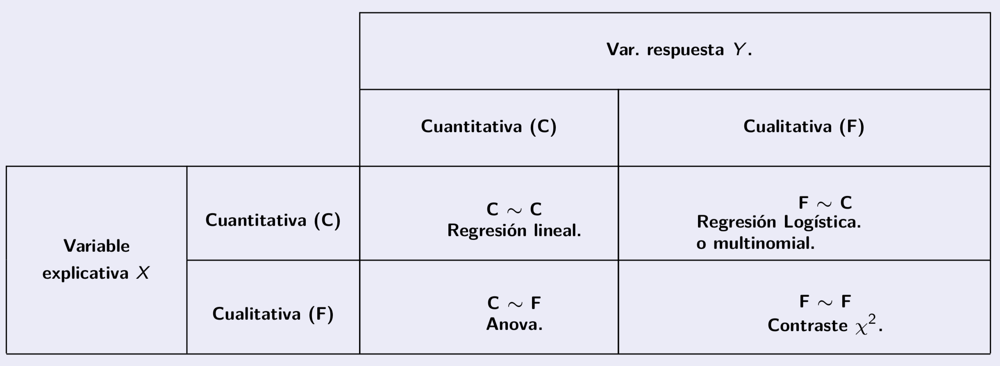
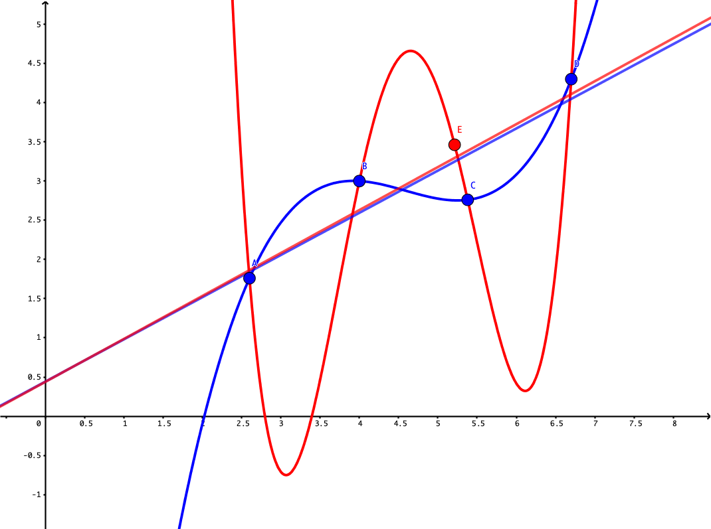
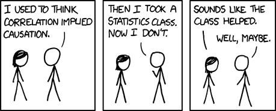
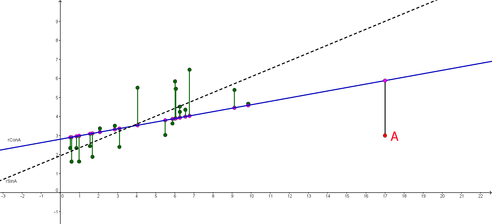
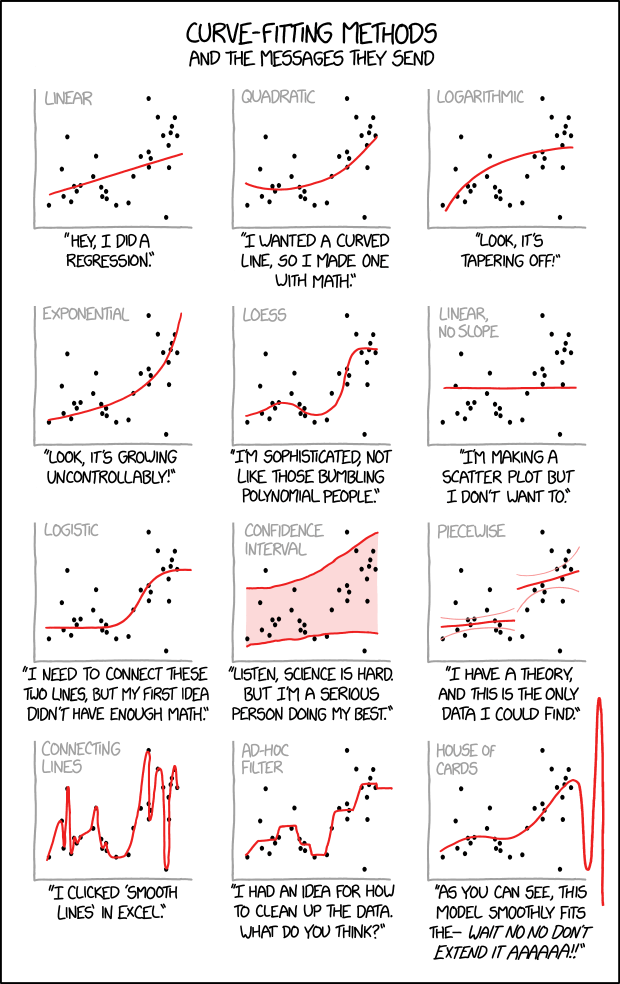
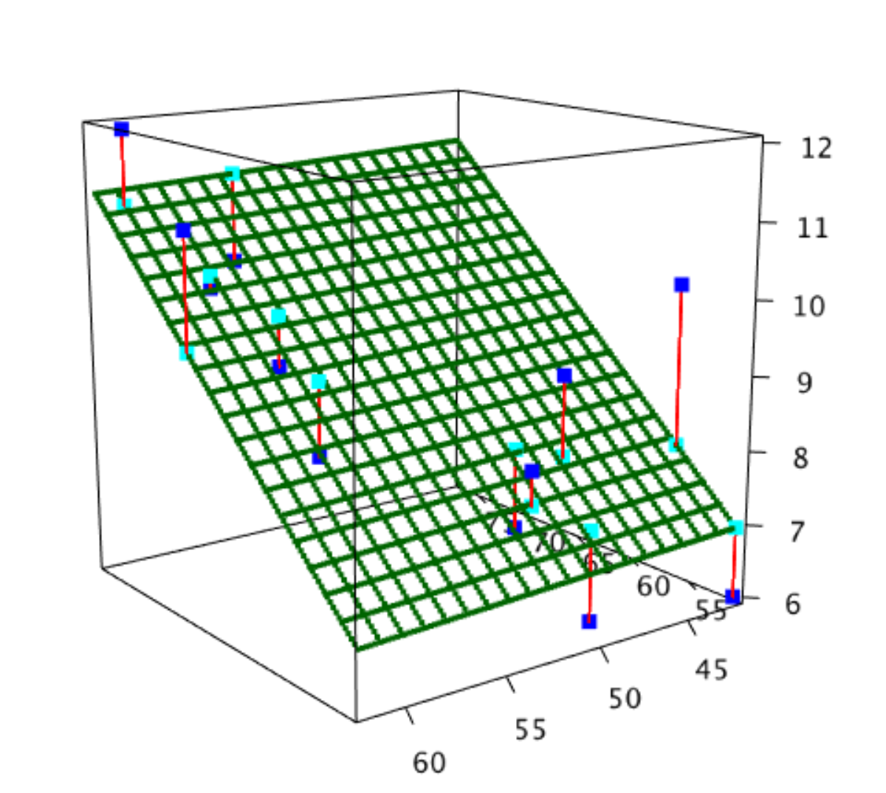

```{r set-options, echo = FALSE, purl=FALSE}
options(width = 60)
library(knitr)
def.chunk.hook  <- knitr::knit_hooks$get("chunk")
knitr::knit_hooks$set(chunk = function(x, options) {
  x <- def.chunk.hook(x, options)
  ifelse(options$size != "normalsize", paste0("\\", options$size,"\n\n", x, "\n\n \\normalsize"), x)
})


if (grepl(pattern = "cloud", getwd())){
  homeDir = "/cloud/project/"
  } else {
  homeDir = "../"
  }
figpath = function(figname){
  paste0(homeDir,"fig/", figname)
}

```

```{r echo = FALSE}
## title: 'Master en Big Data. Fundamentos  matemáticos  del  análisis  de  datos.'
## author: "Fernando San Segundo"
## subtitle: "Sesión 7. Introducción a los modelos. Regresión lineal simple.

```

```{r echo=FALSE}
########################################################################
########################################################################
########################################################################
########################################################################
```


# Relación entre dos variables.

## Introducción.

+ Vamos a extender los métodos de inferencia que hemos aprendido al estudio de las **relaciones entre dos variables aleatorias**, relación que representamos con un símbolo que ya conocemos:
$$Y \sim X$$
donde $X$ es la **variable explicativa**, mientras que $Y$ es la **variable respuesta.** 

+ Dependiendo del tipo de variables $X$ e $Y$ se pueden dar cuatro situaciones:
  ```{r echo=FALSE, message=FALSE, fig.align='center', out.width = "90%", purl=FALSE}
  
  ```
  Empezaremos por el caso $C \sim C$, la relación entre dos variables continuas. Pero primero vamos a hablar sobre la exploración gráfica de estos cuatro tipos de relaciones. 

## Dos variables continuas.

+ Recomendamos encarecidamente la lectura de los Capítulos 3 y 7 de [R for Data Science, @Wickham2016].

+ Para representar gráficamente este tipo de situaciones usaremos un *diagrama de dispersión (scatterplot)*. Dibujamos pares $(x, y)$ donde $x$ es la variable explicativa e $y$ la respuesta. Con R clásico y las variables `cty` (respuesta) y `hwy` (explicativa) de `mpg` se obtiene este diagrama:\small
    ```{r echo = -1, message=FALSE, warning = FALSE, fig.align='center', out.width = "60%"}
    # Diagrama de dispersión
    library(tidyverse)
    plot(mpg$hwy, mpg$cty, pch = 19, col = "blue", xlab = "hwy", ylab = "cty")
    ```

## Diagrama de dispersión con ggplot. 

+ Con ggplot el código y el diagrama son:\small   
    ```{r echo=-1, message=FALSE, fig.align='center', out.width = "65%", results= "hold"}
    # con ggplot
    library(tidyverse)
    plt = ggplot(mpg) +
      geom_point(aes(hwy, cty), col = "darkgreen")
    plt
    ```
\normalsize Pronto volveremos con más detalle sobre este tipo de gráficos. Hemos puesto nombre al gráfico porque lo reutilizaremos más adelante.

## Una variable continua $X$ y un factor $F$.

+ Para este tipo de situaciones podemos emplear varios recursos gráficos. Puesto que la variable $X$ es continua sus valores se pueden representar mediantes boxplots, histogramas, curvas de densidad, etc. Para ilustrar la relación con $F$ mostramos esos diagramas para cada nivel del factor $F$. 

+ Por ejemplo, para ilustrar la relación entre $X =$ `cty` y el factor `class` de `mpg` dibujamos boxplots (o violinplots) paralelos por niveles y añadimos los puntos de las poblaciones.\small  
    ```{r echo=-1, message=FALSE, fig.align='center', out.width = "50%"}
    # Una variable continua $X$ y un factor $F$.
    boxplot(cty ~ class, data = mpg, col= heat.colors(7), 
            las=2, cex.axis=0.75, xlab = "")
    stripchart(cty ~ class, data = mpg, method = "jitter", 
               vertical = TRUE, pch = 19, col = "red", cex=0.3, add = TRUE)
    ```
  \normalsize 

## Otras opciones.

+ Las curvas de densidad por grupos son otra opción común. Con ggplot (en R base es algo más complicado):\small  
    ```{r echo=-1, message=FALSE, fig.align='center', out.width = "80%"}
    # curvas de densidad por grupos
    ggplot(mpg) +
      geom_density(aes(x = cty, color = class))
    ```
  \normalsize


## Invirtiendo los papeles de $X$ y $F$

+ Los dos gráficos anteriores invitan a pensar en $X$ como variable respuesta y el factor $F$ como variable explicativa, como en $X \sim F$. Pero a veces querremos cambiar los papeles. En casos así una opción es invertir el papel de los ejes y usar los mismos boxplots o bien diagramas de puntos con los valores de $X$ para cada nivel de $F$ como se ilustra aquí:\small
    ```{r echo=-1, message=FALSE, fig.align='center', out.width = "50%"}
    # Invirtiendo los papeles de $X$ y $F$
    library(lattice)
    mpg$class = reorder(mpg$class, mpg$cty, FUN = mean)
    dotplot(class ~ cty, data = mpg, lwd= 2)
    ```
  \normalsize Hemos aprovechado para ordenar los niveles según el valor medio de $X$ para hacer más fácil la visualización. 

## Dos factores.

+ En casos con pocos niveles lo más sencillo es mostrar la información en una tabla. Pero si se desea una representación gráfica entonces se pueden usar gráficos de mosaico.\small
    ```{r message=FALSE, echo = -1, fig.align='center', out.width = "50%"}
    # Dos factores., mosaicplot
    Tabla = table(mpg$year, mpg$class)
    mosaicplot(Tabla, col=terrain.colors(nlevels(mpg$class)), las = 1)
    ```
  \normalsize En este tipo de gráficos el *área de cada rectángulo* es proporcional al valor correspondiente en la tabla de contingencia. 

## La función `table` para dos factores

+ Aunque ya lo vimos en el caso especial de las tablas de contingencia $2\times 2$, no queremos dejar pasar la ocasión de mencionar que `table` es normalmente el primer paso para explorar la relación entre dos factores, como en este ejemplo.\scriptsize
    ```{r echo=-1}
    # La función `table` para dos factores
    table(mpg$cyl, mpg$class, dnn = c("Cilindros", "Tipo"))
    ```
    \normalsize
+ Aunque `table` está bien, hay varias librerías de R que extienden mucho su funcionalidad y la información. Por ejemplo, prueba a instalar la librería `gmodels` y luego ejecuta estos comandos para ver la cantidad de información que puedes obtener :\small
    ```{r eval = FALSE, comment=NULL, echo = -(1:2)}
    # Usando CrossTable
    
    require(gmodels)
    CrossTable(mpg$year, mpg$cyl)
    ```
    \normalsize

## Matrices de gráficos de correlación.

+ A veces para explorar las posibles relaciones entre variables de un conjunto de datos se utilizan este tipo de diagramas que comparan dos a dos las variables y disponen la información en forma de "matriz de gráficos".\scriptsize
    ```{r echo=-1, message=FALSE, fig.align='center', out.width = "60%"}
    # Matrices de gráficos de correlación.
    library(GGally)
    ggpairs(iris, progress = FALSE, 
            lower = list(combo = wrap("facethist", binwidth = 0.25)))
    ```
  \normalsize Aunque el contenido de la matriz puede ser distinto según la función que la crea, típicamente la información sobre cada par de variables se encuentra en los dos cruces de la tabla. La diagonal muestra información sobre la distribución de esa variable.


## Patrones y modelos.

+ Ver la \link{https://r4ds.had.co.nz/exploratory-data-analysis.html\#covariation}{sección 7.6 de R for Data Science}. Los gráficos, las tablas y las estimaciones que estamos aprendiendo a construir nos sirven para buscar *patrones* o *tendencias* en nuestros datos, que a su vez apuntan a la existencia de posibles relaciones entre las variables del problema. 

+ Y al explorar esos patrones, debemos tener presentes estas preguntas:  
    $-$ ¿el patrón que observamos puede ser fruto del azar?  
    $-$ ¿cómo describiríamos la relación que señala ese patrón?  
    $-$ ¿cómo de fuerte aparenta ser esa relación?  
    $-$ ¿puede haber otras variables implicadas?  
    $-$ y en particular ¿cambia la relación si se consideran subgrupos de los datos?  

+ Un *modelo* es una representación abstracta de las propiedades y relaciones que existen en un conjunto de variables. Al decir que una variable se distribuye como una normal ya estamos usando un modelo, De hecho, al decir que la media de una variable es $\mu$ ya estamos modelizando. Ahora queremos pensar en modelos de las *relaciones entre variables*. Vamos a empezar por uno de los modelos más sencillos, la regresión lineal simple.  
  
# Regresión lineal simple.

## Ejemplo: consumo de oxígeno y temperatura en herrerillos comunes.

+ En el artículo [@haftorn1985effect] los investigadores estudiaron la relación entre el consumo de oxígeno y la temperatura del aire en una hembra de *Herrerillo Común*, el ave que puedes ver en la Figura.  

\begin{center}
\includegraphics[height=4.5cm]{./fig/06-Herrerillo.png}
\end{center}

+ ¿Qué crees que sucede con el consumo de oxígeno cuando sube la temperatura del aire?
+ ¿Son igual de fáciles de medir ambas variables?  


## Intuición.

+ Al tratarse de dos variables continuas el resultado de las mediciones es un conjunto de **pares** de valores (por ejemplo $x =$ temp. del aire, $y =$ consumo de O$_2$)
$$
(x_1, y_1),\, (x_2, y_2), \ldots,\, (x_n, y_n)
$$
que podemos representar en unos ejes de coordenadas, con un *diagrama de dispersión*.

+ En el caso de los herrerillos la conjetura natural es que si representamos esos valores la *tendencia* o *patrón* será esta:
\begin{center}
\includegraphics[height=4cm]{./fig/06-IntuicionProblemaHerrerillos.png}
\end{center}

## Patrones lineales en el diagrama de dispersión.

+ En el caso de los herrerillos, los datos recogidos por los investigadores produjeron este gráfico:
  \begin{center}
  \includegraphics[height=5cm]{./fig/06-Figura05HaftornReinertsenHerrerillos.png}
  \end{center}
  que, como se ve, confirma nuestra intuición (hay dos muestras, una durante el periodo de incubación y otra fuera de ese periodo).

+ Las rectas que aparecen representan el *patrón* que parecen indicar esos datos.¿Cómo podemos elegir la mejor representación, la *mejor recta*? ¿En qué sentido sería la mejor?

## Relaciones entre variables. Funciones deterministas.

+ Al estudiar Matemáticas nos hemos encontrado con la idea de **función**
  $$y = f(x)$$
  que describe la relación entre una **variable independiente** $x$ y una **variable dependiente** $y$, ligadas a menudo por una expresión, como por ejemplo:
  $$
  y = \sin(3x)\cos(7x)
  $$
  que produce una gráfica como esta:
  \begin{center}
  \includegraphics[height=3cm]{./fig/06-FuncionTrigonometrica.png}
  \end{center}

+ Este tipo de relaciones pueden ser muy complicadas, pero son **deterministas**: dado el valor de $x$, calculamos el valor de $y$ obteniendo *siempre el mismo (único) resultado*. Se usan para describir relaciones teóricas entre variables, como las Leyes de la Física, o en operaciones formales como las conversiones de unidades, etc.

## Relaciones estadísticas entre variables. Notación y terminología.

+ Las relaciones deterministas no bastan para describir muchas situaciones que involucran medidas, observaciones que llevan asociado algún tipo de *incertidumbre*. También hablaremos de *azar* o *ruido* para describir todos esos factores que hacen que la relación entre variables no sea determinista sino estadística. A menudo se usa también la terminología *señal y ruido*, procedente de las telecomunicaciones, para distinguir entre la relación que nos interesa (señal) y los factores aleatorios (ruido) que la enmascaran.  

+ En el caso de estas relaciones estadísticas a menudo seguirá siendo cierto que queremos utilizar los valores de una variable $x$ para *estimar o predecir* los valores de otra variable $y$. En este contexto diremos que $x$ es la **variable predictora (o explicativa)** mientras que $y$ es la **variable respuesta**.  

+ En lugar de la notación $y = f(x)$ de las relaciones deterministas, usamos $y \sim x$ para representar una de estas relaciones estadísticas. Por ejemplo, si $O_2$ es el consumo de oxígeno y $T$ la temperatura del aire, escribiremos $O_2 \sim T$. Esta ecuación indica que el valor de $T$, por si mismo, no permite calcular un único valor de $O_2$, porque existen elementos de incertidumbre (ruido) asociados con esa relación.  

## Ejemplos de relaciones *ruidosas*.

+ Las tres gráficas ilustran tres ejemplos de relaciones con ruido que ilustran situaciones comunes en ese tipo de relaciones:
    ```{r echo=FALSE, message=FALSE, fig.align='center', out.width = "60%"}
    # Ejemplos de relaciones *ruidosas*.
    set.seed(2017)
    margins = par("mar")
    par(mfrow = c(1, 3), mar = c(5, 2, 4, 2))
    n = 100
    x = sort(runif(n))
    y1 = 3 + 2 * x + 0.3 * rnorm(n)
    plot(x, y1, col="seagreen", pch=19, xlab="", ylab="")
    y2 =  x * (1 - x) + 0.01 * rnorm(n)
    plot(x, y2, col="seagreen", pch=19, xlab="", ylab="")
    y3 =  2 * rnorm(n)
    plot(x, y3, col="seagreen", pch=19, xlab="", ylab="")
    par(mfrow = c(1, 1))
    par(mar=c(5.1,4.1,4.1,2.1))
    ```
  
+ La primera es una relación que se puede resumir bien mediante una recta. La segunda muestra una relación muy bien definida entre x e y (*mucha señal, poco ruido*), pero que no se puede resumir en una recta. La tercera no muestra relación aparente entre las variables (*poca señal, mucho ruido*). En este momento nos interesan especialmente situaciones como la primera.

## La recta de regresión.

+ Nos centramos en el primer caso y tratamos de elegir *la mejor recta posible* para representar la relación estadística entre $x$ e $y$. Esa recta es la **recta de regresión lineal de $y$ frente a $x$**. En este ejemplo la *mejor recta* es esta:
    ```{r echo=FALSE, message=FALSE, fig.align='center', out.width = "40%"}
    # La recta de regresión.
    set.seed(2017)
    n = 100
    x = sort(runif(n))
    y1 = 3 + 2 * x + 0.3 * rnorm(n)
    plot(x, y1, col="seagreen", pch=19, xlab="", ylab="")
    abline(lm(y1 ~ x), lwd= 3, col="blue")
    ```
+ El plan de trabajo inmediato es este:  
  $(a)$ Entender en qué sentido la recta de regresión es la mejor recta posible.  
  $(b)$ Obtener su ecuación.  
  $(c)$ Entender que a veces incluso la mejor recta sigue siendo muy mala.

+ Como lectura complementaria para este tema recomendamos el libro \link{https://leanpub.com/regmods}{Regression Models} de Brian Caffo y los vídeos que lo acompañan.

## Ecuación de la recta. Valores predichos y residuos.

+ Vamos a fijar la notación que nos ayudará a avanzar. Escribimos la ecuación de la recta de regresión así:
$$
y = b_0 + b_1\, x
$$
donde $b_1$ es la **pendiente (slope)** de la recta, y refleja su inclinación. El signo de $b_1$ indica si la recta sube o baja. Su valor absoluto indica cuantas unidades cambia $y$ por unidad de cambio de $x$. El valor de $y$ cuando $x = 0$ es $b_0$, la **ordenada en el origen (intercept)**. A veces la recta se escribe $y = a + b\, x$ y de ahí la función `abline` de R.

+ Supongamos conocidos $b_0$ y $b_1$. Dados los puntos de la muestra:
$$
(x_1, y_1),\, (x_2, y_2), \ldots,\, (x_n, y_n)
$$
al sustituir cada valor $x_i$ en la ecuación de la recta obtenemos *otro valor* de $y$, el **valor predicho** por la recta:
$$
\hat y_i = b_0 + b_1\, x_i,\quad\text{para cada }i=1,\ldots,n
$$
 + Los **residuos** son las diferencias:
$$e_1 = y_1 - \hat y_1,\, e_2 = y_2 - \hat y_2, \ldots, \,e_n = y_n - \hat y_n $$

## Representación gráfica de valores predichos y residuos.

+ Los puntos rojos son los valores originales de la muestra $y_1, \ldots, y_n$, mientras que los verdes son los valores predichos $\hat y_1, \ldots, \hat  y_n$. Los residuos miden la longitud de los segmentos verticales que los conectan.
\begin{center}
\includegraphics[height=5cm]{./fig/06-Residuos.png}
\end{center}

## Error cuadrático medio.

+ Los residuos indican la distancia (vertical) entre la muestra y la recta. Una buena recta debería producir *residuos pequeños* en *"promedio"*.

+ La primera tentación es usar la media aritmética de los residuos, pero los positivos y negativos se pueden cancelar y eso impide juzgar adecuadamente la calidad de la recta. 

+ El **error cuadrático  (EC)** para una recta dada por $b_0$ y $b_1$ es\small
  $$
  EC =
  \sum_{i=1}^n e_i^2 =
  \sum_{i=1}^n(y_i-\hat y_i)^2 =
  \sum_{i=1}^n(y_i-b_0-b_1\cdot x_i)^2.
  $$
  \normalsize
  y el error cuadrático medio muestral es $ECM = \dfrac{EC}{n-1}$.

+ La siguiente figura y la construcción de este \link{https://www.geogebra.org/m/pryzjnya}{enlace} ayudan a interpretar el ECM.
  \begin{center}
  \includegraphics[height=3cm]{./fig/06-InterpretacionErrorCuadratico.png}
  \end{center}


## Los coeficientes de la recta de regresión.

+ La mejor recta es la que produce el ECM mínimo.  Al resolver este problema de mínimos (usando métodos de Cálculo Diferencial) se obtiene:

  \begin{center}
    \fcolorbox{black}{Gris025}{\begin{minipage}{10cm}
    {\bf Recta de regresión.} La ecuación de la recta es
    $$(y-\bar y)=\dfrac{\text{Cov}(x,y)}{s^2(x)}\cdot (x-\bar x)$$
    donde la {\bf covarianza muestral} es:\small
    $$
    \text{Cov}(x,y)=\dfrac{\displaystyle\sum_{i=1}^{n}(x_i-\bar x)(y_i-\bar y)}{n-1}
    $$
    \normalsize Los coeficientes de la recta son  $b_1= \dfrac{\text{Cov}(x,y)}{s^2(x)}, \qquad 
     b_0= \bar y - \dfrac{\text{Cov}(x,y)}{s^2(x)}\cdot\bar x.$
    \end{minipage}}
  \end{center}
  La covarianza se calcula en R con la función `cov`. Además, en el tema 4 hemos hablado de una *covarianza teórica*, pero esta es *muestral* (mira el $n-1$).
  
+ En particular:  
    $(a)$ La recta de regresión **siempre pasa por el centro de la muestra** $(\bar x, \bar y)$.  
    $(b)$ **La suma de los residuos de la recta de regresión es siempre 0**.

## La recta de regresión con R.

+ Vamos a pensar en la relación `cty ~ hwy` en los datos `mpg`. Antes vimos el diagrama de dispersión de los pares (hwy, cty). Recuerda que le pusimos de nombre `plt`, así que basta con invocarlo:\small
    ```{r echo=-1, message=FALSE, fig.align='center', out.width = "70%"}
    # La recta de regresión con R.
    plt
    ```
    \normalsize

## La función `lm`.

+ Para obtener los coeficientes de la recta de regresión usamos `lm` (de *linear model*):\small
    ```{r echo=-1}
    # Construyendo el modelo
    modelo = lm(cty ~ hwy, data = mpg)
    modelo$coefficients
    ```
    \normalsize Para acceder a los coeficientes individuales les asignamos nombres:
    \small
    ```{r echo=-1}
    # Coeficientes del modelo
    b0 = modelo$coefficients[1]
    b1 = modelo$coefficients[2]
    ```
    \normalsize Añadimos la recta al diagrama de dispersión (observa como reutilizamos `plt):\small
    ```{r echo=-1, message=FALSE, fig.align='center', out.width = "40%"}
    # Añadimos la recta al diagrama
    plt + 
      geom_abline(intercept = b0, slope = b1, color="blue", size = 1.5)
    plt
    ```
    \normalsize

    ```{r echo=FALSE, eval=FALSE, comment=NULL}
    # Otra forma
    plt +geom_smooth(aes(hwy, cty), 
                method=lm, se=FALSE, fill= "gold3")
    ```


## Predicción.

+ Uno de los usos más comunes de la recta de regresión es para estimar/predecir el valor de $y$ correspondiente a un valor de $x$ determinado.  Por ejemplo `hwy = 24.5` no está en la muestra. ¿Qué valor de `cty` predecimos en ese caso? Sustituyendo en la recta:
\small
    ```{r echo = -(1:2)}
    # Predicción con el modelo lineal.
    
    newHwy = 24.5
    (ctyEstimado = b0 + b1 * newHwy)
    ```
    \normalsize  El nombre `Intercept` se *hereda* de `b0`; se puede eliminar con `unname`):

+ Cuando uses R para Análisis de Datos o Machine Learning construirás otros modelos mucho más complejos, en los que no será fácil sustituir. Para eso existe un mecanismo general con la función `predict`, en la forma:\small   

    `prediccion = predict(`*modelo*, *datos_input*`)`  

  \normalsize Para la predicción anterior sería:\small
    ```{r echo=-1}
    # Usando predict
    predict(modelo, newdata = data.frame(hwy = 24.5))
    ```
    \normalsize
  
+ **Extrapolación: nunca se debe usar la recta con valores de $x$ fuera del recorrido de la muestra.** 

## Sobreajuste (overfitting). 

+ Este puede ser un buen momento para introducir una reflexión sobre el modelo lineal ilustrada por la siguiente figura y la construcción de \link{https://www.geogebra.org/m/v6hsfrbx}{este enlace}.  
    ```{r echo=FALSE, message=FALSE, fig.align='center', out.width = "40%", purl=FALSE}
    
    ```
    Fíjate en que las dos rectas de regresión se parecen mucho, pero que si nos empecinamos en hacer pasar una curva por todos los puntos de la muestra nuestro *modelo* se vuelve inestable y pierde sustancialmente capacidad de predecir.
  
+ Es muy importante entender el concepto de *señal y ruido*.  Tratar de acallar a toda costa el ruido en los datos tiende a producir modelos muy inestables y con capacidad de predicción pobre. El problema que hemos encontrado aquí es del posible *sobreajuste (overfitting)* del modelo a la muestra. En Machine Learning aprenderás estrategias como la validación cruzada (cross validation) para paliar el problema.   

# Bondad del ajuste (goodness of fit).

## La mejor recta puede ser muy mala.

+ El método de mínimos cuadrados permite encontrar rectas de regresión *incluso en casos en los que es evidente que usar una recta  es una mala idea*. Volviendo sobre algunos ejemplos que ya hemos visto:
    ```{r message=FALSE, echo=FALSE, fig.align='center', out.width = "60%"}
    # Bondad del ajuste (goodness of fit).
    
    # La mejor recta puede ser muy mala.
    set.seed(2017)
    margins = par("mar")
    par(mfrow = c(1, 3), mar = c(5, 2, 4, 2))
    n = 100
    x = sort(runif(n))
    y1 = 3 + 2 * x + 0.3 * rnorm(n)
    plot(x, y1, col="seagreen", pch=19, xlab="", ylab="")
    abline(lm(y1 ~ x), col="red", lwd=2)
    y2 =  x * (1 - x) + 0.01 * rnorm(n)
    plot(x, y2, col="seagreen", pch=19, xlab="", ylab="")
    abline(lm(y2 ~ x), col="red", lwd=2)
    y3 =  2 * rnorm(n)
    plot(x, y3, col="seagreen", pch=19, xlab="", ylab="")
    abline(lm(y3 ~ x), col="red", lwd=2)
    par(mfrow = c(1, 1))
    par(mar=c(5.1,4.1,4.1,2.1))
    ```
    En el gráfico de la izquierda la recta parece una buena representación o *modelo* de los datos. Pero en los otros dos gráficos el modelo no es adecuado, aunque por razones distintas en cada uno de ellos. ¿Ves la diferencia?

## Análisis de la varianza e identidad Anova en la regresión lineal simple.

+ Recordemos que el error cuadrático EC es:  
  $$  EC =  \sum_{i=1}^n e_i^2 =  \sum_{i=1}^n(y_i-\hat y_i)^2 =\sum_{i=1}^n(y_i-b_0-b_1\cdot x_i)^2.$$
  El error cuadrático RC está asociado con los residuos de la  recta y por tanto con la componente *ruido*  en esa dualidad señal/ruido de la que hemos hablado.
  
+ La segunda de esas expresiones recuerda al numerador de la varianza de $y$. Jugando con ese parecido se obtiene esta importantísima relación:  
  
  \begin{center}
    \fcolorbox{black}{Gris025}{\begin{minipage}{10cm}
    {\bf Identidad Anova para la regresión lineal simple.} 
    $$
    \underbrace{\displaystyle\sum_{i=1}^{n}(y_i-\bar y)^2 }_{SStotal}=
    \underbrace{\sum_{i=1}^n e_i^2}_{SSresidual} + 
    \underbrace{\sum_{i=1}^n(\hat y_i-\bar y)^2}_{SSmodelo}
    $$
    \end{minipage}}
  \end{center}
+ Ya hemos dicho que el término SSresidual tiene que ver con la parte de *ruido* de los datos. En cambio el término SSmodelo se calcula usando los valores predichos por la recta (la parte *modelo* de los datos); es decir, incluso si no hubiera ruido y los puntos estuvieran perfectamente alineados seguirían teniendo cierto valor de dispersión (vertical), explicable completamente en tal caso por la presencia de la recta.

  
## Consecuencias de la identidad Anova. 

+ Dividiendo la identidad Anova $SS_{total} = SS_{residual} + SS_{modelo}$ por  $SS_{total}$ obtenemos:
  $$
  1 = \dfrac{SS_{residual}}{SS_{total}} + \dfrac{SS_{modelo}}{SS_{total}} = 
  \dfrac{\mbox{EC}}{\displaystyle\sum_{i=1}^{n}(y_i-\bar y)^2}
  +
  \dfrac{\displaystyle\sum_{i=1}^n(\hat y_i-\bar y)^2}{\displaystyle\sum_{i=1}^{n}(y_i-\bar y)^2}
  $$
  La división garantiza que los sumandos de la derecha son:  
    $(a)$ *adimensionales* y no dependen de la escala del problema.  
    $(b)$ Son cantidades *positivas y suman 1*. 
    $(x)$ El primer sumando se refiere a la parte *ruidosa* de los datos, mientras el segundo se refiere al *modelo* de regresión (la recta). 
  
+ En particular, parece ser que la recta será tanto mejor, cuanto más grande sea este segundo sumando y, por tanto, más pequeño sea el primero. 

+ Si sustituimos en $SS_{modelo}$ la ecuación $(\hat y_i - \bar y) =  \dfrac{\text{Cov}(x,y)}{s^2(x)}(x - x_i)$ llegamos a:\small
  $$
  1 = \dfrac{\mbox{EC}}{\displaystyle\sum_{i=1}^{n}(y_i-\bar y)^2} + \left(
  \dfrac{\text{Cov}(x,y)}{s(x)\cdot s(y)} \right)^2
  $$\normalsize
  El término entre paréntesis es por tanto una medida de la bondad del ajuste.

## Coeficiente de correlación.

+ La definición es:  

  \begin{center}
    \fcolorbox{black}{Gris025}{\begin{minipage}{10cm}
    {\bf Coeficiente de correlación $r$ (de Pearson)}\small
    $$
    R = \text{Cor}(x,y) = \overbrace{\text{Cor}(y, x)}^{\text{es simétrico}} = \dfrac{\text{Cov}(x,y)}{{s(x)\cdot s(y)}}
    $$
    \normalsize
    \end{minipage}}
  \end{center}  
  Recuerda que aquí también hablamos de una *cantidad muestral*.  

+ En R se calcula con `cor`. Por ejemplo:\small
    ```{r echo=-1}
    # Coeficiente de correlación.
    cor(mpg$hwy, mpg$cty)
    ```
    \normalsize

+ Usando el coeficiente de correlación podemos rescribir algunos resultados:  

  \begin{center}
    \fcolorbox{black}{Gris025}{\begin{minipage}{10cm}
    {\bf Identidad Anova y Recta de regresión con el coef. de correlación $R$}
    La identidad Anova es: $1 = \dfrac{SS_{residual}}{SS_{total}} + R^2$
    y la recta de regresión es:
    $$
    (y - \bar y) = \text{Cor}(x,y)\dfrac{s(y)}{{s(x)}} (x - \bar x)
    $$
    \end{minipage}}
  \end{center}
  Observa la asimetría de esta última fórmula en $x$ e $y$.     

## Propiedades e interpretación del coeficiente de correlación $R$.

+ Es simétrico: $\text{Cor(X, Y)} = \text{Cor(Y, X)}$ y es un número adimensional comprendido entre $-1$ y $1$. El signo de $r$ es el mismo que el de la pendiente $b_1$ de la recta de regresión. Así, si $r > 0$ la recta es creciente y viceversa.

+ Sólo vale $1$ o $-1$ cuando **todos** los puntos de la muestra están situados exactamente sobre la recta de regresión (ajuste perfecto de la recta cuando los puntos están alineados).

+ $R^2$ es el **coeficiente de determinación** y representa la proporción de variación total de $y$ que se explica con el modelo.

+ Sean $\tilde x_i = \frac{x_i - \bar x}{s_x}$ los valores tipificados de los $x_i$ y análogamente sean $\tilde y_i$ los valores tipificados de los $y_i$. La recta de regresión se puede escribir $\tilde y_i = R\cdot \tilde x_i$ que puede verse como una recta de regresión para $\tilde y \sim \tilde x$. Su pendiente es menor que 1 en valor absoluto, lo que explica el fenómeno de *regresión a la media*, que da nombre a todo el método.

+ **Interpretación:**   
    $-$ Siempre que $r$ está cerca de 0, el ajuste de la recta a los datos es malo.  
    $-$ Siempre que el ajuste de la recta a los datos es bueno, $|r|$ está cerca de $1$.  
    **¡Cuidado, al revés no funciona!** Un valor de $|r|$ cercano a 1 **no garantiza** que el ajuste sea bueno. **Siempre es necesario al menos examinar gráficamente el ajuste.** 

## Ejemplos de coeficientes de correlación.

+ Los tres gráficos muestran situaciones distintas con respecto al ajuste de la recta de regresión a los datos de la muestra (ver el código de esta sesión).
    ```{r echo=FALSE, message=FALSE, fig.align='center', out.width = "70%"}
    # Ejemplos de coeficientes de correlación.
    margins = par("mar")
    par(mfrow = c(1, 3), mar = c(5, 2, 4, 2))
    
    set.seed(2017)
    n = 100
    x = sort(runif(n))
    y = 3 + 2 * x + 0.3 * rnorm(n)
    plot(x, y, col="seagreen", pch=19, xlab="", ylab="", cex=0.5)
    abline(lm(y ~ x), col="red", lwd=2)
    mtext(text = paste0("r = ", signif(cor(x, y), 2),
                        collapse = ""), line = 2, side = 1, cex=0.75)
    
    set.seed(2017)
    n = 150
    x = sort(runif(n, min = -1, max = 1))
    y = x +  2 * sin(20 * x)/10 + rnorm(n)/50
    plot(x, y, col="seagreen", pch=19, xlab="", ylab="", cex=0.5)
    abline(lm(y ~ x), col="red", lwd=2)
    mtext(text = paste0("r = ", signif(cor(x, y), 2),
                        collapse = ""), line = 2, side = 1, cex=0.75)
    
    set.seed(2017)
    n = 150
    x = sort(runif(n, min = -1, max = 1))
    y = floor(3 * x) + rnorm(n)/20
    plot(x, y, col="seagreen", pch=19, xlab="", ylab="", cex=0.5)
    abline(lm(y ~ x), col="red", lwd=2)
    mtext(text = paste0("r = ", signif(cor(x, y), 2),
                        collapse = ""), line = 2, side = 1, cex=0.75)
    par(mfrow = c(1, 1))
    par(mar=c(5.1,4.1,4.1,2.1))
    ```
    La observación más importante en este caso es que *el valor de $r$ más bajo* de entre los tres es precisamente el que *corresponde al único modelo que es aceptable* como representación de los datos.
  
## El cuarteto de Anscombe.

+ Es un ejemplo clásico disponible en el data.frame `anscombe` de R base, con cuatro muestras que ilustran el riesgo de juzgar la bondad del ajuste solo con $r$. Los cuatro diagramas de dispersión son estos.  
    ```{r echo=FALSE, message=FALSE, fig.align='center', out.width = "70%"}
    #  El cuarteto de Anscombe.
    
    par(mfrow = c(2, 2))
    anscombeModels = sapply(1:4, function(k){
      anscombe %>% 
        select(ends_with(as.character(k))) %>% 
        rename(x = 1, y = 2) %>% 
        do(
          lm(y ~ x, data = .) %>% 
            (function(m){
              plot(m$model[,2:1], col="seagreen", 
                   pch=19, xlab="", ylab="", cex=1.5)
              cffs = coefficients(m)
              abline(a = cffs[1], b = cffs[2], col="red", lwd = 4)
              c(coefficients(m),cor(m$model)[1, 2])
            }) %>%
            as.data.frame)
      })
    par(mfrow = c(1, 1))
    b0 =  signif(anscombeModels[[1]][1], 3)
    b1 =  signif(anscombeModels[[1]][2], 3)
    r =  signif(anscombeModels[[1]][3], 3)
    ```
    Este ejemplo tiene la particularidad de que *las cuatro muestras* comparten los mismos valores de $b_0$ = `r b0`, $b_1$ = `r b1` y, lo que es aun más sorprendente $r$ = `r r`. 

## Correlación y causalidad.

+ Otra observación importante sobre el concepto de correlación es que no debe confundirse con la idea de causalidad. En muchos casos leemos titulares que dicen cosas como *"el consumo de A vinculado con casos de B"*. Demasiado a menudo el titular se debe a que un estudio ha detectado una correlación entre A y B, sin que ello implique ni dependencia ni mucho menos causalidad (*cum hoc ergo propter hoc*). 

+ Sirva de ejemplo este diagrama que muestra una ¿asombrosa? correlación (procedente de la pagina de Tyler Vigen llamada  [\textcolor{blue}{spurious-correlations}](http://www.tylervigen.com/spurious-correlations)) entre dos series de datos:
\begin{center}
\includegraphics[height=3.5cm]{./fig/06-SpuriousCorrelation.png}
\end{center}
En este caso se obtiene $r = 0.9979$ pero nadie en sus cabales sostendría que existe una relación de causa y efecto entre estas dos variables (ver también \link{http://www.investigacionyciencia.es/revistas/investigacion-y-ciencia/nacido-del-caos-674/correlacin-no-implica-causalidad-14325}{Investigación y Ciencia}).


## Ejemplo

+ *Con el conjunto de datos `mpg`, ¿qué porcentaje de la variabilidad total en `hwy` se explica con los valores de `cty`?*  
  Empezamos construyendo un modelo lineal:
    ```{r}
    # porcentaje de variabilidad total explicado por el modelo
    modelo = lm(hwy ~ cty, data = mpg)
    ```
    Para extraer esa información podemos usar
    ```{r}
    (R2 = cor(mpg$hwy, mpg$cty)^2)
    ```
    que dice que el `r signif(100 * cor(mpg$hwy, mpg$cty)^2, 2)`% de la variación total en `hwy` se explica por la variación en `cty`.
  

    ```{r echo = FALSE, comment=NULL, fig.align='center', out.width = "60%", purl=FALSE}
    # RXKCD::getXKCD(552, saveImg = TRUE)
    
    ```
  $\qquad\qquad\qquad\qquad\qquad$[\textcolor{blue}{{XKCD}}](https://xkcd.com/552/)

# Modelo de regresión lineal simple e inferencia.

## De nuevo, muestra y población. Ecuación del modelo.

+ Es muy importante entender que todo lo que henos hecho en este tema hasta ahora (incluido el análsis de la bondad del ajuste) se refiere a una *muestra concreta*. Pero esto es Estadística y estamos interesados en hacer Inferencia. 

+ Vamos a suponer que el patrón lineal que hemos observado en la muestra es un reflejo de un *modelo lineal subyacente* en la población en la que están definidas $X$ e $Y$. Este modelo lineal es una abstracción teórica. Lo definimos as:

  \begin{center}
    \fcolorbox{black}{Gris025}{\begin{minipage}{10cm}
    {\bf Modelo de regresión lineal simple.} Viene dado por esta ecuación:
    $$Y_i = \underbrace{\beta_0 + \beta_1 X_i}_{\text{modelo}} + 
    \underbrace{\epsilon_i}_{\text{ruido}}$$
    donde $\beta_0, \beta_1$ son los coeficientes del modelo, mientras que las {\em variables de error} $\epsilon_i$ se suponen independientes entre sí y todas con distribución normal $N(0, \sigma)$.
    \end{minipage}}
  \end{center}
  La *recta poblacional* que aparece aquí, con coeficientes $\beta_0, \beta_1$ es una *recta teórica, no observable*. Las muestras de las que venimos hablando desde el principio del tema nos permiten calcular rectas de regresión con *valores empíricos (observables)* de los coeficientes $b_0$ y $b_1$. Por supuesto, la idea es estimar 
$$\beta_0\approx b_0, \qquad \beta_1\approx b_1$$

## Simulación de muestras, recta muestral y recta poblacional.

+ Vamos a simular 5 muestras de tamaño 30 de una población en la que se tiene un modelo lineal. A partir de cada una de esas muestras calcularemos su recta de regresión como hemos aprendido a hacerlo. Puesto que es una simulación y conocemos la *recta poblacional (teórica)* compararemos esa recta (en rojo) con las que se obtienen de las muestras (en azul). En este ejemplo será $\beta_0 = 4$, $\beta_1 = -2$. Además la varianza común de los errores es $\sigma^2 = 1$.\scriptsize
    ```{r message=FALSE, fig.align='center', out.width = "50%", echo=-1}
    # Simulación de muestras, recta muestral y recta poblacional.
    set.seed(2019); colores = rainbow(5)
    plot(x=c(0, 1), y=c(-1, 7), type = "n", xlab="x", ylab="y")
    for(k in 1:5){
      x = runif(30) 
      y = 4 - 2 * x + rnorm(30, mean = 0, sd = 1)
      points(x, y, col=alpha(colores[k], 0.8), pch="·", cex=2)
      abline(lm(y ~ x), col="blue", lwd=5)
    }
    abline(a = 4, b = -2, lwd=8, lty = 1, col="red")
    ```
  \normalsize

## Varianza residual.

+ Tenemos por tanto que ser capaces, entre otras cosas, de estimar $\beta_0$ y $\beta_1$, por ejemplo mediante intervalos de confianza calculados a partir de una muestra. Además también nos interesa el contraste de hipótesis nula $H_0 = \{\beta_1 = 0\}$, porque nos dirá si las variables están o no correlacionadas.

+ Como veremos el ingrediente esencial para todo esto es la siguiente estimación de $\sigma^2$, la denominada **varianza residual**.  
  $$
  \hat\sigma^2 = \dfrac{1}{n - 2}\sum_i{e_i^2}
  $$
  Observaciones:  
  
    $\cdot$ Usamos el símbolo $\hat\sigma$ en lugar de $\sigma$ para indicar que es una *estimación muestral*. Esta notación es la habitual en Estadística para estimadores.   
    $\cdot$ Dividimos por $n - 2$ por la misma razón que en la varianza muestral, para tener un *estimador insesgado*. Además ese dos significa que tenemos *dos grados de libertad*, porque hay dos parámetros $\beta_0$ y $\beta_1$ en el modelo lineal.  
    $\cdot$ Si se piensa un poco sobre la ecuación del modelo y el papel de $\sigma$ es razonable que la estimación de $\sigma^2$ sea en términos de los cuadrados de los residuos (¡tienen media 0!).

## Inferencia sobre los valores de $\beta_0, \beta_1$.

+ Las varianzas muestrales de los coeficientes son:
  $$
  \sigma^2_{b_1} = \dfrac{\sigma^2}{\sum_{i=1}^n(X_i - \bar X)^2},\qquad\qquad
  \sigma^2_{b_0} = \left(\dfrac{1}{n} + \dfrac{\bar X^2}{\sum_{i=1}^n(X_i - \bar X)^2}\right)\sigma^2
  $$
  Para usar esto en la estimación sustituiremos $\sigma^2$ por el estimador $\hat\sigma^2$ basado en la varianza residual que hemos visto. 
  
+ Si se cumplen las hipótesis del modelo entonces 
$$\dfrac{b_i - \beta_i}{\sigma^2_{b_i}}$$
(para $i = 0, 1$ y remplazando $\sigma^2$ por $\hat\sigma^2$) sigue una distribución $t$ de Student con $n - 2$ grados de libertad.

+ A partir de estos resultados sobre distribución muestral podemos construir los intervalos de confianza y los contrastes de hipótesis necesarios. Por ejemplo, un intervalo de confianza al nivel $nc = 1 - \alpha$ para la pendiente $\beta_1$ es:
$$
\beta_1 = b_1 \pm t_{n-2; \alpha/2}\dfrac{\hat\sigma^2}{\sum_{i=1}^n(X_i - \bar X)^2}
$$

## Ejemplo extendido de cálculo con R.

+ Vamos a volver sobre el modelo que hemos usado antes, con $\beta_0 = 4$, $\beta_1 = -2$. Empezamos por simular una muestra acorde con ese modelo:\small
    ```{r echo=-1}
    # Ejemplo extendido de cálculo con R.
    set.seed(2019); 
    beta0 = 4; beta1 = -2; n = 30
    x = runif(n) 
    y = beta0 + beta1 * x + rnorm(n, mean = 0, sd = 1)
    datos = data.frame(x, y)
    ```
  \normalsize Ahora vamos a usar `lm` para ajustar una recta de regresión. Y la dibujaremos en el diagrama de dispersión junto con la muestra:\small
    ```{r message=FALSE, fig.align='center', out.width = "40%", echo=-1}
    # Diagrama de dispersión
    modelo = lm(y ~ x, data = datos)
    plot(x, y, col=alpha("blue", 0.8), pch=19)
    abline(modelo, col="blue", lwd=5)
    ```
  \normalsize

## Continuación del ejemplo, 1. Estimación de la varianza residual. 

+ Al aplicar la función `summary` a un modelo de R se obtiene una gran cantidad de información (directa e indirectamente, como veremos).\scriptsize
    ```{r echo=-1}
    # summary para un modelo
    (sumModelo = summary(modelo))
    ```
  \normalsize Le hemos puesto nombre para poder acceder a las componentes. Por ejemplo, la estimación $\hat\sigma^2$ de la varianza residual (que R llama *Residual standard error*) es:\scriptsize
    ```{r}
    sumModelo$sigma
    # sqrt(sum(modelo$residuals^2)/(modelo$df)) # comprobación
    ```
  \normalsize

## Continuación del ejemplo, 2. Intervalo de confianza para $\beta_i$

+ Los intervalos de confianza de los coeficientes del modelo se obtienen  con\scriptsize
    ```{r echo=-1}
    # Intervalo de confianza de los coeficientes del modelo
    confint(modelo)
    # Vamos a comprobar a mano el de beta_1
    # valor crítico de la t de Student, df = n- 2
    tc = qt(1 - 0.025, df = n - 2) 
    # Busca el siguiente valor en la salida de summary(lm)
    (seB1 = sumModelo$sigma / sqrt(sum((x - mean(x))^2))) 
    # Y ahora el intervalo
    (intervalo = coefficients(modelo)[2] + c(-1, 1) * tc * seB1)
    ```
  \normalsize Dejamos el intervalo de $\beta_0$ como ejercicio.
  
+ Para contrastar $H_0 = \{\beta_1 = 0\}$ el estadístico y p-valor están en las dos últimas columnas de la segunda fila de esta tabla:\scriptsize
    ```{r echo=-1}
    # Y contraste sobre si beta1 = 0
    sumModelo$coefficients
    ```
  \normalsize Y en el código de la sesión  puedes ver como calcular estos valores a mano.
    ```{r echo=FALSE, results='hide'}
    # Calculo "a mano" de ese contraste
    (tValue = coefficients(modelo)[2] /  seB1)
    (pValor = 2 * pt(abs(tValue), df = n - 2, lower.tail = FALSE))
    ```
  
## Intervalos de confianza y predicción para valores de $Y$.  

+ Ya hemos usado `predict` para predecir valores de $y$ con la recta de regresión. Pero dado que esa recta de regresión es ella misma una estimación de la recta poblacional se plantean dos preguntas nuevas sobre la predicción:  
    
    $\bullet$ Calcular un *intervalo de confianza para la media de los valores de *$Y$, para un $x_0$ dado. La estimación de esa media es la que obtuvimos con `predict`, pero si la pendiente puede variar la media también, dentro de cierto intervalo.  
    
    $\cdot$ Calcular un *intervalo de predicción para los valores de $Y$*, igualmente para $x_0$.¿Qué valores mínimo y máximo de $Y$ esperamos encontrar para $x_0$ si además de la media tenemos en cuenta el ruido? Debería estar claro que este intervalo es más ancho que el anterior.

+ De nuevo usamos `predict` para estos dos intervalos. En el ejemplo $x_0 = 1/2$ no está en la muestra (pero sí en su recorrido, *no extrapolamos*). Los intervalos de confianza y predicción son:\scriptsize
    ```{r echo=-1}
    # Intervalos de confianza y predicción para valores de $Y$.  
    nuevoX = data.frame(x = 1/2)
    predict(modelo, newdata = nuevoX, interval = "confidence")
    predict(modelo, newdata = nuevoX, interval = "prediction")
    ```
  \normalsize

## Bandas de confianza y predicción para valores de $Y$.  

+ Si repetimos esos intervalos de confianza y predicción para *todos los valores* $x_0$ dentro del recorrido de la muestra se obtienen unas bandas alrededor de la recta de regresión, más anchas en los extremos del rango y más estrechas en la zona central. En el ejemplo (ver el código que las dibuja). La banda de confianza se muestra en verde y la de predicción en rojo. Ambas se ensanchan  hacia el borde pero el efecto es mucho más apreciable en la de confianza:
    ```{r echo=FALSE, message=FALSE, fig.align='center', out.width = "70%"}
    ######
    # Bandas de confianza y predicción con R base
    
    # Vamos a hacer intervalos para muchos valores de x
    newXs = data.frame(x=seq(min(x), max(x), length.out=50))
    # Calculamos los extremos de ambas bandas con predict
    preBand = predict(modelo, int="prediction", newdata=newXs)
    confBand = predict(modelo, int="confidence", newdata=newXs)
    # Creamos el gráfico
    plot(x, y, ylim= range(y, preBand,na.rm=T), pch=19, lwd=5, col="black")
    # Estas son las funciones que dibujan las bandas
    matlines(newXs$x, preBand[, -1], lty=c(2,2), col="red", lwd=5)
    matlines(newXs$x, confBand[, -1], lty=c(4,4), col="darkgreen", lwd=5)
    # Añadimos la recta de regresión
    abline(modelo, lwd= 5, col= "blue")
    ```

## Con ggplot

+ El código con ggplot produce este resultado. De nuevo, consulta el código de esta sesión para ver como se ha hecho el dibujo (atención: se usan objetos creados para el anterior gráfico) \scriptsize
    ```{r echo=FALSE, message=FALSE, fig.align='center', out.width = "90%"}
    ######
    # Bandas de confianza y predicción con ggplot
    newXs = newXs  %>%  
      bind_cols(as_tibble(preBand))
    ggplot(data = newXs) +
      geom_smooth(mapping = aes(x,  fit), method = "lm", se=FALSE)  +
      geom_ribbon(aes(x, ymin=lwr, ymax = upr), fill= "lightblue2") +
      geom_point(data = datos, mapping = aes(x, y)) +
      geom_smooth(data = datos, aes(x, y), 
                  method=lm, se=TRUE, fill= "gold3")
  
    ```
    \normalsize


# Gráficos para el diagnóstico del modelo de regresión lineal simple.

+ Para usar el modelo de regresión lineal simple la población debe cumplir varias condiciones que aseguran la validez de nuestras conclusiones (como cuando suponemos que una variable es normal en la población pero debemos *verificarlo* en la muestra). 

+ La primera condición es esencial: comprobar gráficamente la bondad del ajuste. Si observamos algún patrón inesperado en el diagrama de dispersión debemos analizar por qué aparece.

+ Más formalmente, las hipótesis del modelo lineal $Y_i = \beta_0 + \beta_1 X_i + \epsilon_i$ se refieren a las variables de error $\epsilon_i$. Esas variables aleatorias deben ser: *independientes*, *normales* y *tener la misma varianza $\sigma^2$*. Puesto que nuestra estimamos $\epsilon_i$ con el residuo $e_i$, examinaremos los residuos buscando posibles síntomas de que los datos incumplen alguna de esas condiciones.

+ En cualquier caso debemos tener presente la dificultad de estimar estas condiciones en *muestras pequeñas*, como la de este ejemplo.  

+ Si después de construir un modelo ejecutamos un código con este formato `plot(nombre_del_modelo, which = numero_de_1_a_5)`     accederemos a cinco gráficos muy útiles para e diagnóstico del modelo.

## Gráficos de residuos con R para el diagnóstico del modelo de regresión.

+ Para nuestro último ejemplo accedemos al primero de esos gráficos si hacemos (las líneas verdes de trazos las hemos añadido a posteriori con `segments`):\scriptsize
    ```{r message=FALSE, fig.align='center', out.width = "40%", echo=-(1:3)}
    # Gráficos para diagnóstico en modelos de regresión lineal simple.
    
     # residuos frente a valores predichos
    plotModelo = plot(modelo, which = 1, pch=19, lwd= 12)
    segments(x0 = c(2.3, 2.3), y0 = c(1, -1), x1 = c(3.7, 3.7), y1 = c(3, -2), 
             lty=3, lwd=12, col="blue")
    ```
  \normalsize En este gráfico de *residuos frente a valores predichos* si las hipótesis se cumplen los puntos se distribuyen verticalmente de forma aleatoria y homogénea en todo el gráfico, formando una especie de banda horizontal de anchura similar y sin que ningún punto destaque frente al resto.  
  En este caso concreto añadimos líneas de trazos azules para resaltar una cierta forma de "cuña" en los puntos que podría indicar falta de homogeneidad de las varianzas (*heterocedasticidad*). ¡Pero recuerda que la muestra es pequeña!

## Normalidad de los residuos, QQ-plot.

+ La segunda de las gráficas sirve para analizar la normalidad de los residuos mediante un qq-plot, que ya vimos en el Tema 4.\small
    ```{r message=FALSE, fig.align='center', out.width = "50%", echo=-1}
    # normalidad de los residuo
    plotModelo = plot(modelo, which = 2, pch=19)
    qqline(modelo$residuals, col="blue")   
    ```
  \normalsize En este ejemplo concreto no parece haber problemas demasiado importantes con esa hipótesis. Hemos añadido la recta como ayuda visual para el análisis.

## Gráfico scale-location. 

+ En el tercer tipo de gráfico diagnóstico lo que buscamos es:  
    - que la línea roja sea aproximadamente horizontal.  
    - que la anchura de la nube de puntos sea homogénea a lo ancho del gráfico. 
  La información de este gráfico muchas veces complementa y refuerza la del primero. Aquí de nuevo vemos un patrón que nos hace sospechar de posible falta de homogeneidad de las varianzas.
    ```{r message=FALSE, fig.align='center', out.width = "60%", echo=-1}
    # Gráfico scale-location. 
    plotModelo = plot(modelo, which = 3, pch=19)
    ```

+ Los gráficos cuarto y quinto se refieren a medidas de influencia y palanca para residuos atípicos.  Volveremos sobre ellos tras discutir esas ideas. 

## Ejemplo de datos con varianza claramente no homogénea.

+ En este ejemplo se han simulado unos datos que claramente no cumplen la hipótesis de homogeneidad de las varianzas (homocedasticidad), porque la varianza depende de $x$. Los gráficos diagnósticos muestran claramente eso. El primero de los gráficos es simplemente el diagrama de dispersión.\scriptsize
    ```{r echo = -c(1:2, 10), message=FALSE, fig.align='center', out.width = "60%"}
    # Gráficos diagnosticos, datos con varianza no homogénea
    par(mfrow = c(2, 2))
    set.seed(2019)
    n = 100
    x = sort(signif(runif(n, min = 0, max = 1), digits=2) )  
    y = 1 - (x/2) + rnorm(n, sd = 0.01*(1 + 50 * x))
    plot(x, y)
    abline(lm(y ~ x), col="red", lwd=2)
    plot(lm(y ~ x), which = 1:3)
    par(mfrow=c(1, 1))
    ```
    \normalsize

```{r eval=FALSE, echo=FALSE, purl=FALSE}
library(gvlma)
gvlma(modelo)
```

  
## Valores atípicos y puntos influyentes en la regresión.

+ A veces sucede que algún punto $(x_i,y_i)$  de la muestra afecta de manera exagerada al resultado del modelo. Y en ese caso diremos que $(x_i,y_i)$ es un *punto influyente* de la muestra. La situación recuerda a la de los puntos atípicos, pero más complicada al existir dos coordenadas. 

+ Piensa en la recta de regresión como un balancín apoyado en el punto $(\bar x, \bar y)$ por el que siempre pasa. Hay dos formas de que un punto tenga un efecto muy grande en la posición de la recta:  

  $(1)$ Puede tener una coordenada $x$ muy grande, con mucho brazo de *palanca (leverage)*. El punto $A$ de la figura tiene esa propiedad (se muestran las rectas de  regresión con y sin A). 
    ```{r echo=FALSE, message=FALSE, fig.align='center', out.width = "40%", purl=FALSE}
    
    ```

  $(2)$ Aunque su coordenada $x$ no sea atípica puede tener un residuo excepcionalmente grande, como si una persona muy pesada se sentara en el balancín. Puedes explorar estas ideas \link{https://www.geogebra.org/m/e6f2qgxf}{en este enlace}.  

## Análisis del brazo de palanca (*leverage*) con R.
 
+ La *distancia de Cook* se usa para estimar el brazo de palanca (*leverage*) de los puntos. El último de los gráficos que se obtinene con `plot(modelo_con_lm)` muestra información sobre esa distancia. Si alguno de los puntos tiene mucha palanca, lo veremos situado fuera de las bandas de trazos que R dibuja. En este ejemplo de Brian Caffo (ver las Referencia y el código en la siguiente página) vemos como se refleja ese punto en el gráfico de diagnóstico:
    ```{r echo = FALSE, message=FALSE, fig.align='center', out.width = "45%"}
    # Análisis del brazo de palanca (*leverage*) con R.
    
    # Ejemplo de Brian Caffo
    par(mfrow = c(1, 2))
    set.seed(2019)
    n <- 100; x <- c(10, rnorm(n)); y <- c(10, c(rnorm(n)))
    plot(x, y, frame = FALSE, cex = 2, pch = 21, bg = "lightblue", col = "black")
    abline(lm(y ~ x))  
    plot(lm(y ~ x), which = 5, pch=19)
    par(mfrow = c(1, 1))
    ```
    En cualquier caso la palanca es *capacidad para la influencia* y un punto con mucha palanca puede ser o no influyente. 
  
## Medidas de influencia. Hatvalues.

+ Para medir directamente la influencia se utiliza otro conjunto de valores, los llamados *hat values*. En R los podemos obtener con `hatvalues(modelo)`. Los valores del ejemplo anterior son:\small
    ```{r echo=-1}
    # Hatvalues.
    set.seed(2019)
    n <- 100
    x <- c(10, rnorm(n))
    y <- c(10, c(rnorm(n)))
    modelo = lm(y ~ x)
    ```
    \normalsize El punto "especial" se ha colocado al principio. Sus `hatvalues`  (se muestran los primeros) son\small
    ```{r}
    head(hatvalues(modelo))
    ```
    \normalsize Y está claro que el primero es mucho mayor. En general los puntos con hatvalue mayor que $4/n$ se consideran puntos influyentes ($n$ es el tamaño muesral). Y como pasaba con los atípicos, al encontrar puntos influyentes tenemos que investigar específicamente qué ocurre con esos puntos, si se deben a errores o algún otra particularidad de los datos. 

```{r echo=FALSE, purl=FALSE}
########################################################################
########################################################################
########################################################################
########################################################################
```

# Extendiendo el modelo lineal.

## Regresión simple (una v explicativa), más allá de las rectas.

+ Recuerda que antes hemos visto un conjunto de datos en el que el ajuste lineal mediante una recta resulta inadecuado. 
    ```{r echo=FALSE, message=FALSE, fig.align='center', out.width = "50%"}
    # Extendiendo el modelo lineal..
    
    # Regresión simple (una v explicativa), más allá de las rectas..
    
    set.seed(2017)
    n = 100
    x = sort(runif(n))
    y1 = 3 + 2 * x + 0.3 * rnorm(n) # para que la muestra sea la misma que antes
    y =  x * (1 - x) + 0.01 * rnorm(n)
    plot(x, y, col="seagreen", pch=19, xlab="", ylab="")
    ```
    Lo razonable en un caso como este es ajustar una parábola o una curva simular a los datos. En R es muy fácil ajustar curvas de grado más alto con `lm`. Por ejemplo, para una parábola (polinomio de grado 2):\small
    ```{r echo=1}
    modeloParabola = lm(y ~ poly(x, 2))
    ```

## El modelo ya no es una recta.

+ Añadimos esa parábola al diagrama de dispersión para que quede claro que ya no estamos ajustando rectas.\small
    ```{r echo=FALSE, message=FALSE, fig.align='center', out.width = "35%"}
    # El modelo ya no es una recta. Predict para dibujar el modelo.
    
    plot(x, y, col="seagreen", pch=19, xlab="", ylab="")
    xParabola = seq(min(x), max(x), length.out = 100)
    yParabola = predict(modeloParabola, 
                          newdata = data.frame(x = xParabola ))
    lines(xParabola, yParabola, lwd= 3, col= "red")
    yP = predict(modeloParabola, newdata = data.frame(x = 0.7))
    points(0.7, yP, pch = 19, cex=3.5, col="orange")
    ```
  \normalsize Aunque no veamos la ecuación de la parábola, todo funciona casi igual. Por ejemplo podemos predecir valores con `predict`; el punto naranja que aparece destacado corresponde a $x= 0.7$ y el valor de $y$ correspondiente se ha obtenido con (ver código):\small
    ```{r eval=FALSE, message=FALSE, purl=FALSE, comment=NULL}
    predict(modeloParabola, newdata = data.frame(x = 0.7))
    ```
  \small
  **Observaciones:**  
  - A veces tenemos la tentación de usar un polinomio de grado tres, cuatro, etc. para tratar de *ajustar mejor* los datos. ¡Cuidado con el sobreajuste (overfitting)!
  - La interpretación de los coeficientes del modelo no es ahora tan sencilla como en la recta, porque R usa *polinomios ortogonales* para hacer el ajuste. 
\normalsize

## Dibujo con ggplot.

+ Se puede obtener un dibujo similar con ggplot así:\small
    ```{r message=FALSE, fig.align='center', out.width = "60%", echo=-1}
    # Dibujo con ggplot.
    library(tidyverse)
    datos = data.frame(x, y)
    ggplot(datos) + 
      geom_point(aes(x, y)) + 
      geom_smooth(aes(x, y), method="lm", formula = y ~ poly(x, 2))
    ```
  \normalsize

## Ajuste de curvas exponenciales, logarítmicas, etc.

+ El tipo de curvas que se pueden usar no se agota en los polinomios, desde luego. A veces la curva que mejor se ajusta a unos datos es una exponencial, un logaritmo, etc. Exsiten también las llamadas técnicas de *ajuste local* (método loess, ver \link{https://en.wikipedia.org/wiki/Local_regression}{Wikipedia}), que utiliza por defecto `ggplot` en `geom_smooth` para dibujar curvas de tendencia y sus bandas de confianza, como en esta figura.\scriptsize
    ```{r message=FALSE, fig.align='center', out.width = "45%", echo=-1}
    # Ajuste de curvas exponenciales, logarítmicas, etc.
    ggplot(mpg, aes(displ, cty)) + 
      geom_point() + 
      geom_smooth()
    ```
  \normalsize Siempre hay que ejercer el sentido común a la hora de ajustar curvas a los datos, para no caer en alguna de las situaciones sobre las que ironiza XKCD en las viñetas de la próxima página.

## XKCD


    ```{r echo=FALSE, eval=FALSE, purl=FALSE}
    library(RXKCD)
    getXKCD(which = "2048", saveImg = TRUE)
    ```
    
+ Los datos son siempre los mismos, pero...     
    ```{r echo=FALSE, message=FALSE, fig.align='center', out.width = "35%", purl=FALSE}
    
    ```


## Regresión multivariable.

+ El modelo de regresión lineal simple con una variable que hemos usado es 
  $$Y = \beta_0 + \beta_1 X + \epsilon,\qquad\text{ con }\quad\epsilon\sim N(0, \sigma)$$
  pero muchas veces vamos a querer estudiar situaciones en que $Y$ depende de más de ua variable explicativa. Como ejemplo usaremos una tabla con datos sobre pesos, alturas y edades de un grupo de niños. Inicialmente pensamos en la relación entre edad y peso.\scriptsize
    ```{r message=FALSE, fig.align='center', out.width = "40%", echo=-(1:2)}
    # Regresión multivariable.
    
    childData = data.frame(
    wgt = c(64, 71, 53, 67, 55, 58, 77, 57, 56, 51, 76, 68), 
    hgt = c(57, 59, 49, 62, 51, 50, 55, 48, 42, 42, 61, 57), 
    age = c(8, 10, 6, 11, 8, 7, 10, 9, 10, 6, 12, 9)) 
    ggplot(childData, mapping = aes(age, wgt)) +
          geom_point() + 
          geom_smooth(method="lm")
    ```

## Modelo de regresión lineal con una de las variables.

+ Como ya sabemos, podemos analizar el modelo de la página anterior con R así:\scriptsize
    ```{r echo=FALSE}
    # Modelo de regresión lineal con una de las variables.
    modelo1 = lm(wgt ~ age, data = childData)
    summary(modelo1)
    ```
    \normalsize Los dos asteriscos que aparecen en la fila `age` indican que parece haber una relación significativa entre edad y peso.
  
+ Pero al hacer esto no estamos teniendo en cuenta el efecto que la altura puede tener sobre esa relación. El objetivo principal de la regresión multivariable es *analizar la relación entre una variable explicativa y una respuesta, teniendo en cuenta el resto de las variables.*

## Modelo lineal con dos variables. 

+ La extensión del modelo lineal para incluir dos variables explicativas es formalmente muy sencilla:\small
  $$Y = \beta_0 + \beta_1 X_1 + \beta_2 X_2 + \epsilon,\qquad\text{ con }\quad\epsilon\sim N(0, \sigma)$$
  \normalsize Es decir, añadimos un término más para la nueva variable.
  
+ Para obtener un modelo como este en R, en el que añadimos la variable altura `hgt` hacemos:\tiny
    ```{r echo = -1}
    # Modelo con las dos variables. 
    modelo2 = lm(wgt ~ age + hgt, data = childData)
    summary(modelo2)
    ```
  \normalsize Fíjate en que ahora la edad ya no aparece como significativa y la altura sí, aunque con un p-valor relativamente grande.
  
## Representación del modelo con dos variables. 

+ Al introducir dos variables explicativas en el modelo la geometría de la situación aumenta de dimensión. Ya no podemos representarla mediante un diagrama de dispersión en el plano, sino que tendríamos que ir a una representación tridimensional como esta:
    ```{r echo=FALSE, message=FALSE, fig.align='center', out.width = "35%", purl=FALSE}
    
    ```
  Ahora tenemos un *plano de regresión*, pero las nociones de residuos, valores predichos, etc. siguen teniendo el mismo sentido.
  
+ Aunque vamos a usar ejemplos con dos variables explicativas, está claro que podríamos usar más variables y en esos casos ya no es posible visualizar el modelo así.


## Expresión de los coeficientes estimados en términos de residuos.

+ En el modelo de dos variables $Y = \beta_0 + \beta_1 X_1 + \beta_2 X_2 + \epsilon$ el valor predicho y el residuo para un par de valores de las variables predictoras $(x_{i1}, x_{i2})$ son:
$$
\hat y_i =  \beta_0 + \beta_1 x_{i1} + \beta_2 x_{i2}, \qquad e_i = y_i - \hat y_i
$$
+ Hay una expresión interesante de los *coeficientes estimados* del modelo con dos variables, que facilita su interpretación. Por ejemplo para la estimación de $\beta_1$ es:
\small
$$
\hat\beta1 = \dfrac{\sum e_i(Y \sim X_2) \cdot e_i(X_1 \sim X_2)}{\sum (e_i(X_1 \sim X_2))^2}
$$
\normalsize
donde $e_i(Y \sim X_2)$ representa los residuos del modelo en el que solo usamos $X_2$ como variable explicativa, mientras $e_i(X_1 \sim X_2)$ son los residuos de un modelo en el usamos $X_2$ para explicar los valores de $X_1$. Al considerar los residuos con respecto a $X_2$ es como si *restáramos* el efecto de esa variable por un lado sobre $Y$ y por otro lado sobre $X_1$. Así que lo que queda en la estimación es el efecto de $X_1$ sobre $Y$ *ajustado* respecto de $X_2$.

+ En general en un modelo con $p$ variables explicativas $Y = \beta_0 + \beta_1 X_1 + \beta_2 X_2 + \cdots + \beta_p X_p + \epsilon$ tendríamos:\small
$$
\hat\beta1 = \dfrac{\sum e_i(Y \sim (X_2+\cdots+ X_p) \cdot 
e_i(X_1 \sim (X_2+\cdots+ X_p))}{
\sum (e_i(X_1 \sim (X_2+\cdots+ X_p)))^2}
$$
\normalsize con expresiones similares para los otros $\hat\beta_i$. El caso de $\hat\beta_0$ se puede tratar introduciendo una variable auxiliar $X_0$ que vale 1 en todas las observaciones. 

## Comprobación con R en los datos del ejemplo. Identidad Anova.

+ La estimación de  $\beta1$, el coeficiente de `age` para el `modelo2` que es `wgt ~ age + hgt` es:\scriptsize
    ```{r echo=-(1:2)}
    # Comprobación con R en los datos del ejemplo. Identidad Anova.
    
    modelo2$coefficients
    ```
  \normalsize Para comprobar las expresiones residuales anteriores vamos a crear dos modelos auxiliares en los que analizamos el efecto de `hgt` sobre `wgt` y sobre `age` por separado:\scriptsize
    ```{r}
    modelo_yx2 =  lm(wgt ~ hgt, data = childData)
    modelo_x1x2 =  lm(age ~ hgt, data = childData)
    ```
  \normalsize y ahora usamos la expresión de $\hat\beta_1$ en términos de los residuos de estos dos modelos:\scriptsize
    ```{r}
    sum(residuals(modelo_yx2) * residuals(modelo_x1x2)) /     sum(residuals(modelo_x1x2)^2)
    ```
  \normalsize 
  
+ En estos modelos multivariable es válida la **identidad Anova** que ya vimos en el caso de una variable:
    $$
    \underbrace{\displaystyle\sum_{i=1}^{n}(y_i-\bar y)^2 }_{SStotal}=
    \underbrace{\sum_{i=1}^n e_i^2}_{SSresidual} + 
    \underbrace{\sum_{i=1}^n(\hat y_i-\bar y)^2}_{SSmodelo}
    $$
    y los términos que aparecen en ella se interpretan exactamente igual.
    
    
    
## Interpretación de los coeficientes.

+ Las expresión del modelo de regresión múliple permite interpretar de forma sencilla los coeficientes $\beta_i$. Por ejemplo $\beta_1$ es el incremento medio en el valor de $Y$ esperado al aumentar en una unidad el valor de $X_1$ *manteniendo el resto de las variables explicativas constantes (controlando respecto a esas variables)*.    

+ En el ejemplo la edad está en años, la altura en pulgadas y el peso en libras. Así que por ejemplo el valor estimado $\hat\beta_2\approx$ `r signif(modelo2$coefficients[3] ,4)` significa que por cada pulgada adicional de altura *pero manteniendo la edad constante* el peso aumenta en `r signif(modelo2$coefficients[3] ,4)` libras.

+ Vamos a comprobarlo usando predict. Creamos una tabla de tres datos de entrada con edad constante y alturas espaciadas por una pulgada:\small
    ```{r echo=-1}
    # Interpretación de los coeficientes.
    nuevosDatos = data.frame(age = c(9, 9, 9), hgt = c(52, 53, 54))
    (pesosPredichos = predict(modelo2, newdata = nuevosDatos))
    ```
  \normalsize Y ahora vamos a ver las diferencias entre elementos sucesivos del vector de resultados (eso es precisamente lo que hace la función `diff`)\small
    ```{r}
    diff(pesosPredichos)
    ```
  \normalsize Las diferencias son precisamente el valor de $\hat\beta_2$, como esperábamos.
  
## Temas para seguir avanzando.

+ Quedan pendientes muchos aspectos de los modelos de regresión múltiple, enumeramos algunos aquí. Para profundizar en todos estos aspectos recomendamos consultar las fuentes que aparecen en la sección de Referencias.

+  La inferencia para este tipo de modelos es una generalización natural de lo que vimos en el caso de una variable. Con `lm` es sencillo obtener intervalos de confianza para $\beta_i$, intervalos de predicción para valores de $Y$, contrastes de hipótesis sobre coeficientes, etc. Como muestra:\scriptsize
    ```{r echo=-1}
    # Intervalos de confianza en modelos con 2 variables
    confint(modelo2)
    ```
  \normalsize

+ Para comprobar las hipótesis del modelo se usan herramientas de diagnóstico análogas a las que vimos en el caso de una variable: representaciones gráficas de los residuos para analizar la independencia, homogeneidad de la varianza, posibles 
puntos influyentes, etc.

+ Otro tema interesante es la posible presencia de *interacción*. Volveremos sobre esto al hablar de Anova.

## Selección de modelos. 

+ ¿Qué modelo es mejor para representar las relaciones entre variables en `childData`? ¿El modelo inicial `wgt ~ age` o el modelo con dos predictores `wgt ~ age + hgt`? Una manera de responder consiste en comparar la fracción de la variabilidad total (recuerda $SStotal$) explicada por cada uno de los dos modelos. Esto se lleva a cabo mediante una tabla Anova, que en R puede obtenerse mediante:\scriptsize
    ```{r echo=-1}
    # Selección de modelos. 
    anova(modelo2)
    ```
  \normalsize Podemos interpretar esta tabla así: los tres asteriscos de la primera fila muestran que el modelo1 `wgt ~ age` es preferible al *modelo nulo* (que no usa variables explicativas y predice un valor constante `mean(wgt)`). A continuación el asterisco de la segunda fila dice que, con un p-valor mayor en este caso, el modelo2 `wgt ~ age + hgt` es preferible al modelo1. 

+ **Advertencias:** aunque pueda parecer igual, al comparar modelos para R no es lo mismo `wgt ~ age + hgt` que `wgt ~ hgt + age`. Prueba a definir un modelo3 con `wgt ~ hgt + age` y luego haz `anova(modelo3)` para ver la diferencia. 


```{r echo=FALSE, eval=FALSE, comment=NULL}
# Cuidado con el orden en los términos del modelo
aov(modelo1)
(summ2 = summary(modelo2))
(aov2 = anova(modelo2))

modelo3 = lm(formula = wgt ~ hgt + age, data = childData)
(summ3 = summary(modelo3))
(aov3 = anova(modelo3))

sum(aov2$`Sum Sq`[1:2]) / sum(aov2$`Sum Sq`)
summ2$r.squared
summ3$r.squared
```

# Modelos lineales con factores. Anova. 

## Un ejemplo

+ La motivación del modelo de regresión lineal está en la relación $C \sim C$ entre dos variables continuas, pero esos métodos se pueden extender a otras situaciones. Por ejemplo al caso $C \sim F$ de una variable respuesta continua con un factor como variable explicativa . 

+ Para centrar las ideas vamos a empezar por un ejemplo muy sencillo. Usando la tabla `iris` vamos a estudiar la relación entre la variable respuesta continua `Sepal.Length` y el factor `Species`.  Empezamos con una figura de boxplots por nivel que ilustra esa relación.\small
    ```{r message=FALSE, fig.align='center', out.width = "40%", echo=-1}
    # Modelos lineales con factores. Anova.
    ggplot(iris) +
      geom_boxplot(aes(x = Species, y = Sepal.Length, color=Species))
    ```
    \normalsize

## El modelo lineal para $C\sim F$. 

+ Para describir una relación de tipo $C\sim F$ con notación similar a la de la regresión vamos a seguir llamando $Y$ a la variable respuesta (en el ejemplo la variable continua `Sepal.Length`). Para la variable predictora (el factor `Species`) vamos a hacer algo un poco más complicado. Puesto que la variable tiene tres niveles, vamos a usar dos *variables índice* auxiliares (en inglés se las denomina con poco acierto *dummy variables*), a las que llamaremos $X_1$ y $X_2$. Esas variables sólo toman los valores 0 y 1 y se tiene esta tabla de valores:
$$
\begin{array}{lccc}
& & \multicolumn{2}{r}{Variables}\\
  \cline{3-4}
  &\text{Species}& \multicolumn{1}{|c|}{X_1} &\multicolumn{1}{|c|}{X_2}\\
  \cline{2-4}
  &\multicolumn{1}{|c|}{\text{setosa}}&\multicolumn{1}{|c|}{0}&\multicolumn{1}{|c|}{0}\\
  \cline{2-4}
  &\multicolumn{1}{|c|}{\text{versicolor}}&\multicolumn{1}{|c|}{1}&\multicolumn{1}{|c|}{0}   \\
  \cline{2-4}
  &\multicolumn{1}{|c|}{\text{virginica}}&\multicolumn{1}{|c|}{0}& \multicolumn{1}{|c|}{1}\\
  \cline{2-4}
\end{array}
$$
+ Con estas variables la ecuación del modelo lineal te debería resultar familiar:
$$
Y = \beta_0 + \beta_1 X_1 + \beta_2 X_2 + \epsilon, \qquad \text{ con }\quad \epsilon\sim N(0, \sigma)
$$
enseguida volveremos sobre el significado de los $\beta_i$ de esta ecuación. 

+ ¡No te preocupes, R se encarga de todo esto automáticamente! Basta con escribir:
    ```{r echo=-1}
    # El modelo lineal para Anova
    modelo = lm(Sepal.Length ~ Species, iris)
    ```
    y R se encarga de definir las variables auxiliares $X_1, X_2$ adecuadas. 

## Interpretación de los coeficientes del modelo.

+ El modelo que estamos construyendo predice como respuesta para cada nivel del factor $X$ la media de $Y$ en ese nivel del factor. Es decir, que si las medias de $Y =$ `Sepal.Length` en cada uno de los tres niveles de $X =$ `Species`  son, respectivamente
$\mu_1$, $\mu_2$ y $\mu_3$ entonces al usar la ecuación del modelo 
$$
Y = \beta_0 + \beta_1 X_1 + \beta_2 X_2 + \epsilon, \qquad \text{ con }\quad \epsilon\sim N(0, \sigma)
$$
con una observación del nivel $i$, debemos obtener como respuesta $Y = \mu_i$. 

+ Pero recuerda que si la observación es de la especie `setosa` entonces $X_1 = X_2 = 0$. Y al sustituir esto junto con $Y = \mu_1$ en la ecuación se obtiene  
$$\beta_0 = \mu_1$$
+ Si la observación es de la especie `versicolor` entonces $X_1 = 1,  X_2 = 0$. Sustituyendo esto con $Y = \mu_2$ en la ecuación vemos que ha de ser:  
$$\beta_1 = \mu_2 - \mu_1$$
De forma análoga, para una observación de la especie `virginica` se obtiene 
$$\beta_2 = \mu_3 - \mu_1$$

## Representación gráfica de los coeficientes del modelo.

+ Podemos visualizar esos coeficientes en un diagrama de boxplots paralelos mediante las flechas de colores que se muestran:
    ```{r echo=FALSE, message=FALSE, fig.align='center', out.width = "60%"}
    # Representación gráfica de los coeficientes del modelo.
    
    require(latex2exp)
    boxplot(Sepal.Length ~ Species, data = iris, ylim = c(0, 8), lwd = 1)
    medias = aggregate(Sepal.Length ~ Species, data = iris, FUN = mean)[,2]
    arrows(x0 = 1:3, y0 = c(0, medias[1], medias[1]), 
           x1 = 1:3, y1 = medias, col= c("red", "darkgreen", "blue"), lwd= 5)
    abline( h = medias[1], col="red", lty = 2, lwd = 4 )
    text(x=1, y= medias[1]/2, label=TeX("$\\beta_0 = \\mu_1$"), col="red", cex = 2)
    text(x=2, y= medias[1] - 0.5, label=TeX("$\\beta_1 = \\mu_2 - \\mu_1$"), col="darkgreen", cex = 2)
    text(x=3.1, y= medias[1] - 0.5, label=TeX("$\\beta_2 = \\mu_3 - \\mu_1$"), col="blue", cex = 2)
    ```
    Como indica el diagrama en este modelo la media $\mu_1$ del primer nivel (`setosa`) se usa como *nivel de referencia*; es decir, como término indepiente o *intercept* $\beta_0$ del modelo. Los dos coeficientes $\beta_1 = \mu_2 - \mu_1$ y $\beta_2 = \mu_3 - \mu_1$ representan las diferencias entre las medias de esos niveles y el nivel de referencia. 

## Estimando los coeficientes del modelo. 

+ A poco que lo pensemos debería estar claro que la estimación de los valores $\mu_i$ se obtiene mediante las medias muestrales $\bar Y_1$, $\bar Y_2$ y $\bar Y_3$ de $Y$ en cada uno de los niveles del factor $X$. En R:\small
    ```{r echo=-(1:2)}
    # Estimando los coeficientes del modelo. 
    
    (medias = aggregate(Sepal.Length ~ Species, iris, FUN = mean)[,2])
    ```
    \normalsize Ahora calculamos $\bar y_1$, $\quad\bar y_2 - \bar y_1$,  $\quad\bar y_3 - \bar y_1$\small
    ```{r}
    c(medias[1], medias[2] - medias[1], medias[3] - medias[1])
    ```
    \normalsize   y comparamos con los coeficientes del modelo que se obtiene con `lm`:\small
    ```{r echo=-1}
    # comparamos con los coeficientes del modelo con lm
    modelo = lm(Sepal.Length ~ Species, iris)
    (coefs = modelo$coefficients)
    ```
    \normalsize que confirma nuestra interpretación de los coeficientes del modelo.
  
## Anova de una vía. Utilizando el modelo para hacer inferencia.

+ Un modelo lineal para $C\sim F$ como el que acabamos de describir se conoce clásicamente como *modelo Anova de una vía (one-way Anova)*. La palabra Anova se debe a que también en este caso se tiene una identidad Anova similar a la que vimos en la regresión. Si definimos el *residuo* de una observación como la diferencia $e_i = y_i - \hat y_i$ entre el valor observado y la estimación del valor predicho por el modelo, esa relación Anova se escribe de hecho exactamente igual:
    $$
    \underbrace{\displaystyle\sum_{i=1}^{n}(y_i-\bar y)^2 }_{SStotal}=
    \underbrace{\sum_{i=1}^n e_i^2}_{SSresidual} + 
    \underbrace{\sum_{i=1}^n(\hat y_i-\bar y)^2}_{SSmodelo}
    $$
  La interpretación es que la estimación del valor predicho  $\hat y_i$ es la media muestral $\bar y_i$ correspondiente a un nivel del factor predictor $X$. A partir de esta relación se puede proceder de manera muy parecida a como lo hacíamos en el caso de la regresión.
  
+ El modelo que estamos usando es el que se emplearía por ejemplo para hacer un contraste de la hipótesis nula de que no hay diferencia entre las medias de los tres niveles:
$$
H_0 = \{\mu_1 = \mu_2 = \mu_3\}
$$
*¡Atención!* La hipótesis alternativa aquí no es "las tres medias son diferentes" sino "al menos hay dos medias que son diferentes."

## Información sobre el modelo con R.

+ Si hacemos:\scriptsize
    ```{r echo=-1}
    # summary para el modelo
    (sumModelo = summary(modelo))
    ```
    \normalsize obtenemos mucha información sobre este modelo.  Queremos destacar el valor del coeficiente de correlación  `r signif(sumModelo$r.squared, 4)` que nos dice que el modelo con el factor `Species` explica el porcentaje correspondiente de la variabilidad total en `Sepal.Length`. 
  
## De nuevo, esto es solo el principio. 

+ Como dijimos en el caso de la regresión multivariable, apenas nos hemos asomado a la puerta de los modelos lineales. Todos los temas que adelantamos allí están presentes también cuando las variables explicativas (o algunas de ellas) son factores. 

+ En particular, debemos ocuparnos de la inferencia sobre los coeficientes del modelo, de verificar que se cumplen las hipótesis del modelo (diagnósticos del modelo), etc.

+ La formulación del modelo que hemos empleado (que es la que R usa por defecto) es adecuada para la hipótesis nula de igualdad de medias que hemos discutido antes. Supongamos que rechazamos esa hipótesis. Eso significa que al menos hay dos medias diferentes. La pregunta es evidente ¿cualés? Una manera de hacer esto es comparar dos a dos las medias de cada uno de los niveles. Cuando hay tres niveles, eso no es un problema. Pero si el factor tuviera, por ejemplo, 8 niveles, entonces el número de comparaciones dos a dos sería `r choose(8, 2)`. Y ya hemos visto que hacer tantas comparaciones puede producir errores de tipo I por puro azar. 

+ Existen extensiones naturales de estos modelos a situaciones en las que interviene más de un factor como variable explicativa. En ese tipo de modelos (de doble vía si intervienen dos factores, etc.) el análisis es mucho más delicado y entra de lleno con el tema del Diseño Experimental, del que no hemos hablado. 

+ Cuando las hipótesis de Anova no se cumplen podemos recurrir a *métodos no paramétricos*.

## Comparaciones entre dos grupos.

+ Hay un caso particular pero especialmente importnate del modelo Anova de un factor que hemos comentado: cuando $F$ es un factor binario, con dos niveles. En ese caso lo que hace el modelo Anova es simplemente comparar las medias de ambos niveles, asumiento las condiciones de independencia y *homogeneidad de la varianza*. 

+ Ese caso puede estudiarse también como una generalización del contrastes hipótesis sobre la media de una población que hacíamos con la $t$ de Student. De hecho, para dos grupos la hipótesis de igualdad de medias se puede contrastar en R asi:\scriptsize
    ```{r echo=-(1:2)}
    # Contraste de igualdad de medias en dos grupos usando $t$
    # Caso de homogeneidad de varianzas
    
    # Fabricamos dos muestras. Hacemos "trampa" porque sabemos las medias 
    set.seed(2020)
    muestra1 = rnorm(30, mean = 2, sd = 0.4)
    muestra2 = rnorm(30, mean = 2.5, sd = 0.4)
    # Fíjate en que las varianzas son iguales. Ahora hacemos el contraste
    t.test(muestra1, muestra2, alternative = "two.sided", var.equal = TRUE)
    ```
    \normalsize
    El resultado de `t.test` muestra el p-valor y un intervalo de confianza para $\mu_1 - \mu_2$. Para acceder a esos valores asigna el contraste a una variable y usa `$`.    

## Anova vs t.test

+ Para aplicar Anova a esas dos muestras lo más fácil es crear un factor que las distinga usando `gl` y guardar todo en un `data.frame`:\scriptsize
    ```{r echo=-(1:3)}
    # Anova vs t.test 
    
    # Creamos el factor
    tipo = gl(n = 2, k = 30)
    datos = data.frame(x = c(muestra1, muestra2), tipo)
    ```
    \normalsize
    Ahora ya podemos usar Anova así:
    \scriptsize
    ```{r echo=-1}
    # Ajustamos el modelo
    modelo = lm(x ~ tipo, data = datos)
    summary(modelo)
    ```
    \normalsize Compara el p-valor con el de `t.test`. En este caso ambos métodos son equivalentes.

## Otros tipos de comparaciones entre dos grupos más allá de Anova.

+ El contraste que hemos visto es de igualdad de medias. Por eso hemos usado la opción `alternative = "two.sided"`. Para contrastes unilaterales como $H_a = \{\mu_1 < \mu_2\}$ o $H_a = \{\mu_1 > \mu_2\}$ usamos `"less"` o `"greater"` respectivamente.  
**Cuidado:** la desigualdad es la de $H_a$ no la de $H_0$.

+ A veces queremos comparar las medias de dos poblaciones sin poder asumir que las varianzas son iguales. En esos casos Anova ya no se puede usar, pero `t.test` nos ofrece una alternativa. Ejecuta el código para verlo:\scriptsize
    ```{r echo=-(1:3), eval=FALSE, comment=NULL}
    # Otros tipos de comparaciones entre dos grupos más allá de Anova.
    
    # Caso de varianzas distintas
    
    # Fabricamos las dos muestras. Fíjate en las varianzas
    muestra1 = rnorm(30, mean = 2, sd = 0.1)
    muestra2 = rnorm(30, mean = 2.5, sd = 0.6)
    # Hagamos un contraste unilateral, con varianzas distintas
    t.test(muestra1, muestra2, alternative = "less", var.equal = FALSE)
    ```
    \normalsize
    
+ Otro caso que no cumple las hipótesis de Anova: cuando dos grupos representan mediciones *no independientes*. Un ejemplo: comparamos la temperatura antes y después de un tratamiento. Ambas medidas se refieren a un mismo paciente. Entonces hablamos de *muestras emparejadas (paired samples)* y usamos `t.test` así\scriptsize
    ```{r echo=-1, eval=FALSE, comment=NULL}
    # Muestras emparejadas
    
    # Fabricamos las dos muestras. Fíjate en las varianzas
    antes = rnorm(25, mean = 36.5, sd = 0.6)
    despues = rnorm(25, mean = 37, sd = 0.8)
    # Hagamos un contraste unilateral, con varianzas distintas
    t.test(antes, despues, alternative = "less", paired = TRUE)
    ```
    \normalsize Pero recuerda que en todos estos casos estamos asumiendo la hipótesis de *normalidad* de las poblaciones. Son las *otras* hipótesis de Anova las que no se cumplen.

## Como comprobar la igualdad de varianzas en el caso de dos muestras

+ Hemos visto que para decidir el tipo de contraste es necesario saber si las varianzas de las dos poblaciones se pueden considerar iguales. Es decir, debemos contrastar la hipótesis nula:
$$H_0 : \sigma_1^2\neq\sigma^2$$
Este contraste se realiza con la información que proporciona la **distribución de Fisher** otra de las distribuciones destacadas de la estadística clásica, y que es también la base del contraste que hacemos en Anova.

+ En R hay una forma sencilla de realizar este tipo de contrastes usando la función `var.test`, Vamos a aplicarla a dos muestras como las que vimos antes, procedentes de poblaciones (de las que en este ejemplo sabemos a priori que son de varianzas distintas)
\scriptsize   
    ```{r echo=-1, eval=FALSE, comment=NULL}
    # Contraste de igualdad de varianzas con var.test`
    
    # Fabricamos las dos muestras (con varianzas dis
    muestra1 = rnorm(30, mean = 2, sd = 0.1)
    muestra2 = rnorm(30, mean = 2.5, sd = 0.6)
    # Y contrastamos la igualdad de esas varianzas
    var.test(muestra1, muestra2)
    ```
    \normalsize El p-valor de este contraste permite rechazar la nula, que es la igualdad de varianzas.Este contraste se realizaría como paso previo a un `t.test` en el que ahora elegiríamos `var.equal = FALSE`


## Referencias para la sesión

**Enlaces**

```{r eval = FALSE, comment = NULL,  echo=FALSE, purl=FALSE, message=FALSE, error=FALSE}
getwd()
sessionName = "sesion07"
RmdName = paste0(sessionName,".Rmd")
ScriptName = paste0(sessionName,"-comandos.R")
lnkScriptGitHub = paste0("https://raw.githubusercontent.com/mbdfmad/fmad2122/main/scripts/", ScriptName)
knitr::purl(RmdName, output = paste0("./scripts/", ScriptName), documentation = 0)
codigo = readLines(paste0("./scripts/", ScriptName))
codigo = gsub(pattern = '../datos', replacement= "./data", codigo, fixed=TRUE)
empty_lines = grepl('^\\s*$', codigo)
dobleBlanco = empty_lines[-1] * empty_lines[-length(empty_lines)]
codigo = codigo[!dobleBlanco]
writeLines(codigo, paste0("./scripts/", ScriptName))
```


- \link{https://raw.githubusercontent.com/mbdfmad/fmad2122/main/scripts/.R}{Código de esta sesión}

- \link{https://leanpub.com/regmods}{Regression Models for Data Science in R, de Brian Caffo.}

```{r echo = FALSE, purl=FALSE}
url = "https://raw.githubusercontent.com/hadley/r4ds/master/diagrams/join-inner.png"
download.file(url, destfile ="./fig/r4ds-join-inner.png", mode = "wb")

```

**Bibliografía**

